```{r setup, include=FALSE, purl=FALSE}
options(htmltools.dir.version = FALSE)
knitr::opts_chunk$set(comment = "##")
library(kableExtra)
```


# Outline

1. Course Overview

2. Introduction to R, RStudio, and R Markdown

3. Elementary Operations in R

4. Data Types in R

Appendices:

A. Probability

B. Random Variables

<font size="4">* Acknowledgement: Parts of the slides are modified from the course materials by Prof. Ryan Tibshirani, Prof. Yen-Chi Chen, Prof. Deborah Nolan, Bryan Martin, and Andrea Boskovic. </font>

---
class: inverse

# Part 1: Course Overview and Logistics

---

# What Is Statistical Computing?
--

<p align="center">
Answer: A computing program that does Statistics!
</p>
<p align="center">
Well! Let's see some "official answers"...
</p>

--
From ChatGPT:
<p align="center">
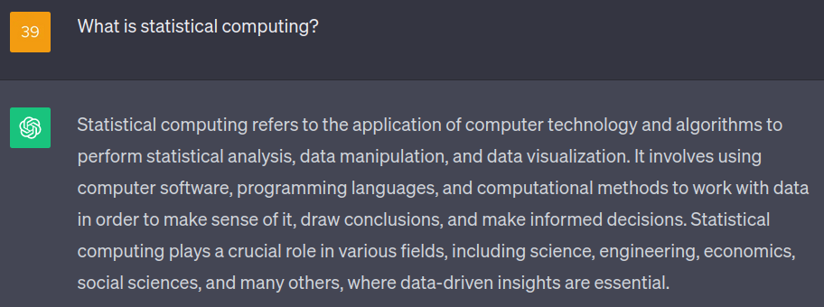
</p>

---

# What Is Statistical Computing?

<p align="center">
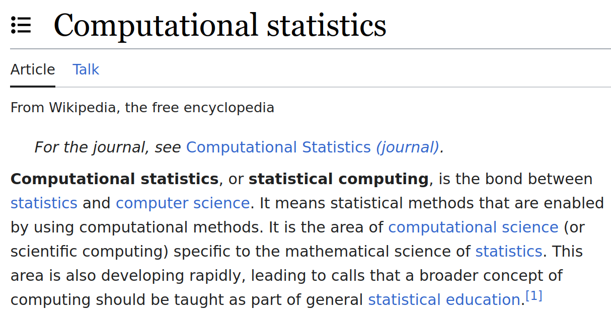
</p>

--

Statistical computing is a course with intensive programming tasks that are related to Statistics.

--

<p align="left">
<b>
In other words, there will be a lot of coding in this course!!
</b>
</p>

---

# Why Do We Learn Statistical Computing?

--

- We want to utilize (big) data to address scientific questions.

<p align="center">

</p>
<p align="center">
<font size="4">Cited from 
<a href="https://bleuwire.com/5-biggest-big-data-challenges/">https://bleuwire.com/5-biggest-big-data-challenges/</a>.</font>
</p>

---

# Why Do We Learn Statistical Computing?

**An Example From My Research**: Cosmic Web Detection with Observed Galaxies in the Sloan Digital Sky Survey.

<p align="center">
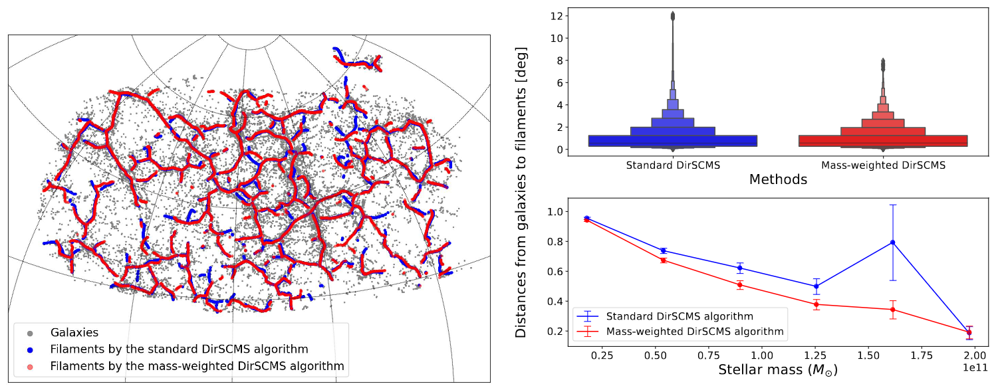
</p>
<p align="center">
<font size="4">See my paper at
<a href="https://doi.org/10.1093/mnras/stac2504">MNRAS</a> and our <a href="https://doi.org/10.5281/zenodo.6244866">cosmic web catalog</a> (i.e., a well-documented dataset). </font>
</p>


One scientific question that we address here is "*how is the stellar mass of a galaxy correlated with its distance to nearby cosmic web structures?*"

---

# Why Do We Learn Statistical Computing?

- We need to conduct simulation studies to validate our statistical theory and methodology.

--

  - For example, we can verify the asymptotic normality of our proposed statistical estimator with finite samples.

<p align="center">

</p>
<p align="center">
<font size="4">See my recent paper 
<a href="https://arxiv.org/abs/2309.06429">https://arxiv.org/abs/2309.06429</a>. </font>
</p>

---

# Why Do We Learn Statistical Computing?

- Mastering statistical computing skills can give us better jobs.

--

<p align="center">

</p>

<p align="center">
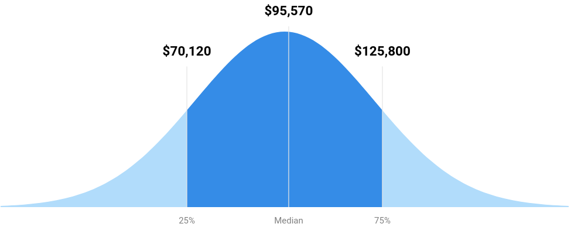
</p>
<p align="center">
<font size="4">Sources from US News in 2021. </font>
</p>

---

# Syllabus

<p align="center">
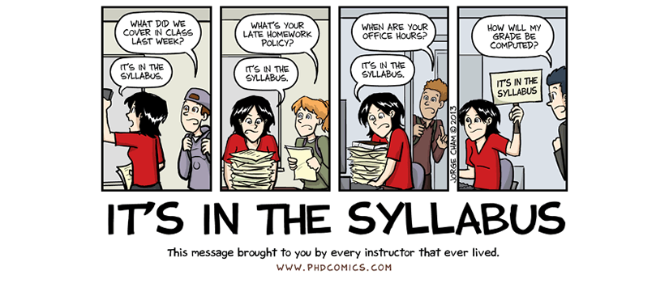
</p>

Let's spend some time going over the [Course Syllabus](https://zhangyk8.github.io/teaching/file_stat302/Syllabus_Win2024.pdf).

---

# Canvas Discussion

* It is worth up to 2% extra credit on the final grade.

* Only substantive and helpful questions will be counted.


.pull-left[
### Bad questions:

* How do you do Problem 2?

* Here's my code and it's broken. How can I fix it?
]

--

.pull-right[
### Good questions:
* Here's a snippet of code that I used for Problem 2: 
<br/>`formatted code snippet`
<br/>It returned the following error:
<br/>`formatted error message`
<br/>Does anyone know why? I already tried...

* I don't understand the concept from Slide 18 today. Could anyone elaborate on why...?
]

---

# Canvas Discussion

* It is worth up to 2% extra credit on the final grade.

* Only substantive and helpful answers will be counted.

.pull-left[
### Bad or null answers:
* Here's my solution:
<br/>`formatted code snippet`

* The grader is wrong. You should ask the grader to add your points back...

(*However, you are encouraged to point out my mistakes and typos during lectures or on the discussion board.*)
]

--

.pull-right[
### Good answers:
* This error message occurs because your variable is a string instead of a numeric.
Have you tried checking...?

* I think that Slide 18 in Lecture 2 will address your questions.
]

---

# Why R?

R is a programming language developed by statisticians for statistical computing.

### Pros:
* R is open-source and has a community of developers and users.
* It is convenient for statistical analysis and data visualization...

<p align="center">

</p>

--

### Cons:
* R is slow unless we use parallel computing packages or [Rcpp](https://www.rcpp.org/).
* It is not very popular outside of the statistical community.

---

# Why R?

.pull-left[
Windows Interface

<p align="center">
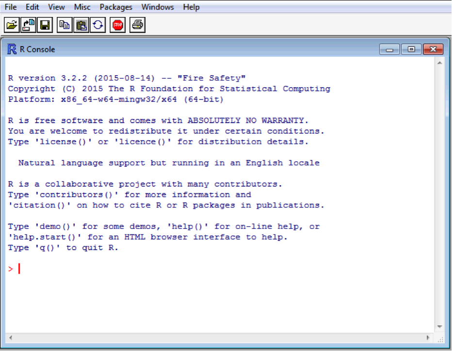
</p>

]

.pull-right[

Linux/Unix Terminal

<p align="center">
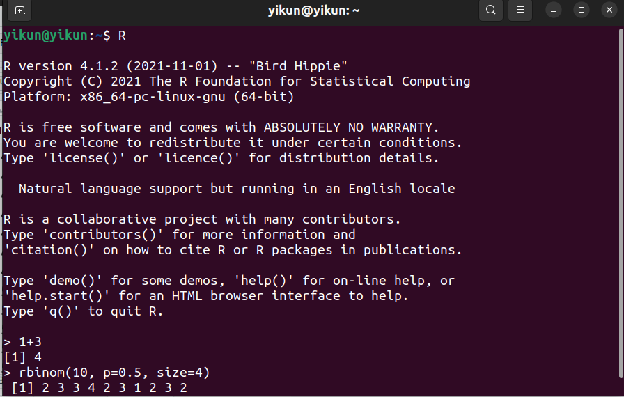
</p>

]

--

It is not convenient to write programs with thousands of R code lines directly in the R interface!

---

# Why RStudio?

Luckily, we have [RStudio](https://posit.co/download/rstudio-desktop/), an integrated development environment (IDE) designed for writing and running R programming.
--

* We recommend to first install R. Then, Rstudio will automatically locate the R directory in our computer.

* It helps us organizes R scripts, files, plots, code console, etc.

* It provides helpful interactive graphical interface.

--

* And more essentially, it has R Markdown integration.

For the rest of the course, we will use Rstudio to write our code and finish the lab assignments.

---


# RStudio Interface

By default...

* *Top left*: Editor panel. Browse and edit scripts or data with tabs.

* *Top right*: List of objects in the Environment (recall `ls()`), code history, etc.

* *Bottom left*: Console for running R code line-by-line (`>` prompt)

* *Bottom right*: Files, plots, packages, help files, etc.

If the Edit window is not open, then choose File -> New File -> Choose R Script.

---

# Editor

* Our important code should be written here (**not** the console).

* Primarily used for writing and editing .R or .Rmd scripts.
  
* Try opening a file now using *File > New File > R Script*, write two lines of simple code, such as `1 + 3` or `a = 6`.

* Click `Run` in the bar above the script. What happens?

* Click on one of the lines of code. Press `Ctrl`/`⌘` + `Enter`. What happens?

--

.center[**Important:** Every part of our R workflow belongs in this window!]

---

# Console and Environment/History

#### Console

* It gives us an easy way to run and test individual lines of code.

* Nothing that we run here will be saved after we close Rstudio (unless you save the R history)!

--

#### Environment/History

* The variables that we defined can be seen in the _Environment_ tab.

* Click on the _History_ tab to see what it contains. Try searching!

* Select a line from the _History_ tab and click `To Source`. What happens?
 - It is useful for adding lines that we tested in our Console to our R scripts.

---

# Files, Plots, Packages, Help

* _Files_ tab is used to browse the files on our computer.

  * Open files/data, move files that we are working with, etc.
  
  * **Use caution!** Changing files here is the same as changing them on our computer. If we delete something, it's gone!
  
* _Plots_ tab is used to display plots that we create in R.

* _Help_ tab is used to browse the documentations of functions. We can explore these by preceding a function name with `?`. 

  Try `?sqrt` to see its user documentation. (If we are unsure about any function, ask R in this way!)

* _Packages_ tab shows all the packages that we currently have installed. (We will discuss more about it later.)

---

# Why R Markdown?

[R Markdown](https://rmarkdown.rstudio.com/) is a markup language for combining R code with text.

* It facilitates the creations of those neat HTML files, PDF documents, slides (like the one I am using), webpages, books, etc.

--

* And more importantly, it is required for our lab assignments and final project!

---

# Create an R Markdown File

Let's try creating an R Markdown file:

1. Choose *File > New File > R Markdown...*.

2. Make sure *PDF Output* is selected and click OK.

3. Save the file in your new folder, call it `stat302_test1.Rmd`.

4. Click the *Knit* button
  * After it is done, browse to the file location using the `Files` tab. What have been added?

Note: The PDF output requires an installation of $\LaTeX$; see the instructions [here](https://bookdown.org/yihui/rmarkdown/installation.html).

---

# R Markdown Syntax

.pull-left[

## Output

**bold/strong emphasis**

*italic/normal emphasis*

.forcehead[Header]
## Subheader
### Subsubheader

]

.pull-right[
## Syntax

<pre>
**bold/strong emphasis**

*italic/normal emphasis*

# Header

## Subheader

### Subsubheader

</pre>
]

---

# R Markdown Syntax

.pull-left[
## Output

1. Ordered list Item 1
1. Item 2
  1. Even with sub-item 1
  2. Sub-item 2

* Unordered lists Item 1
* Item 2
  + Sub-item

[URL link](http://www.uw.edu)


]

.pull-right[

## Syntax

<div style="width:400px;overflow:auto">
<pre>
1. Ordered list Item 1
1. Item 2
  1. Even with sub-item 1
  2. Sub-item 2

* Unordered lists Item 1
* Item 2
  + Sub-item

[URL link](http://www.uw.edu)


</div>
</pre>
]

---

# R Markdown Syntax

.pull-left[
## Output 

You can put some math $y= \left( \frac{5}{3} \right)^2$ right up in there.


$$\frac{1}{n} \sum_{i=1}^{n} x_i = \bar{x}_n$$

Or a sentence with `code-looking font`.


Or a block of code:

```
y <- 1:5
z <- y^2
```
]

.pull-right[

## Syntax

<div style="width:400px;overflow:auto">
<pre>
You can put some math $y= \left(\frac{5}{3} 
\right)^2$ right up in there

$$\frac{1}{n} \sum_{i=1}^{n}
x_i = \bar{x}_n$$

Or a sentence with `code-looking font`.

Or a block of code:

    ```
    y <- 1:5
    z <- y^2
    ```
</pre>
]
</div>

---

# R Code Within R Markdown

As in Lab 1, we can run and execute R code within R Markdown. 
To do so, we need to encase our code as follows.


    `r ''````{r, eval = TRUE, echo = TRUE}
    # Your code goes here!
    ```

We can click the green triangle in the corner to evaluate that code chunk to preview the results without compiling the entire document.

---

# Useful Code Chunk Parameters

Parameters go into the opening brackets `{r}` and are separated by commas. Here are some useful options:

* `echo=FALSE`: Hide R code but keep results.

* `eval=FALSE`: Do not execute the R code.

* `include=FALSE`: Hide all outputs for this chunk (It is useful to load packages at the beginning of your document).

* `cache=TRUE`: Store the results of the chunk, and only re-run if the chunk is changed. (It is useful for files that take a while to compile).

* `fig.height=5, fig.width=5`: Modify the dimensions of any plots that are generated in the chunk (units are in inches).

Note: See the [R Markdown Reference Guide](https://www.rstudio.com/wp-content/uploads/2015/03/rmarkdown-reference.pdf) for a complete list of knitr chunk options.

---
class: inverse

# Part 2: R Basics

---

# R as a Calculator

* **Binary (Arithmetic) Operators** take two arguments. For instance, +, -, *, /, %% (for mod), %/%(integer division), and ^ (exponentiation).

```{r}
# Addition
6 + 1
```

```{r}
# Subtraction
9 - 16.6
```

```{r}
# Multiplication
6 * 3
```

---

# R as a Calculator

* **Binary (Arithmetic) Operators** take two arguments. For instance, +, -, *, /, %% (for mod), %/% (integer division), and ^ (exponentiation).

```{r}
# Division
10 / 3
```

```{r}
# Mod
10 %% 3
```

```{r}
# Integer division
10 %/% 3
```

---

# R as a Calculator

* **Binary (Arithmetic) Operators** take two arguments. For instance, +, -, *, /, %% (for mod), %/% (integer division), and ^ (exponentiation).

```{r}
# Exponentiation
3^4
```

```{r}
# Exponentiation (same as the syntax in Python)
3**4
```

* **Unitary (Arithmetic) Operators** take only one argument. For example, - is for arithmetic negation.

---

# R as a Calculator

* We can also use some build-in functions in R to calculate more advanced math functions.

```{r}
# Exponentiation with natural basis "e"
exp(3)
```

```{r}
# Trigonometric functions
sin(pi)
cos(2*pi)
```

---

# R as a Calculator

```{r}
# Square root
sqrt(5)
```

```{r}
# Logarithm with natural base
log(10)
```

```{r}
# Logarithm with base 10
log(10, base=10)

# Ask R (in the console) if we are unsure of 
# any function and its arguments
?log
```

---

# Comparison Operators

```{r}
# Strictly greater than
6 > 3
# Greater than or equal to
6 >= 6
```

```{r}
# Equal to
5 == 3
5 == 2 + 3
```

---

# Comparison Operators

```{r}
# Not equal to
6 != 3
```

```{r}
# Strictly less than
6 < 6
# Less than or equal to
6 <= 6
```

---

# Logical Operators

* **Logical Operators** take one or more "comparison statements" and return TRUE or FALSE.

```{r}
# AND
(6 < 5) & (1 < 3)
```

```{r}
# AND
(6 < 9) & (1 <= 3)
```

---

# Logical Operators

* **Logical Operators** take one or more "comparison statements" and return TRUE or FALSE.

```{r}
# OR
(6 < 5) | (1 < 3)
```

```{r}
# OR
(6 < 5) | (1 <= -3)
```

```{r eval=FALSE}
# Combine AND with OR operators
(6 < 5) & (7 > 2) | (1 <= 3)
```

--

```{r echo=FALSE}
# Combine AND with OR operators
(6 < 5) & (7 > 2) | (1 <= 3)
```


---

# Logical Operators

* **Logical Operators** take one or more "comparison statements" and return TRUE or FALSE.

```{r}
# Logical negation
!(6 < 5)
```

```{r}
# Logical negation
!(6 < 9)
```

---
class: inverse

# Part 3: Data Types in R

---

# Functional Programming

Functional programming in R comprises two basic types of things/objects: **data** and **functions**.
--

* **Data** are things like 8, "James", *NA*, and 
$$\begin{bmatrix} 
1 & 3 & 6\\
4 & 7 & -1\\
\end{bmatrix}.$$

--

* **Functions** are some programs that turns input objects, or *arguments*, into an output object or a return value (possibly with side effects), according to a definite rule. 

--

* Good programming is writing functions to correctly and efficiently transform inputs into outputs. (We will discuss functions later...)
  - <font size="4"> The principle of good programming is to take a big transformation and break it down into smaller ones so that we can efficiently implement these smaller tasks (using built-in functions). </font>

---

# Data Types

At the base level, all data can represented in binary format, by **bits** (i.e., TRUE/FALSE, YES/NO, 1/0). However, basic data types in R are:

- **Booleans** are direct binary values: `TRUE` or `FALSE` in R.

- **Integers** are whole numbers (positive, negative or zero), represented by a fixed-length block of bits.

- **Floating point numbers** are (some approximations) to rational numbers, i.e., $p/q$ where $p,q$ are both integers. 

- **Complex numbers** are numbers like 1+2i.

- **Characters** are fixed-length blocks of bits, with special coding; **strings** are sequences of characters.

- **Missing or ill-defined values**: `NA`, `NaN`, etc.

---

# Data Types (Examples)

```{r}
?typeof()

typeof(TRUE)

# By default, R stores numeric values as 64 floating points.
typeof(6)

# We can coerce it into integer as follows.
typeof(as.integer(6))

typeof(as.integer(6.5))
```

---

# Data Types (Examples)

We can also use the build-in function `class()` to determine the data type of an object. [This webpage](https://stackoverflow.com/questions/6258004/types-and-classes-of-variables) describes the differences between `typeof()` and `class()`.

- In short, `typeof()` or `mode()` represents how an object is stored in memory (numeric, character, list, or function), while `class()` represents its abstract type.

```{r}
class("26a")
typeof("26a")
mode("26a")
```


---

# Data Types (Examples)

```{r}
as.integer(6.6)

# It rounded a floating point number 6.5 to the largest integer that is less than 6.5. Check its difference with the `ceiling()` function.
floor(6.6)

typeof("7")

length("7112")
```

---

# Data Types (Examples)

```{r}
is.character("7")

is.na(6.6)

is.na(NA)
```

```{r}
is.na(NaN)

is.nan(NA)
```

---

# Variables in R

- With the preceding arithmetic operations, it is difficult for us to utilize the outputs.

--

- To better keep track of the intermediate results, we can assign the (outputs of) expressions to some **named variables**.

- Naming variables is the first step towards abstraction in functional programming.

--

```{r}
a = 1 + 2
course_code = "STAT 302"
dept = paste("Statistics", "Data Science")

# List all the variables that we have defined
ls()
```

Note: `<-` and `=` are both valid assignment operators.

---

# Variables in R

* A variable in R has its name and value.

* We can access a variable by its name.

```{r}
# Access variable `a`
a

# Check the data type of `course_code`
class(course_code)

# Remove a variable (from R memory)
rm("a")
```

Note: We can also keep track of all the defined variables in the _Environment_ tab (**Top right** in Rstudio). 

---

# Rules for Variable's Name

* A variable's name must follow some rules:

  - It cannot start with a digit or underscore `_`.
  
  - It may contain characters, digits, and some punctuation (period `.` and underscore `_` are allowed, while others are generally prohibited).
  
  - It is case-sensitive.
  
--

```{r}
w2v = 1 + 4
W2v = "word to vector"
w2v == W2v
```

---
# Summary

- Statistical computing focuses on using the computer programs to solve scientific problems with solid statistical methods.

- R is an open-source programming language for statistical computing.

- RStudio and R markdown further enhance our R programming experience.

- R supports arithmetic, comparison, and logical operators.

- The basic data types in R enable us to represent Booleans, numbers, characters, etc.

Submit Lab 1 on Gradescope by the end of Mondays (January 15)!!

---
class: inverse

# Appendix A. Probability

---

# Sample Space

A **sample space**, commonly denoted $\Omega$ or $S$, is the set of all possible outcomes from a random experiment. For example,

* Coin flip: $\Omega = \{H, T\}$;

* Two coin flips: $\Omega = \{HH, HT, TH, TT\}$;

* Rolling a 6-sided die: $\Omega = \{1, 2, 3, 4, 5, 6\}$;

* Hours spent sleeping in day: $\Omega = \{x: x\in \mathbb{R}, 0 \leq x \leq 24\}$;

* A simulation from a normal distribution: $\Omega = (-\infty, \infty)$.

The elements of $\Omega$ must be **mutually exclusive** and **collectively exhaustive**.

---

# Events

An **event**, which we will call $A$, can be any subset of your sample space. For example,

* Heads in a coin flip: $A = \{H\}$;

* At least one heads in two coin flips: $A = \{HT, HT, TH\}$;

* Rolling an even number on a 6-sided die: $A = \{2, 4, 6\}$;

* Sleeping at least 8 hours in a day: $A = \{x: x \in \mathbb{R}, 8 \leq x \leq 24\}$;

* Simulating a number between 1 and 2, inclusive, from a normal distribution: $A = [1, 2]$.

---

# Probability

Informally, probability $P$ is often defined as the chance of something happening.

More formally, it is a function that goes from an event $A$ to the real line. 

* $P(\text{heads in a fair coin flip}) = \dfrac{1}{2}$.

* $P(\text{at least one heads in two fair coin flips}) = \dfrac{3}{4}$.

* $P(\text{rolling an even number on a fair dice}) = \dfrac{1}{2}$.

---

# Axioms of Probability

Probability allows follows three basic principles, known as the **axioms of probability**.

1. The probability of any event $A$ must be between 0 and 1, inclusive.
  * $0 \leq P(A)\leq 1$.
  
2. The probability of the sample space is equal to 1.
  * $P(\Omega) = 1$.
  
3. If events $A$ and $B$ are **mutually exclusive**/**disjoint**, then the probability of *either* $A$ *or* $B$ is the same as the sum of the probability of $A$ and the probability of $B$.
  * $A \cap B = \emptyset \ \ \Rightarrow \ \ P(A\cup B) = P(A) + P(B)$

---
layout: true

# Probability Notation

---

## Intersection: $\cap$

$P(A \cap B)$: *joint* probability of $A$ *and* $B$.

.center[]

---

## Intersection: $\cap$

$P(A \cap B)$: *joint* probability of $A$ *and* $B$.

.center[]

---

## Union: $\cup$

$P(A \cup B)$ probability of $A$ *or* $B$.

.center[]

---

## Union: $\cup$

$P(A \cup B)$ probability of $A$ *or* $B$.

.center[]

---


## Complement: $A^c$

$P(A^c)$ probability of *not* $A$.

.center[]

---

## Complement: $A^c$

$P(A^c)$ probability of *not* $A$.

.center[]

---


## Difference: $A\setminus B$

$P(A\setminus B)$ probability of $A$ *and not* $B$.

.center[]

---

## Difference: $A\setminus B$

$P(A\setminus B)$ probability of $A$ *and not* $B$.

.center[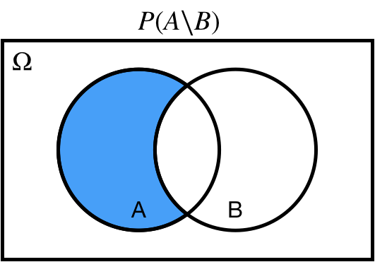]

---

## Conditional: $A | B$

$P(A | B)$ probability of $A$ *conditional on*/*given* $B$.

.center[]

---

## Conditional: $A | B$

$P(A | B)$ probability of $A$ *conditional on*/*given* $B$.

.center[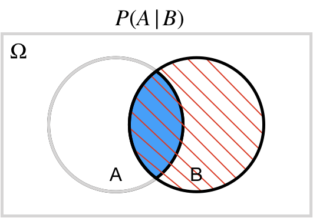]

---

## Subset: $A \subseteq \Omega$

$A \subseteq \Omega$: $A$ is a *subset* of $\Omega$.

$A \subset \Omega$: $A$ is a *proper subset* of $\Omega$.

.center[]

---

## Subset: $A \subseteq \Omega$

$A \subseteq \Omega$: $A$ is a *subset* of $\Omega$.

$A \subset \Omega$: $A$ is a *proper subset* of $\Omega$.

.center[]

---

## Superset: $\Omega \supseteq A$

$\Omega \supseteq A$: $A$ is a *superset* of $\Omega$.

$\Omega \supset A$: $A$ is a *proper superset* of $\Omega$.

.center[]

---

## Superset: $\Omega \supseteq A$

$\Omega \supseteq A$: $A$ is a *superset* of $\Omega$.

$\Omega \supset A$: $A$ is a *proper superset* of $\Omega$.

.center[]

---

## Element of: $X \in A$

$X \in A$: $X$ is an *element of* $A$.

.center[]

---

## Empty set: $\varnothing$

$A\cap E = \varnothing$: the intersection of $A$ and $E$ is the empty set.

.center[]

---
layout: false

# Identities of Probability

* The probability of $A^c$ is $1$ minus the probability of $A$:
  * $P(A^c) = 1-P(A)$.
  
* If $A$ is a subset of $B$, then the probability of $A$ is less than or equal to the probability of $B$:
  * $A \subseteq B \implies P(A)\leq P(B)$.
  
* The probability of a union is equal to the sum of the probabilities minus the probability of an intersection:
  * $P(A \cup B) = P(A) + P(B) - P(A\cap B)$.

---

# De Morgan's Laws

* Complement of the union is equal to the intersection of the complements.
  
.center[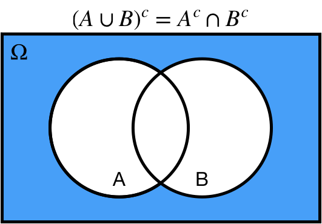]

---

# De Morgan's Laws

* Complement of the intersection is equal to the union of the complements.
  
.center[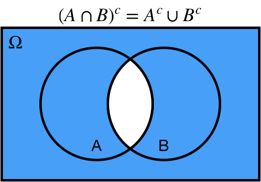]

---

# De Morgan's Laws

1. Complement of the union is equal to the intersection of the complements:
  * $(A \cup B)^c = A^c \cap B^c$.
  
2. Complement of the intersection is equal to the union of the complements:
  * $(A \cap B)^c = A^c \cup B^c$.
  
.center[    ]

---

# Independence

We say that two events $A$ and $B$ are independent, $A\perp \!\!\! \perp B$, *if and only if* one of the followings hold true:

* $P(A \cap B) = P(A) P(B)$;

* $P(A|B) = P(A)$;

* $P(B|A) = P(B)$.

This is an *extremely* important concept in statistics!

---

# Conditional Probability 

The conditional probability of $A$ given $B$ is equal to the joint probability of $A$ and $B$ divided by the marginal probability of $B$:

$$P(A|B) = \dfrac{P(A\cap B)}{P(B)}.$$

Note that this implies 

$$P(A\cap B) = P(A|B) P(B).$$


---


# Bayes' Rule

$$P(A|B) = \dfrac{P(A\cap B)}{P(B)}$$
also implies
$$P(A|B) = \dfrac{P(B|A)P(A)}{P(B)},$$
which is commonly known as **Bayes' rule**!

We won't get into the details in this class, but this can be a very useful result for reversing the conditions in our analysis.

For example: There is a big difference between the probability of having a disease given a positive screening, and the probability of a positive screening given a disease! These concepts are often confused in popular media!

---

# Law of Total Probability

We say that a set of events is a **partition** if all the followings hold:

* The set does not contain the empty set;

* The union of the events in the set is equal to the sample space;

* The intersection of any two distinct events in the set is equal to the empty set.

Note that an event and its complement always define a partition!

.center[]

---

# Law of Total Probability

The **law of total probability** states that given a partition $P_1, P_2, \ldots, P_n$, then 
$$P(A) = P(A|P_1)P(P_1) + P(A|P_2)P(P_2) + \cdots +  P(A|P_n)P(P_n).$$

Commonly, our partition is some event $B$ and its complement:
$$P(A) = P(A|B)P(B) + P(A|B^c)P(B^c).$$

.center[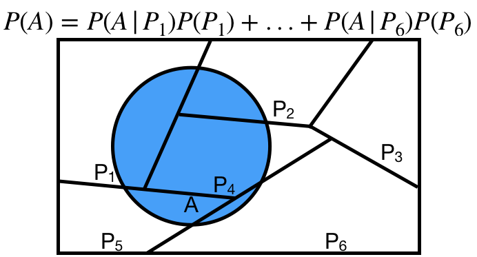]

---
class: inverse

# Appendix B. Random Variables

---

# Random Variables

Typically, we don't care about specific events occuring.
Instead, we tend to focus on functions of our events.
These functions are called **random variables**.

More formally<sup>1</sup>, a random variable $X$ can be defined as function $X: \Omega \mapsto \mathbb{R}$. For example,

* the number of heads out of 10 coin flips;

* the sum of 8 standard die rolls;

* the average value of 1,000 simulations from a $\mathcal{N}(0,1)$.

Typically, a random variable is denoted by a uppercase letter, such as $X$, and values that the random variable takes is denoted by a lowercase letter, such as $x$. 
For example, we might ask the $P(X=x)$ for multiple values of $x$.

We call the set of all values a random variable can take the **support** of that random variable.

.footnote[[1] It is still not very formal.]

---

# Random Variables

Random variables are **not** events! 

This can be confusing because often use similar notation with random variables and events. Think of an event as an outcome that can lead to a certain value of a random variable. For example,

* Event in 10 coinflips: $\{THHTTTHTTH\}$. 
  * Random variable representing the number of heads $X = 4$.
  
* Event in 8 standard die rolls: $\{2, 4, 2, 1, 5, 4, 2, 6\}$. 
  * Random variable representing the sum $X = 25$.

---

# Discrete Random Variables 

Random variables are **discrete** if there are a finite<sup>1</sup> number of values in the support. 
We've already seen some examples of this in class from the binomial distribution!
We define the **probability mass function**, or **PMF**, of a discrete random variable $X \sim Bin(n,p)$ as 
$$P(X=k|n,p) = \begin{pmatrix} n\\ k\end{pmatrix} p^k(1-p)^{n-k}$$

Probability mass functions must satisfy:

1. $0 \leq P(X=x) \leq 1$ for all $x$
2. $\sum_{x \in support(X)} P(X = x) = 1$
3. For any set $A\subseteq support(X)$, $P(X \in A) = \sum_{x \in A} P(X = x)$

.footnote[[1] or countably infinite]

---

# Continuous Random Variables

Random variables are **continuous** if the support is uncountably infinite. 
We've already seen some examples of this in class from the normal distribution!
We define the **probability density function**, or **PDF** of a continuous random variable $X \sim \mathcal{N}(\mu, \sigma^2)$ as 
$$f_X(x) = \dfrac{1}{\sqrt{2\pi\sigma^2}} e^{-\dfrac{1}{2}\left(\dfrac{x-\mu}{\sigma}\right)^2}$$
Probability density functions must satisfy:

1. $f_X(x) > 0$ for all $x \in support(X)$;

2. The area under the curve of the pdf in the support is equal to $1$. That is,
$\int_{support(X)} f_X(x)dx = 1$;

3. If $A$ is some interval in the support of $X$, then $P(X \in A) = \int_A f_X(x)dx$.

Note that the second and third properties are essentially the continuous versions of the corresponding properties of discrete PMFs!

---

# Expected Value

The **expected value** or expectation of a random variable, denoted $E[X]$ or $\mathbb{E}[X]$, is the mean of the random variable.
Intuitively, it can be thought of as a weighted average of all values in the support, weighted by their value in the pdf/pmf.

Expected values satisfy the following properties for random variables $X$, $Y$ and constants $a$, $b$:
* $\mathbb{E}[a] = a$;

* $\mathbb{E}[aX + b] = a \cdot \mathbb{E}[X] + b$;

* $\mathbb{E}[X + Y] = \mathbb{E}[X] + \mathbb{E}[Y]$.

If $X$ and $Y$ are independent, then 
* $\mathbb{E}[XY] = \mathbb{E}[X]\cdot \mathbb{E}[Y]$.

---

# Variance

The **variance** of a random variable is the expected squared difference between a random variable and its mean.
$$\text{Var}(X)=\mathbb{E}[(X - \mathbb{E}[X])^2].$$
Intuitively, this measures how far the values of $X$ are from their mean, on average.
It is a measure of spread, or variability.

Variances satisfy the following properties for a random variable $X$ and constants $a, b$:
* $\text{Var}(a) = 0$
* $\text{Var}(aX + b) = a^2\cdot \text{Var}(X)$

The square root of the variance is known as the **standard deviation**, because it is the expected (standard) magnitude of the difference (deviation) between a random variable and its mean.

More detailed review of the basic probability theory can be found in Section 3 of [this notes](https://zhangyk8.github.io/teaching/file_stat548/CS547_Proof_Probability_new.pdf).
