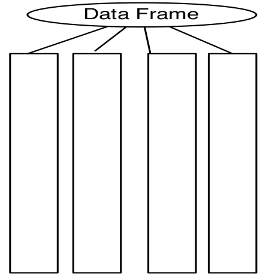

```{r setup, include=FALSE, purl=FALSE}
options(htmltools.dir.version = FALSE)
knitr::opts_chunk$set(comment = "##")
library(kableExtra)
```

# Outline

1. Vectors in R.

2. Arrays and Matrices in R.

3. Lists in R.

4. Data Frames.

5. R Coding Style Guide

<font size="4">* Acknowledgement: Parts of the slides are modified from the course materials by Prof. Ryan Tibshirani, Prof. Yen-Chi Chen, Prof. Deborah Nolan, Bryan Martin, and Andrea Boskovic. </font>

---
class: inverse

# Part 1: Vectors in R

---

# First Data Structure: Vectors

* A **data structure** is a grouping of related data values into an object.

* A **vector** is a sequence of values with the _same_ data type.

--

```{r}
# Create a numeric vector
x = c(7, 8, 10, 45, 2)

is.vector(x)

class(x)
```

The function `c()` combines all its arguments into a vector (or a list).

---

# Vectors in R

* A **vector** is a sequence of values with the _same_ data type.

```{r}
y = c(7.5, as.integer(8), 10+4i, "c")
y

class(y)
```

* If there is some elements in a vector that is of character type, R will coerce all the elements into characters.

--

```{r}
1:6
```

`1:6` is shorthand for `c(1,2,3,4,5,6)`.

---

# Vectors in R

* We can also generate vectors using functions such as `rep()` and `seq()`

```{r}
# Sequence from 1 to 20, incrementing by a step 5
seq(1, 20, by = 5)
# Repeat each element of a vector 3 times each
rep(c(1, 2), each = 3)
# Repeat an entire vector 3 times
rep(c(1, 2), times = 3)
```

---

# Subsetting Vectors in R

* We subset a vector using `[index]` after the vector name.

```{r}
x = c(7, 8, 10, 45, 2)
# Subset the second element
x[2]

# Subset the first, second, and fourth elements
x[c(1,2,4)]
```

--

* If we use a negative index, we return the vector with that element removed.

```{r}
x[-3]
```

---

# Subsetting Vectors in R

* We can also subset a vector by a logical statement (or equivalently, a logical vector of the same length).

```{r}
x = c(7, 8, 10, 45, 2)
x[x > 9]

# Return the indices of those elements > 9
which(x > 9)

# Same output, but the code is redundant
x[which(x > 9)]
```

---

# Naming the Elements of Vectors in R

* We can give names to elements/components of vectors, and index vectors accordingly.
  - <font size="4"> Note: Names are the labels of elements but not the additional components of the vector. </font>

```{r}
z = c(3, 2, 31, 10)
names(z) = c("v1","v2","v3","fred")
z

z["fred"]

z[c("v1", "fred")]
```

---

# Naming the Elements of Vectors in R

What if we only name one element of `z` in the first place?
```{r}
z = c(3, 2, 31, 10)
names(z[2]) = "b"
z
```

--

We can't change the name of a single element in vector `z` neither.

```{r}
names(z[2]) = "b"
z
```

---

# Vector Arithmetics

Arithmetic operators apply to vectors in a "componentwise" fashion.

```{r}
x = c(7, 8, 10, 45, 2)
y = -1:-5
x + y
```

--

```{r}
z = c("a", "6", "7", "2", "5")
x - as.numeric(z)
```

Note: Arithmetic operations only work for numeric vectors.

---

# Vector Recycling

What if we apply arithmetic operators to two numeric vectors of different lengths?

```{r size='tiny', warning=FALSE}
x = c(7, 8, 10, 45, 2)
p = c(2, 3)
x^p
```

--

**Recycling** in R repeat elements in the shorter vector to match with the longer one. 
  - This is useful when done on purpose, but could also lead to hard-to-catch bugs in our code!

```{r}
2*x
```

---

# Comparative and Logical Operations on Vectors

We can also do componentwise comparisons and logical operations with vectors.

```{r warning=FALSE}
x = c(7, 8, 10, 45, 2)
x > 9

(x > 9) | (x < 6)

x == c(10, 2)

sum(x > 9)
```

---

# Build-in Functions for Vectors

Many build-in functions can take vectors as arguments:

* `mean(), median(), sd(), var(), max(), min(), length()`, and `sum()` return single numbers.

* `sort()` returns the sorted vector.

* `order()` returns the indices of the sorted vector.

* `hist()` takes a vector of numbers and produces a histogram, a highly structured object, with the side effect of making a plot.

* `ecdf()` similarly produces a cumulative-density-function object.
    
* `summary()` gives the summary statistics of numerical vectors.
    
* `any()` and `all()` are useful on Boolean vectors.

---
class: inverse

# Part 2: Arrays and Matrices in R

---

# Second Data Structure: Arrays

* An **array** is a multi-dimensional generalization of vectors。

```{r}
x = c(7, 8, 10, 45, 20, 1)
# Create a 3-by-2 array using the elements in `x`
x_arr = array(x, dim = c(3, 2))
x_arr
```

--

```{r}
dim(x_arr)
```

The function `dim()` tells us the numbers of rows and columns. The output of `dim()` could be a vector of arbitrary length.

---

# Arrays in R

We can also create a 3-dim array (known as tensor in Python).

```{r}
y = c(7, 8, 10, 45, 20, 1, 4, 2, 188, 32, 12, 34)
# Create a 3-by-2-by-2 array using the elements in `x`
y_arr = array(y, dim = c(3, 2, 2))
y_arr
```

---

# Subsetting/Indexing An Array in R

We can access a 2-dim array either using `[index,index]` or by the underlying vector (column-major order).

```{r}
is.array(x_arr)

x_arr[1,2]

y_arr[3,1,2]

x_arr[c(1,2),2]
```

---

# Subsetting/Indexing An Array in R

We can access a 2-dim array either using `[index,index]` or by the underlying vector (column-major order).

```{r}
x_arr

# View an array as a vector in a column-major order
x_arr[4]

as.vector(x_arr)
```

---

# Matrices in R

A matrix is a specialization of a 2-dim array.

```{r}
z_mat = matrix(c(40, 1, 60, 3, 4, 2), nrow = 3)
z_mat

is.matrix(z_mat)

is.array(z_mat)
```

* We could also specify `ncol` for the number of columns.

---

# Matrices in R

We can also generate matrices by column binding (`cbind()`) and row binding (`rbind()`) vectors.

```{r}
y = c(2, 3, 4)
arr1 = cbind(x_arr, y)
arr1

rbind(x_arr, x_arr[c(1,2),])
```

---

# Matrices in R

* We can subset a matrix as how we did for an array.

* Matrices, like vectors, can only have its entries of the same data type. 

```{r}
rbind(c(1, 2, 3), c("a", "b", "c"))
```

--

* We can also apply (build-in) functions to matrices as vectors.

```{r}
mean(arr1)
```

---

# Matrix Multiplication

The usual multiplication `*` can only do componentwise multiplication between two matrices.

```{r}
x_arr * y_arr[,,1]
```

--

The matrix multiplication in R is achieved by `%*%`.

```{r}
z_mat = matrix(data = c(1,2,3,12), ncol = 2)
x_arr %*% z_mat
```

---

# Other Matrix Operations

* Row/Column sum and mean:

```{r}
rowSums(x_arr)

colMeans(x_arr)
```

* Matrix transpose:

```{r}
t(x_arr)
```

---

# Other Matrix Operations

* The determinant of a square matrix:

```{r}
print(z_mat)
# The determinant of a square matrix
det(z_mat)
```

* The inverse of a matrix:

```{r}
solve(z_mat)
```


---

# Other Matrix Operations

* The `diag()` function can extract the diagonal entries of a matrix:

```{r}
diag(z_mat)
```

--

* The `diag()` function can also be used to create a diagonal matrix:

```{r}
diag(c(1,4,3))
```

---

# Names in Matrices

* We can name either rows or columns or both, with `rownames()` and `colnames()`. The rules are the same as naming the vectors.

```{r}
colnames(z_mat) = c("a", "b")
z_mat
```

--

Similarly to `names()` for vectors, we then access them by calling the function again.

```{r}
colnames(z_mat)
```

Note: Names help us understand what we are working with.

---
class: inverse

# Part 3: Lists in R

---

# Third Data Structure: Lists

A **list** is a collection of objects that are not necessarily all of the same data type and can even have different lengths.

```{r}
my_list = list("exponential", 7, FALSE, c(1,6,2))
my_list
```

---

# Subsetting A List

* We can use `[index]` as with vectors, and it will return a list.

```{r}
my_list[4]

class(my_list[4])
```

--

* If we want to extract one element of a list, we have to use `[[index]]`.

```{r}
my_list[[4]]
```

---

# Subsetting and Expanding A List

```{r}
# Subset the second sub-element in the fourth element of the list
my_list[[4]][2]
```


We can also use `[[index]]` to expand the list.

```{r}
my_list[[5]] = c("a", "3", "UW STAT")
my_list
```

---

# Contracting A List

We can also shorten the list with by setting the length to something smaller (also works with vectors).

```{r}
length(my_list)

length(my_list) = 3
my_list
```

---

# Naming A List

We can also name the elements of a list:

```{r}
names(my_list) = c("first", "num", "logical")
my_list
```


---

# Naming A List

The names for the element of a list can be given when we initialize the list.

```{r}
my_list = list(func = "exponential", num = 7, 
               logi = FALSE, vec = c(1,6,2))
my_list
```

---

# Subsetting A List By Name

There are two different ways to subset an element from the list by name.

```{r}
my_list["num"]

my_list$num
```

We will also use `$` to access a column of the data frame later...
---

# Advantage of Lists

* Lists give us a natural way to store and look up data by name, rather than by position.

--

* Lists achieve a useful programming concept called **key-value pairs**, i.e., dictionaries in Python.

  - If we need to know the value of a component, we can look that up by name without caring where it is (in what position it lies) in the list.
  
--
  
* Lists are generally used when a function returns multiple results...

---
class: inverse

# Part 4: Data Frames in R

---

# Fourth Data Structure: Data Frames

* A **data frame** is a classic data table with $n$ rows for cases and $p$ columns for variables.

--

* A data frame can be viewed as a generalization of a named array.

--

* In principle, a data frame is a special list, with the restriction that all its components are vectors of the same length.

<p align="center">

</p>

---

# Data Frames in R

We start from creating a matrix (2-dim array).

```{r}
a_mat = matrix(c(35, 8, 10, 4, 12, 20, 10, 11, 1, 2), 
               ncol=2)
colnames(a_mat) = c("v1","v2")
a_mat

class(a_mat)
```

---

# Data Frames in R

We can expand the column of a data frame or coerce a matrix/array to the data frame type using `data.frame()`.

```{r}
a_df = data.frame(a_mat, Date=as.Date("1965/5/15") + 1:5)
a_df
```

Note: Check what the function `as.Date()` is for. Why can we add a numeric vector to it?

---

# Data Frames in R

The function `cbind()` and `rbind()` also works for data frames.

```{r}
a_df = cbind(a_df, binary=rbinom(5, size = 1, prob = 0.3))
a_df
```


Note: `rbinom()` generates some random samples from the binomial distribution. Run `?rbinom()` to check the documentation.

---

# Data Frames in R

* However, when using `rbind()`, the data type of each column in the new data frame should match the original data frame.

```{r}
rbind(a_df, data.frame(v1=1, v2=32, 
                       Date=as.Date("2023/09/27"), binary=-1.1))
```

---

# Subset Rows/Columns of A Data Frame

```{r}
a_df$v2

a_df$Date[1:3]

a_df[,2]

a_df[-(3:4),2]
```

---

# Read Tables into R

So far, we only create our data frames manually in R. 
--

In practice, it is more common to read those existing tabular data into R and carry out our analysis. There are many different ways to read tables into R. Here are two possible ways:

```{r}
family_df = 
  read.table(url("https://github.com/zhangyk8/zhangyk8.github.io/raw/master/_teaching/file_stat302/Data/family.txt"), 
             sep = "\t", header = TRUE)

family_df2 = 
  read.csv(url("https://github.com/zhangyk8/zhangyk8.github.io/raw/master/_teaching/file_stat302/Data/family.txt"), 
           sep = "\t", header = TRUE)

all(family_df == family_df2)
```

The data `family.txt` can be downloaded through the link [https://github.com/zhangyk8/zhangyk8.github.io/raw/master/_teaching/file_stat302/Data/family.txt](https://github.com/zhangyk8/zhangyk8.github.io/raw/master/_teaching/file_stat302/Data/family.txt).

---

# Read Tables into R

If the data file is in our current working directory, then we do not have to use the function `url()` to access it.

```{r}
family_df3 = read.table("family.txt", sep = "\t", header = TRUE)
class(family_df3)

head(family_df3)
```

---

# Post-Analysis After Reading the Tables

```{r out.width="40%", fig.align='center'}
# Find all the unique first name
unique(family_df$firstName)

# Histogram of BMIs for all individuals
hist(family_df$bmi, xlab = "BMIs",
     main = "Histogram of BMIs for all individuals")
```


---

# Working Directory in R

A working directory is the file path that R uses to save and look for data.  

* We can check for our current working directory using `getwd()`.
  
```{r}
getwd()
```

* We can change our working directory using `setwd()`.

--

```{r}
setwd("/media/yikun/Disk_D1/Graduate School/STAT 302/Lectures")
```

Note: Do not change the working directory inside R Markdown files! By default, R Markdown sets the file path of where it is in as the working directory. 

---

# Saving Tables in R

We can save a single R object as `.rds` files using `saveRDS()`, and multiple R objects as `.RData` or `.rda` files using `save()`.

```{r}
object1 = 1:5
object2 = c("a", "b", "c")
# save only object1
saveRDS(object1, file = "object1_only.rds")
# save object1 and object2
save(object1, object2, file = "both_objects.RData")
```

--

If we want to save a data frame, it is recommended to write it as `.csv` or `.txt` file.

```{r}
write.table(family_df, file = "family_newsave.txt", sep = "\t")
write.csv(family_df, file = "family_newsave.csv")
```


---
class: inverse

# Part 5: R Coding Style Guide

---

# Object Names

Use either underscores (`_`) or big camel case (`BigCamelCase`) to separate words within an object/Variable name.

Try to avoid using dots `.` to separate words in R functions!

```{r, eval = FALSE}
# Good
day_one
day_1
DayOne

# Bad
dayone
```

---

# Object Names

Names should be concise, meaningful, and (generally) nouns.

```{r, eval = FALSE}
# Good
day_one

# Bad
first_day_of_the_month
djm1
```


---

# Object Names

It is **very important** that object names do not overlap with common functions!

```{r, eval = FALSE}
# Very extra super bad
c <- 7
t <- 23
T <- FALSE
mean <- "something"
```

Note: `T` and `F` are R shorthand for `TRUE` and `FALSE`, respectively. In general, we should spell them out as clear as possible.

```{r}
mean(c(1, 2))
```


---

# Spacing

Put a space after every comma, just like the English writing.

```{r, eval = FALSE}
# Good
x[, 1]

# Bad
x[,1]
x[ ,1]
x[ , 1]
```

Do not put spaces inside or outside parentheses for regular function calls.

```{r, eval = FALSE}
# Good
mean(x, na.rm = TRUE)

# Bad
mean (x, na.rm = TRUE)
mean( x, na.rm = TRUE )
```


---

# Spacing with Operators

Most of the time when we are doing math, conditionals, logicals, or assignments, our operators should be surrounded by spaces (e.g. for `==`, `+`, `-`, `<-`, etc.).

```{r, eval = FALSE}
# Good
height <- (feet * 12) + inches
mean(x, na.rm = 10)

# Bad
height<-feet*12+inches
mean(x, na.rm=10)
```

There are some exceptions we will learn more about later, such as the power symbol `^`. 
See the [Tidyverse Style Guide](https://style.tidyverse.org/) for more details!

---

# Extra Spacing

Adding extra spaces is fine if it improves alignment of `=` or `<-`.

```{r, eval = FALSE}
# Good
list(
  total = a + b + c,
  mean  = (a + b + c) / n
)

# Also fine
list(
  total = a + b + c,
  mean = (a + b + c) / n
)
```


---

# Long Lines of Code

Strive to limit our code to 80 characters per line. This fits comfortably on a printed page with a reasonably sized font. 

If a function call is too long to fit on a single line, use one line each for the function name, each argument, and the closing `)`. This makes the code easier to read and to modify later.


```{r, eval = FALSE}
# Good
do_something_very_complicated(
  something = "that",
  requires = many,
  arguments = "some of which may be long"
)

# Bad
do_something_very_complicated("that", requires, many, arguments,
                              "some of which may be long"
                              )
```

<font size="4">
*Tip! Try RStudio > Preferences > Code > Display > Show Margin with Margin column 
80 to give us a visual cue!*
</font>

---

# Semicolons

In R, semi-colons (`;`) are used to execute pieces of R code on a single line.

* In general, this is bad practice and should be avoided. Also, we never need to end lines of code with semi-colons!

```{r, eval = FALSE}
# Bad
a <- 2; b <- 3

# Also bad
a <- 2;
b <- 3;

# Good
a <- 2
b <- 3
```


---

# Quotes and Strings

Use `"`, not `'`, for quoting text. The only exception is when the text already contains double quotes and no single quotes.

```{r, eval = FALSE}
# Bad
'Text'
'Text with "double" and \'single\' quotes'

# Good
"Text"
'Text with "quotes"'
'<a href="http://style.tidyverse.org">A link</a>'
```

--

### Useful References for R Coding Style Guide

* [Tidyverse Style Guide](https://style.tidyverse.org/) by Hadley Wickham.

* [Google Style Guide](https://google.github.io/styleguide/Rguide.html).

This style guides are useful for other people to understand our code! 

---

# Tidy Data Principles

There are three rules required for data (or a data frame/table) to be considered tidy:

1. Each variable must have its own column.

2. Each observation must have its own row.

3. Each value must have its own cell.

---

# Tidy Data Principles (Example 1)

The rules seem simple, but using them can be tricky! Let's consider the following example.

What is untidy about the following data frame?

```{r, echo = FALSE}
library(kableExtra)
untidy_dat = data.frame("Hospital" = c("A", "B", "C", "D"),
                        "Diseased" = c(10, 15, 12, 5),
                        "Healthy"  = c(14, 18, 13, 16))
kable_styling(kable(untidy_dat, align = "c"))
```

--

* **Variables:** the hospital, the disease status, and the counts.

--

* **Observations:** the number of individuals at a given hospital and of a given disease status.

--

* **Values:** Hospital A, Hospital B, Hospital C, Hospital D, individual count values, *Disease Status "Healthy"*, *Disease Status "Diseased"*

---

# Tidy Data Principles (Example 1)

```{r, echo = FALSE}
library(kableExtra)
untidy_dat = data.frame("Hospital" = c("A", "B", "C", "D"),
                        "Diseased" = c(10, 15, 12, 5),
                        "Healthy"  = c(14, 18, 13, 16))
kable_styling(kable(untidy_dat, align = "c"))
```

The main problem is that the column headers are values, not variables! How can we tidy it up?

--

```{r, echo = FALSE}
tidy_dat <- data.frame("Hospital" = rep(c("A", "B", "C", "D"), each = 2),
                       "Status"   = rep(c("Diseased", "Healthy"), 4),
                       "Count"    = c(10, 14, 15, 18, 12, 13, 5, 16))
kable_styling(kable(tidy_dat, align = "c"))
```

---

# Tidy Data Principles (Example 2)

Let's consider another example:

```{r, echo = FALSE}
untidy_dat2 = data.frame("Country" = c("A", "B"),
                         "Year"  = rep(2018, 2),
                         "m1624" = c(49, 34),
                         "m2534" = c(55, 33),
                         "f1624" = c(47, 50),
                         "f2534" = c(41, 43))
kable_styling(kable(untidy_dat2))
```

--

* **Variables:** Country, year, gender, age group, counts.

* **Observations:** the number of individuals in a given country, in a given year, of a given gender, and in a given age group.

* **Values:** Country A, Country B, Year 2018, Gender "m", Gender "f", Age Group "1624", Age Group "2534", individual counts.

---

# Tidy Data Principles (Example 2)

The tidy version is as follows:

```{r, echo = FALSE}
tidy_dat2 = data.frame("Country"   = rep(c("A", "B"), each = 4),
                        "Year"      = rep(2018, 8),
                        "Gender"    = rep(c("m", "m", "f", "f"), 2),
                        "Age_Group" = rep(c("16-24", "25-34"), 4),
                        "Counts"    = c(49, 55, 47, 41, 34, 33, 50, 43))
kable_styling(kable(tidy_dat2, align = "c"))
```

---

# Guidelines of Making Data Tidy

1. Identify the observations, variables, and values.

2. Ensure that each observation has its own row.

  * Be careful about individual observations spreading over multiple tables/Excel files/etc, or multiple types of observations within a single table (this would result in many empty cells).
  
3. Ensure that each variable has its own column.

  * Be careful about variables spreading over two columns and multiple variables within a single column.
  
4. Ensure that each value has its own cell.

  * Be careful about values as column headers.
  
---

# Why Do We Need Tidy Data?

* Easier to read and understand the data.

* More intuitive to analyze and plot the data using standard software (required for `ggplot2`).

* Fewer issues with missing values.

### Useful References for Tidy Data Principles

Here is a [fantastic reference](https://vita.had.co.nz/papers/tidy-data.pdf) written by Hadley Wickham going through all these principles in detail and with more examples.

---
# Reminder

Submit Lab 2 on Canvas by the end of Thursday (October 12)!!