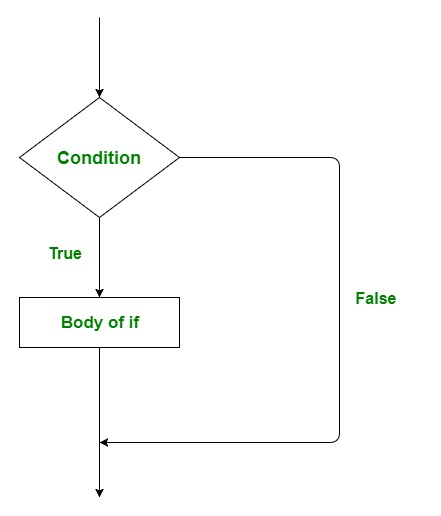
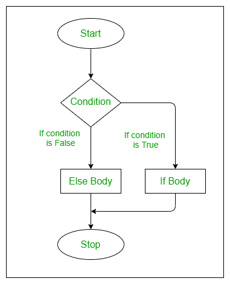

```{r setup, include=FALSE, purl=FALSE}
options(htmltools.dir.version = FALSE)
knitr::opts_chunk$set(comment = "##")
library(kableExtra)
```


# Outline

1. Control Flow

2. Basic Iterations

3. Vectorization and `apply` Functions

<font size="4">* Acknowledgement: Parts of the slides are modified from the course materials by Prof. Ryan Tibshirani, Prof. Yen-Chi Chen, Prof. Deborah Nolan, Bryan Martin, and Andrea Boskovic. </font>

---
class: inverse

# Part 1: Control Flow

---

# Summary of Control Flow

Summary of the control flow tools in R:

* `if()`, `else if()`, `if() else` are standard conditionals.
 
* `ifelse()` is a conditional that can vectorize.

* `switch()` is handy for deciding between several options.

---

# `if` Statement

The syntax of `if` statement goes as follows:

```{r eval=FALSE}
if (condition) {
  statement
}
```

<p align="center">

</p>

---

# `if` Statement

```{r eval=FALSE}
if (condition) {
  statement
}
```

If `condition` is `TRUE`, the statement gets executed. But if it is `FALSE`, nothing happens and the subsequent code will be executed accordingly.

--

  - Here, `condition` can be a logical or numeric vector, but only the first element is taken into consideration.
  
  - In the case when `condition` is a numeric variable or vector, zero is taken as `FALSE`, rest as `TRUE`.
  
---

# `if` Statement (Example)

```{r}
x = 1
if (x > 0) {
  # Code chunks get surrounded by curly brackets
  print("Executing the statement within `if`....")
  cat("x is equal to", x, ", a positive number!")
}
print("Done!")
```

--

If there is only one line code within `{}`, then we can omit `{}`.

```{r}
x = 1
if (x > 0) cat("x is equal to", x, ", a positive number!")
```

---

# `if` Statement (Example)

When the `condition` is FALSE, the code within `{}` will not be executed.

```{r}
x = -3
if (x > 0) {
  # Code chunks get surrounded by curly brackets
  print("Executing the statement within `if`....")
  cat("x is equal to", x, ", a positive number!")
}
print("Done!")
```

---

# `if()` and `else` Statements

The syntax of `if() else` is as follows:

```{r eval=FALSE}
if (condition) {
  statement1
} else {
  statement2
}
```

* The `else` part is optional and only evaluated if `condition` is `FALSE`.

<p align="center">

</p>

---

# `if()` and `else` Statements (Example)

```{r}
x = -5
if (x > 0){
  cat("x is equal to", x, ", a positive number!")
} else {
  cat("x is equal to", x, ", a negative number!")
}
```


```{r}
x = 10
if (x > 0){
  cat("x is equal to", x, ", a positive number!")
} else {
  cat("x is equal to", x, ", a negative number!")
}
```

---

# `else if` Statement

When we want to execute a block of code among more than 2 alternatives, we can consider using add the `else if` statement. 

The syntax is as follows:

```{r eval=FALSE}
if (condition1) {
  statement1
} else if (condition2) {
  statement2
} else if (condition3) {
  statement3
} else {
  statement4
}
```

---

# `else if` Statement (Example)

```{r}
x = 10
if (x > 0) {
  paste0("x is equal to ", x, ", a positive number!")
} else if (x < 0) {
  paste0("x is equal to ", x, ", a negative number!")
} else {
  paste0("x is equal to ", x, "!")
}
```


```{r}
x = 0
if (x > 0) {
  paste0("x is equal to ", x, ", a positive number!")
} else if (x < 0) {
  paste0("x is equal to ", x, ", a negative number!")
} else {
  paste0("x is equal to ", x, "!")
}
```

---

# `ifelse()` Function

In the `ifelse()` function, we specify a condition. Then, a value is returned if the condition holds, otherwise another value is returned if the condition fails.

  - One advantage of `ifelse()` is that it vectorizes nicely.

```{r}
x = c(1,2,4,5)
y = rep(30, 4)
z = rep(10, 4)
ifelse(x > 3, y, z)
```

---

# `%in%` Operator For Value Matching

`%in%` is a binary operator, which returns a boolean vector indicating whether components in the left-hand side are found in the right-hand side.

```{r}
1 %in% 1:16
1 %in% -1:-16
c(0, 1, 2, 7) %in% 1:6
```

---

# `%in%` Operator For Value Matching

To negate the `%in%` operator, we wrap the entire logical statement within `!(...)`.

```{r}
!(1 %in% 1:5)
```

Thus, it is common to see that `%in%` operator appears in the conditional statement of control flows.

---

# Control Flow (Additional Example)

Check if the length of a string is greater than 20 and whether its first character is `a`.

--

```{r}
x = "Artificial Intelligence"
x_split = strsplit(x, split = "")[[1]]

if ((length(x_split) > 20) & (x_split[1] == "a")) {
  print("x is a pretty short string!")
  if (x_split[1] == "a") 
    # This comparison is case-sensitive.
    print('The first character of x is "a".')
} else {
  cat("x is a pretty long string!")
}
```

---

# Control Flow (Additional Example)

Check if the length of a string is greater than 20 and whether its first character is `a`.

```{r}
x = "Artificial Intelligence"
# Convert all the characters to lower cases using `tolower()`
x_split = tolower(strsplit(x, split = "")[[1]])

if ((length(x_split) > 20) & (x_split[1] == "a")) {
  print("x is a pretty short string!")
  if (x_split[1] == "a") 
    # This comparison is case-sensitive.
    print("The first character of x is 'a'.")
} else {
  cat("x is a pretty long string!")
}
```

---

# `switch()` Function

Instead of using an `if()` statement followed by `else if()` statements (and perhaps a final else), we can also use `switch()`. 

  - We pass a variable to select on and a value for each option.

--

```{r}
x = c(1, 2, 4, 10, 32)
sum_type = "sd_dev"

switch(sum_type,
       mean = mean(x),
       median = median(x),
       sd_dev = sd(x),
       histogram = hist(x),
       "I don't understand")
```

* Here, we expect `sum_type` to be a string, either `mean`, `median`, `sd_dev`, or `histogram`; we specify what to do for each option.

---

# `switch()` Function

```{r}
x = c(1, 2, 4, 10, 32)
sum_type = "mode"

switch(sum_type,
       mean = mean(x),
       median = median(x),
       sd_dev = sd(x),
       histogram = hist(x),
       "I don't understand")
```


* The last passed argument has no name, and it serves as the `else` clause.

---
class: inverse

# Part 2: Basic Iterations

---

# Summary of Iterations

We often get bored when repeating the same task again and again...

--

On the contrary, computers are good at applying rigid rules over and over again.

--

Iteration eases our burden of cumbersome repetitions and is one of the essentials in programming.

--

Here is a summary of the iteration methods in R:

* `for()` and `while()` loops: standard loop structures.

* Vectorization: use it whenever possible! It is faster and simpler.

* The family of `apply` functions: alternative to `for()` loop, which often makes our R code more efficient.

<!--
* The family of `map` functions: another alternative from the `purrr` package.
-->

---

# `for()` Loop

A `for()` loop increments a **counter** variable along a vector. It repeatedly runs a code block, called the **body** of the loop, with the counter set to its current value, until it runs through the vector.

--

```{r}
n = 10
log_vec = vector(length = n, mode = "numeric")
for (i in 1:n) {
  log_vec[i] = log(i)
}
log_vec
```

Here `i` is the counter and the vector that we iterate over is `1:n`. The body is the code within `{}`.

---

# Iteration Over Non-numeric counters

The counter vector does not necessarily comprise consecutive integers.

```{r}
fruits = c("apple", "banana", "cherry", "orange")

for (x in fruits) {
  # `print()` function will automatically add a line break
  # When using `cat()` function, we can manually add a line break using "\n"
  cat(x, "\n")
} 
```

---

# Nested `for()` Loop

The body of a `for()` loop can contain another `for()` loop (or several other statements).

```{r}
for (i in 1:4) {
  for (j in 1:i^2) {
    cat(paste(j,""))
  }
  cat("\n")
}
```

---

# Nested `for()` Loop

We can use a nested `for()` loop to fill in a matrix.

```{r}
x = matrix(NA, nrow = 4, ncol = 3)
for (i in 1:4) {
  for (j in 1:3) {
    x[i, j] = i * j
  }
}
x
```

Note: Usually, filling in a matrix in this way is inefficient! Try to vectorize code wherever possible!

---

# `while()` Loop

A `while()` loop repeatedly evaluates a code block, again called the **body**, until the condition is `FALSE`.

--

```{r}
i = 1
log_vec = c()
while (log(i) <= 2) {
  # Using concatenation within a loop is slow!
  log_vec = c(log_vec, log(i))
  i = i + 1
}
log_vec
```

Note: Be careful when using `while()` loop! It is possible to get stuck in an infinite loop!

---

# Concatenation Within A Loop is Slow

It is also recommended for not using `c()` within a loop, because R needs to re-allocate the memory for the variable when we call `c()`.

--

  - It would be better to assign a vector with pre-specified length beforehand.
  
```{r}
i = 1
log_vec1 = c()
start_time = Sys.time()
while (log(i) <= 11) {
  # Using concatenation within a loop is slow!
  log_vec1 = c(log_vec1, log(i))
  i = i + 1
}
end_time = Sys.time()
```

```{r echo=FALSE}
cat("The total execution time of the loop with concatenation is ", end_time - start_time, " seconds!")
```

---

# Concatenation Within A Loop is Slow

* While the total number of steps for an iteration may be unknown, a rough estimate of its upper bound will be good enough.
  
```{r}
i = 1
# Note that 1e6 > exp(11)
log_vec2 = numeric(length = 1e6)
start_time = Sys.time()
while (log(i) <= 11) {
  # Using concatenation within a loop is slow!
  log_vec2[i] = log(i)
  i = i + 1
}
end_time = Sys.time()
# Shorten the vector with the exact length
log_vec2 = log_vec2[1:(i-1)]
all(log_vec1 ==  log_vec2)
```

```{r echo=FALSE}
cat("The total execution time of the loop without concatenation is ", end_time - start_time, " seconds!")
```


---

# Break From A Loop

We can always stop a loop earlier (before the counter has been iterated over the vector for `for()` loop or satisfying the condition for `while()` loop), using the `break` statement.

```{r}
n = 10
log_vec = c()
for (i in 1:n) {
  if (log(i) > 2) {
    print("Stop when the assigning value is larger than 2!")
    break
  }
  log_vec = c(log_vec, log(i))
}
log_vec
```

---

# Skip One Step of An Iteration

We can always skip one step of an iteration using the `next` statement.

```{r}
n = 10
log_vec = c()
for (i in 1:n) {
  if (i == 3) {
    next
  }
  log_vec = c(log_vec, log(i))
}
log_vec

log(3)
```


---

# `for()` Loop Versus `while()` Loop

* `for()` loop is better when the number of times to repeat (or the values to iterate over) is fixed in advance.

--

* `while()` loop is preferred when we can recognize when to stop the repeated code, even if we don't know where it begins with.

--

* `while()` loop is more general, in that every `for()` loop could be replaced with a `while()` loop (but not vice versa).

---

# `while(TRUE)` or `repeat`

Both `while(TRUE)` and `repeat` do the same thing, i.e., repeat the body indefinitely, until something causes the flow to break. 

```{r}
set.seed(123)
x = -1
while (x < 0) {
  x = rnorm(1)
  print(x)
}
```

---

# `while(TRUE)` or `repeat`

Both `while(TRUE)` and `repeat` do the same thing, i.e., repeat the body indefinitely, until something causes the flow to break. 

```{r}
set.seed(123)
x = -1
repeat {
  if (x < 0) {
    x = rnorm(1)
    print(x)
  } else {
    break
  }
}
```

---
class: inverse

# Part 3: Vectorization and `apply` Functions

---

# `for()` Loop Versus Vectorization

Suppose that we want to compute the sum of the product of two vectors. We first use `for()` loop implementation with the lengths of vectors as $n=100$.

```{r}
set.seed(123)
n = 100
a = runif(n, min = 0, max = 3)
b = rnorm(n, mean = 0, sd = 4)

sum_res1 = 0
start_time = Sys.time()
for (i in 1:n) {
  sum_res1 = sum_res1 + a[i] * b[i]
}
end_time = Sys.time()
cat("The `for` loop implementation takes ", end_time - start_time, " seconds to execute.")
```

---

# `for()` Loop Versus Vectorization

Suppose that we want to compute the sum of the product of two vectors. We then leverage vectorization to obtain the same results with the lengths of vectors as $n=100$.

```{r}
set.seed(123)
n = 100
a = runif(n, min = 0, max = 3)
b = rnorm(n, mean = 0, sd = 4)

start_time = Sys.time()
sum_res2 = sum(a * b)
end_time = Sys.time()
cat("The vectorization takes ", end_time - start_time, " seconds to execute.")
```

--

* Based on the above comparisons, the `for()` loop does not seem to be too bad.

---

# `for()` Loop Versus Vectorization

However, imagine what happen if the lengths of vectors are $n=100000$. Here is the `for()` loop implementation.

```{r}
set.seed(123)
n = 100000
a = runif(n, min = 0, max = 3)
b = rnorm(n, mean = 0, sd = 4)

sum_res1 = 0
start_time = Sys.time()
for (i in 1:n) {
  sum_res1 = sum_res1 + a[i] * b[i]
}
end_time = Sys.time()
cat("The `for` loop implementation takes ", end_time - start_time, " seconds to execute.")
```

---

# `for()` Loop Versus Vectorization

However, imagine what happen if the lengths of vectors are $n=100000$. Here is the vectorization version.

```{r}
set.seed(123)
n = 100000
a = runif(n, min = 0, max = 3)
b = rnorm(n, mean = 0, sd = 4)

start_time = Sys.time()
sum_res2 = sum(a * b)
end_time = Sys.time()
cat("The vectorization takes ", end_time - start_time, " seconds to execute.")
```

---

# `for()` Loop Versus Vectorization

The time differences between the `for()` loop and vectorization implementations become more salient as the lengths of the vectors increase.


```{r echo=FALSE, fig.align='center', out.width="60%", fig.pos="H"}
library(latex2exp)

set.seed(123)
n_lst = c(100, 1000, 10000, 50000, 100000, 500000, 1000000)
for_time = c()
vec_time = c()

for (n in n_lst){
  a = runif(n, min = 0, max = 3)
  b = rnorm(n, mean = 0, sd = 4)
  
  sum_res1 = 0
  start_time = Sys.time()
  for (i in 1:n) {
    sum_res1 = sum_res1 + a[i] * b[i]
  }
  end_time = Sys.time()
  for_time = c(for_time, end_time - start_time)
  
  start_time = Sys.time()
  sum_res2 = sum(a * b)
  end_time = Sys.time()
  vec_time = c(vec_time, end_time - start_time)
}

plot(n_lst, for_time, type = "l", col = "green", cex.lab=1.5, cex.axis=1.3, lwd = 5,
     xlab = TeX("Vector Length $n$"), ylab = "Elapsed Time")
lines(n_lst, vec_time, type = "l", col = "orange", lwd = 5)
legend(-0.03, 0.045, legend=c("`for()` Loop", "Vectorize"),
       fill=c("green", "orange"), cex=1.5)
```

---

# The `apply` Family

R offers a family of `apply` functions, which allow you to apply a function across different chunks of data. 

It offers an alternative to explicit iteration using `for()` loop, which can be simpler and faster. 

--

Here is a summary of functions:

  - `apply()`: apply a function to rows or columns of a matrix or data frame.
  
  - `lapply()`: apply a function to elements of a list or vector.
  
  - `sapply()`: same as the above, but simplify the output (if possible).
  
  - `tapply()`: apply a function to the levels of a factor vector.

---

# `apply()` Function in R

The `apply()` function takes inputs of the following form:

  - `apply(x, MARGIN=1, FUN=my.fun)` is to apply `my.fun()` across rows of a matrix or data frame `x`.
  
  - `apply(x, MARGIN=2, FUN=my.fun)` is to apply `my.fun()` across columns of a matrix or data frame `x`.
  
--
    
```{r}
# Built-in matrix of states data, 50 states x 8 variables
class(state.x77)
head(state.x77, n=2)
```

---

# `apply()` Function in R

The `apply()` function takes inputs of the following form:

  - `apply(x, MARGIN=1, FUN=my.fun)` is to apply `my.fun()` across rows of a matrix or data frame `x`.
  
```{r}
# Index of the max in each row
apply(state.x77, MARGIN = 1, FUN=which.max)
```


---

# `apply()` Function in R

The `apply()` function takes inputs of the following form:
  
  - `apply(x, MARGIN=2, FUN=my.fun)` is to apply `my.fun()` across columns of a matrix or data frame `x`.

```{r}
# Maximum entry in each column
apply(state.x77, MARGIN = 2, FUN = max)
```

---

# `apply()` Function in R

The `apply()` function takes inputs of the following form:
  
  - `apply(x, MARGIN=2, FUN=my.fun)` is to apply `my.fun()` across columns of a matrix or data frame `x`.

```{r}
# Summary of each column, which returns a matrix
apply(state.x77, MARGIN=2, FUN=summary)
```

---

# Return Values from `apply()` Function

What kinds of data type will `apply()` return? It depends on what function we pass. Here is a summary, say, with `FUN=my.fun()`:

--

  - If `my.fun()` returns a single value, then `apply()` will return a vector.
  
--
  
  - If `my.fun()` returns $k$ values, then `apply()` will return a matrix with k rows (this is true regardless of whether `MARGIN=1` or `MARGIN=2`).
  
--
  
  - If `my.fun()` returns different length outputs for different inputs, then `apply()` will return a list.
  
--
  
  - If `my.fun()` returns a list, then `apply()` will return a list.

---

# Don't Overuse the `apply()` Function

There are lots of special (or build-in) functions that are **optimized** and will be simpler and faster than using `apply()`. 

--

For instance,
  
  - `rowSums()`, `colSums()`: for computing row, column sums of a matrix.

  - `max.col()`: for finding the maximum position in each row of a matrix.

Combining these functions with logical indexing and vectorized operations will enable us to implement a lot of tasks. 

---

# Don't Overuse the `apply()` Function

As an example, how can we count the number of positive entries in each row of a matrix?
  
```{r}
set.seed(123)
x = matrix(rnorm(90000), 300, 300)
start_time = Sys.time()
# Don't do this (much slower for big matrices)
res1 = apply(x, MARGIN = 1, function(v) { 
  return(sum(v > 0)) 
})
end_time = Sys.time()
cat("The total execution time using `apply()` is ", end_time - start_time, " seconds!")
```

Note: Here, we use our customized function in `apply()`. More details about writing our own function will be discussed in the next lecture.

---

# Don't Overuse the `apply()` Function

As an example, how can we count the number of positive entries in each row of a matrix?

```{r}
set.seed(123)
x = matrix(rnorm(90000), 300, 300)
start_time = Sys.time()
# Don't do this (much slower for big matrices)
res2 = rowSums(x > 0)
end_time = Sys.time()
cat("The total execution time of a direct computations is ", end_time - start_time, " seconds!")
```

---

# `lapply()` Function

The `lapply()` function takes inputs as: `lapply(x, FUN = my.fun)`, to apply `my.fun()` across elements of a list or vector x. The output is always a list.

--

```{r warning=FALSE}
lst1 = list(
  num_vec = 1:15,
  mat = matrix(15:1, ncol = 3),
  sublst = list(x = c(1,2), y="STAT 302")
)

lapply(lst1, mean)
```

---

# `sapply()` Function

The `sapply()` function works just like `lapply()`, but it will try to simplify the return value whenever possible.  

--

  - The most common scenario is to convert a list to a vector.
  
```{r warning=FALSE}
# Simplify the result and return a vector
sapply(lst1, mean)
```

---

# `sapply()` Function

The `sapply()` function works just like `lapply()`, but it will try to simplify the return value whenever possible.  

```{r warning=FALSE}
# Can't simplify and thus still return a list
sapply(lst1, summary)
```

---

# `tapply()` Function

The function `tapply()` takes inputs as: `tapply(x, INDEX = my.index, FUN = my.fun)`, to apply `my.fun()` to subsets of entries in `x` that share a common level in `my.index`.

--

```{r}
n = 17
fac = factor(rep_len(1:3, n), levels = 1:5)
1:17
fac

tapply(1:n, fac, sum)
```

---

# `split()` Function

The function `split()` splits up the rows of a data frame by levels of a factor as: `split(x, f = my.index)`, which splits a data frame `x` according to levels of `my.index`.

--

```{r}
family_df = read.table(url("https://github.com/zhangyk8/zhangyk8.github.io/raw/master/_teaching/file_stat302/Data/family.txt"), 
                       sep = "\t", header = TRUE)

family_df_sp = split(family_df, f=family_df$sex)
class(family_df_sp)
```

---

# `split()` Function

The function `split()` splits up the rows of a data frame by levels of a factor as: `split(x, f = my.index)`, which splits a data frame `x` according to levels of `my.index`.

```{r}
family_df_sp[[1]]
```

---
# Reminder

Submit Lab 3 on Canvas by the end of Monday (October 23)!!