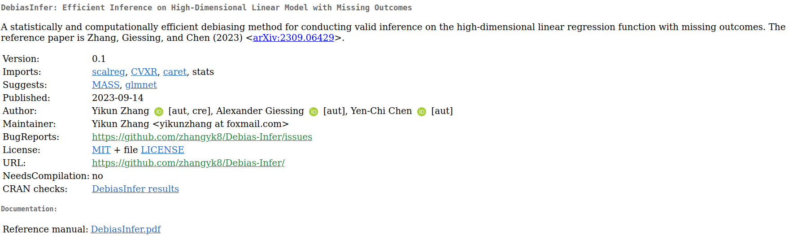

```{r setup, include=FALSE, purl=FALSE}
options(htmltools.dir.version = FALSE)
knitr::opts_chunk$set(comment = "##")
library(kableExtra)
```

# Outline

1. Using Packages in R

2. Data Manipulation via `tidyverse`

3. Basic Graphics in R

4. Data Visualization via `ggplot2`


<font size="4">* Acknowledgement: Parts of the slides are modified from the course materials by Prof. Ryan Tibshirani, Prof. Yen-Chi Chen, Prof. Deborah Nolan, Bryan Martin, and Andrea Boskovic. </font>

---
class: inverse

# Part 1: Using Packages in R

---

# What is an R package?

R packages contain code, data, and documentation in a standardized collection format that can be installed and utilized by users of R.

--

  - There are 19,961+ official R packages available on [Comprehensive R Archive Network (CRAN)](https://cran.r-project.org/web/packages/available_packages_by_name.html). Apart from that, some unofficial R packages are also posted on [GitHub](https://github.com/).
  
--

  - These packages implement miscellaneous statistical methods using functions in R, which makes our programming and data analysis easier.
  
<p align="center">

</p>

---

# How Can We Install R Packages?

If a package is officially available on [CRAN](https://cran.r-project.org/web/packages/available_packages_by_name.html), like most packages we will use for this course, we can install it using

```{r eval=FALSE}
install.packages("PACKAGE_NAME_IN_QUOTES")
```

Or, we can use the "_Packages_" tab in the lower right panel and click the "_Install_" button to install an official package in RStudio.

- After a package is installed, it is saved on our computer until we update R, and we don't need to re-install it. 

- There is no need to include a call to `install.packages()` in any `.R` or `.Rmd` file!

--

Occasionally, we may want to install an R package from a `.tar.gz` file downloaded from CRAN or elsewhere:

```{r eval=FALSE}
install.packages("pkgname.tar.gz", repos = NULL, type ="source")
```


---

# How Can We Use R Packages?

After a package is installed, we can load it into our current R session using `library()` or `require()` if it is inside our customized function:

```{r eval=FALSE}
library(PACKAGE_NAME)
# or 
library("PACKAGE_NAME")
```

- Unlike `install.packages()`, it is not necessary to include the package name in quotes.

--

- Loading a package must be done with each new R session, so we should put calls to `library()` in our `.R` and `.Rmd` files whenever we use some R packages in our code.

- In `.Rmd` files, we can load all the required packages in the opening chunk and set the parameter `include = FALSE` in that chunk to hide the messages and code.

    `r '' ````{r, include = FALSE}
    ```

---

# Install R Packages From Github

There is an `install_github()` function to install R packages hosted on GitHub in the `devtools` package, though it requests developer's name.

```{r eval=FALSE}
library(devtools)
install_github("DeveloperName/PackageName")
```

Here is an example where we don't have to load the `devtools` package:

```{r eval=FALSE}
devtools::install_github("zhangyk8/Debias-Infer", subdir = "R_Package")
```

--

The `githubinstall` package provides a function `githubinstall()`, which does not need developer's name.

```{r eval=FALSE}
library(githubinstall)
githubinstall("PackageName")
```

---
class: inverse

# Part 2: Data Manipulation via `tidyverse`

---

# What is `tidyverse`?

The `tidyverse` is a coherent collection of packages in R for data science (and `tidyverse` itself is also a package that loads all its constituent packages). Packages include:

- Data reading and saving: `readr`.

- Data manipulation: `dplyr`, `tidyr`.

- Iteration: `purrr`.

- Visualization: `ggplot2`.

We can install all of them using

```{r eval=FALSE}
install.packages("tidyverse")
```

Note: We only need to do this once!

---

# Why Do We Need `tidyverse`?

- These packages have a very consistent API as well as an active developer and user community.

  - [Ranking CRAN R Packages by Number of Downloads](https://www.datasciencemeta.com/rpackages).
  
--

- Function names and commands follow a focused grammar.
    
- The functions are powerful and fast when working with data frames and lists (matrices, not so much, yet!).

- Pipes (`%>%` operator) allows us to fluidly glue functionality together.

  - At its best, `tidyverse` code can be read like a story using the pipe operator!

---

# Load `tidyverse` into R

We can load all the `tidyverse` packages into our current R session using the `library()` function.

```{r}
library(tidyverse)
```

---

# Conflicts in Using R Packages

Recall that R packages encapsulate functions written by different R developers.

- Occasionally, some of these functions in different packages may share the same name, which introduces a conflict. 

--

- Whichever package that we load more recently using `library()` will mask the old function, meaning that R will default to that version.

--

- In general, this is fine, especially with `tidyverse`. The conflict message is to make sure that we are aware of conflicts.

---

# Data Manipulation in a Tidy Way

- The packages `dplyr` and `tidyr` are going to be our main workhorses for data manipulation.

- The main data type used by these packages is the data frame (or tibble, but we won't go there).

--

Why do we need to learn data manipulation through `tidyverse`?

- Learning pipes `%>%` will facilitate our learning of the `dplyr` and `tidyr` verbs (or functions).

- The functions in `dplyr` are analogous to SQL counterparts, so learning `dplyr` will get some SQL syntax for free!

---

# Learning Pipes `%>%`

Piping at its most basic level:

  - _It uses the `%>%` operator to take the output from a previous function call and "pipe" it through to the next function, in order to form a flow of results._

--

This can really help with the readability of code when we use multiple nested functions!

- **Shortcut for typing `%>%`:** use `ctrl + shift + m` in RStudio.

Note: In Linux and other related systems, we also have pipes, as in:

```{bash eval=FALSE}
ls -l | grep tidy | wc -l
```

---

# The Logics of Pipes with Single Arguments

Passing a single argument through pipes, we interpret the following code as $h(g(f(x)))$.

```{r eval=FALSE}
x %>% f %>% g %>% h
```

Note: In our mind, when we see the `%>%` operator, we should read this as "and then".

--

We can write `exp(1)` with pipes as `1 %>% exp`, and `log(exp(1))` as `1 %>% exp %>% log`.

```{r}
1 %>% exp
1 %>% exp %>% log
```

---

# The Logics of Pipes with Multiple Arguments

For multi-arguments functions, we interpret the following code as $f(x,y)$.

```{r eval=FALSE}
x %>% f(y)
```

--

We can subset top 1 row of the `mcars` data frame using the following pipes syntax.

```{r}
# Syntax in basic R
head(mtcars, 1)

# Pipes syntax
mtcars %>% head(1)
```

---

# The Logics of Pipes with Multiple Arguments

The command `x %>% f(y)` can be equivalently written in **dot notation** as:

```{r eval=FALSE}
x %>% f(., y)
```

--

What is the advantage of using dots? 

- Sometimes we may want to pass in a variable as the second or third (say, not first) argument to a function, with a pipe. As in:

```{r eval=FALSE}
x %>% f(y, .)
```

which is equivalent to $f(y,x)$.

---

# Some Examples with Pipes

Let's interpret the following code without executing it first.

```{r eval=FALSE}
state_df = data.frame(state.x77)
state.region %>% 
  tolower %>%
  tapply(state_df$Income, ., summary)
```

--

```{r echo=FALSE}
state_df = data.frame(state.x77)
state.region %>% 
  tolower %>%
  tapply(state_df$Income, ., summary)
```

---

# Some Examples with Pipes

Let's interpret the following code without executing it first.

```{r eval=FALSE}
x = "Data Manipulation with Pipes"
x %>% 
  strsplit(split = " ") %>% 
  .[[1]] %>% # indexing 
  nchar %>% 
  max 
```

--

```{r echo=FALSE}
x = "Data Manipulation with Pipes"
x %>% 
  strsplit(split = " ") %>% 
  .[[1]] %>% # indexing 
  nchar %>% 
  max 
```

---

# `dplyr` Functions

Some of the most important `dplyr` verbs (functions):

- `filter()`: subset rows based on a condition.

- `group_by()`: define groups of rows according to a column or specific condition.

- `summarize()`: apply computations across groups of rows.

- `arrange()`: order rows by value of a column.

- `select()`: pick out given columns.

- `mutate()`: create new columns.

- `mutate_at()`: apply a function to given columns.

---

# `filter()` Function

The `filter()` function is to subset rows based on a condition.

```{r}
# Built-in data frame of cars data, 32 cars x 11 variables
mtcars %>% head(2)
```

--

```{r}
mtcars %>% filter((mpg >= 20 & disp >= 200) | (drat <= 3))
```

---

# `filter()` Function

An alternative approach using `subset()` function in base R: 

```{r}
subset(mtcars, (mpg >= 20 & disp >= 200) | (drat <= 3))
```

---

# `filter()` Function

An alternative approaches using the basic R syntax:

```{r}
mtcars[(mtcars$mpg >= 20 & mtcars$disp >= 200) | (mtcars$drat <= 3), ]
```

---

# `group_by()` Function

- The `group_by()` function is to define groups of rows according to a column or specific condition.

```{r}
# Grouped by number of cylinders
mtcars %>% group_by(cyl) %>% head(2)
```

Note: The `group_by()` function doesn't actually change anything about the way that the data frame looks. Only difference is that when it prints, we know the groups.

---

# `summarize()` Function

The `summarize()` function is to apply computations across groups of rows.

```{r}
# Ungrouped
summarize(mtcars, mpg_avg = mean(mpg), hp_avg = mean(hp))
```

--

```{r}
# Grouped by number of cylinders
summarize(group_by(mtcars, cyl), mpg_avg = mean(mpg), hp_avg = mean(hp))
```

Can we rewrite the above code using pipes?

---

# `summarize()` Function

The `summarize()` function is to apply computations across groups of rows.

```{r}
mtcars %>% 
  group_by(cyl) %>% 
  summarize(mpg_avg = mean(mpg), hp_avg = mean(hp))
```

Note: Using the `group_by()` function makes the difference here.

---

# `arrange()` Function

The `arrange()` function is to order rows by value of a column.

```{r}
mtcars %>% 
  arrange(mpg) %>% 
  head(3)
```

--

```{r}
# Base R syntax
mpg_inds = order(mtcars$mpg)
head(mtcars[mpg_inds, ], 3)
```

---

# `arrange()` Function

We can also do it in a descending order.

```{r}
mtcars %>% 
  arrange(desc(mpg)) %>% 
  head(3)
```

--

```{r}
# Base R syntax
mpg_inds_decr = order(mtcars$mpg, decreasing = TRUE)
head(mtcars[mpg_inds_decr, ], 3)
```

---

# `arrange()` Function

We can order by multiple columns as well.

```{r}
mtcars %>% 
  arrange(desc(gear), desc(hp)) %>%
  head(7)
```

---

# `select()` Function

The `select()` function is to pick out given columns.

```{r}
mtcars %>% 
  select(cyl, disp, hp) %>% 
  head(3)
```

--

```{r}
# Base R syntax
head(mtcars[, c("cyl", "disp", "hp")], 3)
```

---

# Some Handy `select()` Helpers

```{r}
mtcars %>% 
  select(starts_with("d")) %>% 
  head(3)
```

```{r}
# Base R syntax
d_colnames = grep(x = colnames(mtcars), pattern = "^d")
head(mtcars[, d_colnames], 3)
```

Note: We need to use the [regular expression](https://cran.r-project.org/web/packages/stringr/vignettes/regular-expressions.html) under the base R syntax.

---

# Some Handy `select()` Helpers

```{r}
mtcars %>% 
  select(ends_with('t')) %>% 
  head(3)

mtcars %>% 
  select(contains('ar')) %>% 
  head(3)
```

More details about these `select()` helper functions can be found in [this web page](https://dplyr.tidyverse.org/reference/select.html#useful-functions).

---

# `mutate()` Function

The `mutate()` function is to create new columns.

```{r}
mtcars = mtcars %>% 
  mutate(hp_wt = hp/wt, 
         mpg_wt = mpg/wt)

# Base R
mtcars$hp_wt = mtcars$hp/mtcars$wt
mtcars$mpg_wt = mtcars$mpg/mtcars$wt
```

--

The newly created variables can be used immediately.

```{r}
mtcars = mtcars %>% 
  mutate(hp_wt_again = hp/wt,
         hp_wt_cyl = hp_wt_again/cyl) 

# Base R
mtcars$hp_wt_again = mtcars$hp/mtcars$wt
mtcars$hp_wt_cyl = mtcars$hp_wt_again/mtcars$cyl
```

---

# `mutate_at()` Function

The `mutate_at()` function is to apply a function to one or several columns.

```{r}
mtcars = mtcars %>% 
  mutate_at(c("hp_wt", "mpg_wt"), log) 

# Base R
mtcars$hp_wt = log(mtcars$hp_wt)
mtcars$mpg_wt = log(mtcars$mpg_wt)
```

Note: 

- Calling `dplyr` functions always outputs a new data frame, and it does not alter the existing data frame.

- To keep the changes, we have to reassign the data frame to be the output of the pipe! (See the example above).

---

# Linking `dplyr` to SQL

Learning `dplyr` also facilitates our understanding of SQL syntax.

- For example, `select()` is SELECT, `filter()` is WHERE, `arrange()` is ORDER BY, `group_by()` is GROUP BY, etc.

- This will make it easier for tasks that require using both R and SQL to manage data and build statistical models.

--

- Another major link to SQL is through merging or joining data frames, via `left_join()` and `inner_join()` functions.

  - More details can be found in [this web page](https://dplyr.tidyverse.org/reference/mutate-joins.html) and [Chapter 13 of the book "R for Data Science"](https://r4ds.had.co.nz/relational-data.html).

---

# `tidyr` Functions

Recall the tidy data principle for data (or a data frame/table) that we discussed in [Lecture 2](https://zhangyk8.github.io/teaching/file_stat302/Lectures/Lecture2_Data_Structures.html#79):

1. Each variable must have its own column.

2. Each observation must have its own row.

3. Each value must have its own cell.

--

There are two of the most important `tidyr` verbs (functions) that help us achieve the tidy data principle:

- `pivot_longer()`: make "wide" data longer.

- `pivot_wider()`: make "long" data wider.

There are many other verbs, such as `spread()`, `gather()`, `nest()`, `unnest()`, etc. More details can be found in [this web page](https://tidyr.tidyverse.org/reference/index.html).

---

# `pivot_longer()` Function

```{r message=FALSE}
# devtools::install_github("rstudio/EDAWR")
library(EDAWR) # Load some nice data sets
EDAWR::cases
```

--

```{r}
EDAWR::cases %>% 
  pivot_longer(names_to = "year", values_to = "n", cols = 2:4) 
```

---

# `pivot_longer()` Function

Here, we transposed columns 2:4 into a "year" column and put the corresponding count values into a column called "n".

- The `pivot_longer()` function did all the heavy lifting of the transposing work, and we just had to specify the output.

```{r}
# A different approach that does the same thing
EDAWR::cases %>% 
  pivot_longer(names_to = "year", values_to = "n", -country) 
```


---

# `pivot_wider()` Function

Here, we transposed to a wide format by "size" and tabulated the corresponding "amount" for each "size".

- Note that `pivot_wider()` and `pivot_longer()` are inverses.

```{r}
EDAWR::pollution
EDAWR::pollution %>% 
  pivot_wider(names_from = "size", values_from = "amount")
```

---
class: inverse

# Part 3: Basic Graphics in R

---

# Overview of Base R Plotting Functions

Base R has a set of powerful plotting tools:

- `plot()`: generic plotting function.

- `points()`: add points to an existing plot.

- `lines()`, `abline()`: add lines to an existing plot.

- `text()`, `legend()`: add text to an existing plot.

- `rect()`, `polygon()`: add shapes to an existing plot.

- `hist()`, `image()`: histogram and heatmap.

- `heat.colors()`, `topo.colors()`, etc: create a color vector.

- `density()`: estimate density, which can be plotted.

- `contour()`: draw contours, or add to existing plot.

- `curve()`: draw a curve, or add to existing plot.

---

# Scatter Plots

To make a scatter plot of one variable versus another, we use `plot()`.

```{r fig.width=6.5, fig.align='center', fig.height=5.5}
set.seed(123)
x = sort(runif(50, min=-2, max=2))
y = x^3 + rnorm(50)
plot(x, y)
```

---

# Plot Types

The `type` argument controls the plot type. Default is "p" for points; set it to "l" for lines. If we want both points and lines, set it to "b".

```{r fig.width=7, fig.align='center', fig.height=5}
plot(x, y, type="b")
```

More details can be found by `?plot`.

---

# Plot Labels

The `main` argument controls the title; `xlab` and `ylab` are the x and y labels.

```{r fig.width=6.5, fig.align='center', fig.height=5.5}
plot(x, y, main="A noisy cubic", xlab="My x variable", ylab="My y variable")
```

---

# Point Types

We use the `pch` argument to control point type.

```{r fig.width=7, fig.align='center', fig.height=6}
plot(x, y, pch = 19) # Filled circles
```

---

# Line Types

We use the `lty` argument to control the line type, and `lwd` to control the line width.

```{r fig.width=6.5, fig.align='center', fig.height=5.5}
plot(x, y, type="l", lty=2, lwd=3) # Dashed line, 3 times as thick
```

---

# Colors

We use the `col` argument to control the color. It can be:  

- An integer between 1 and 8 for basic colors.

- A string for any of the 657 available named colors.

The function `colors()` returns a string vector of the available colors

```{r fig.width=6.5, fig.align='center', fig.height=5.5}
plot(x, y, pch=19, col="red")
```

---

# Multiple Plots

To set up a plotting grid of arbitrary dimension, we use the `par()` function with the argument `mfrow`. 

```{r fig.align='center'}
par(mfrow=c(2,2)) # Grid elements are filled by row
plot(x, y, main="Red cubic", pch=20, col="red")
plot(x, y, main="Blue cubic", pch=20, col="blue")
plot(rev(x), y, main="Flipped green", pch=20, col="green")
plot(rev(x), y, main="Flipped purple", pch=20, col="purple")
```

---

# Margins of the Plots

Default margins in R are large (and ugly); to change them, we use the `par()` function with the argument `mar`.

```{r fig.align='center'}
par(mfrow = c(2,2), mar = c(4,4,2,0.5))
plot(x, y, main="Red cubic", pch=20, col="red")
plot(x, y, main="Blue cubic", pch=20, col="blue")
plot(rev(x), y, main="Flipped green", pch=20, col="green")
plot(rev(x), y, main="Flipped purple", pch=20, col="purple")
```

---

# Saving Plots

We use the `pdf()` function to save a pdf file of our plot in the current R working directory.

```{r}
getwd() # This is where the pdf will be saved
pdf(file="noisy_cubics.pdf", height=7, width=7) # Height, width are in inches
par(mfrow=c(2,2), mar=c(4,4,2,0.5))
plot(x, y, main="Red cubic", pch=20, col="red")
plot(x, y, main="Blue cubic", pch=20, col="blue")
plot(rev(x), y, main="Flipped green", pch=20, col="green")
plot(rev(x), y, main="Flipped purple", pch=20, col="purple")
graphics.off()
```

Also, we use the `jpg()` and `png()` functions to save jpg and png files.

---

# Adding to Plots

The main tools for this are:

- `points()`: add points to an existing plot.

- `lines()`, `abline()`: add lines to an existing plot.

- `text()`, `legend()`: add text to an existing plot.

- `rect()`, `polygon()`: add shapes to an existing plot.

Note: We should pay attention to **layers**---they work just like we are painting a picture by hand.

---

# Plotting a Histogram

Recall that we can plot a histogram of a numeric vector using `hist()`.

```{r fig.width=7, fig.align='center', fig.height=6}
king_lines = readLines("https://github.com/zhangyk8/zhangyk8.github.io/raw/master/_teaching/file_stat302/Data/king.txt")
king_words = strsplit(paste(king_lines, collapse=" "),
                      split="[[:space:]]|[[:punct:]]")[[1]]
king_words = tolower(king_words[king_words != ""])
king_wlens = nchar(king_words)
hist(king_wlens)
```

---

# Adding a Histogram to the Existing Plot

To add a histogram to an existing plot (say, another histogram), we use `hist()` with `add=TRUE`.

```{r fig.width=7, fig.align='center', fig.height=6}
hist(king_wlens, col="pink", freq=FALSE, breaks=0:20, 
     xlab="Word length", main="King word lengths")
hist(king_wlens + 5, col=rgb(0,0.5,0.5,0.5), 
     freq=FALSE, breaks=0:20, add=TRUE)
```

---

# Adding a Density Curve to a Histogram

To estimate a density from a numeric vector, we use the `density()` function; see [this note](http://faculty.washington.edu/yenchic/19A_stat535/Lec2_density.pdf) and [this tutorial](https://arxiv.org/pdf/1704.03924.pdf) for more details. 

```{r}
density_est = density(king_wlens, adjust=1.5) # 1.5 times the default bandwidth
class(density_est)
names(density_est)
```

---

# Adding a Density Curve to a Histogram

The `density()` function returns a list that has components `x` and `y`, so we can call `lines()` directly on the returned object.

```{r fig.width=7, fig.align='center', fig.height=6}
hist(king_wlens, col="pink", freq=FALSE, breaks=0:20, 
     xlab="Word length", main="King word lengths")
lines(density_est, lwd=3)
```

---

# Plotting a Heatmap

To plot a heatmap of a numeric matrix, we use the `image()` function.

```{r}
# Here, %o% gives for outer product
(mat = 1:5 %o% 6:10) 
image(mat) # Red means high, white means low
```

---

# Orientation of `image()`

The orientation of `image()` is to plot the heatmap according to the following order, in terms of the matrix elements:

$$\begin{array}{cccc} 
(1,\text{ncol}) & (2, \text{ncol}) & \ldots & (\text{nrow},\text{ncol}) \\
\vdots & & & \\
(1,2) & (2,2) & \ldots & (\text{nrow},2) \\
(1,1) & (2,1) & \ldots & (\text{nrow},1) 
\end{array}$$

This is a *90 degrees counterclockwise* rotation of the "usual" printed order for a matrix:

$$\begin{array}{cccc} 
(1,1) & (1,2) & \ldots & (1,\text{ncol}) \\
(2,1) & (2,2) & \ldots & (2,\text{ncol}) \\
\vdots & & & \\
(\text{nrow},1) & (\text{nrow},2) & \ldots & (\text{nrow},\text{ncol}) 
\end{array}$$

---

# Orientation of `image()`

Therefore, if we want the displayed heatmap to follow the usual order, we must rotate the matrix** $90^{\circ}$ clockwise **before passing it in to `image()` (Equivalently, reverse the row order and take the transpose).

```{r}
clockwise90 = function(a) { 
  t(a[nrow(a):1,]) 
} # Handy rotate function
image(clockwise90(mat))
```

---

# Color Scale

The default is to use a red-to-white color scale in `image()`, but the `col` argument can take any vector of colors. Built-in functions `gray.colors()`, `rainbow()`, `heat.colors()`, `topo.colors()`, `terrain.colors()`, `cm.colors()` all return contiguous color vectors of given lengths.

```{r}
phi = dnorm(seq(-2,2,length=50))
normal.mat = phi %o% phi
image(normal.mat, col=terrain.colors(20)) # Terrain colors
```

---

# Drawing Contour Lines

To draw contour lines from a numeric matrix, we use the `contour()` function; to add contours to an existing plot (says, a heatmap), we use `contour()` with `add=TRUE`.

```{r echo=TRUE}
image(normal.mat, col=terrain.colors(20))
contour(normal.mat, add=TRUE)
```

---
class: inverse

# Part 4: Data Visualization via `ggplot2`

---

# What is `ggplot2`?

`ggplot2` is a R package for "declaratively" creating graphics. 

- We provide the data and tell `ggplot2` how to map variables to aesthetics and what graphical primitives to use. Then, it takes care of the details.

- Plots in `ggplot2` are built sequentially using layers.

- When using `ggplot2`, it is essential that our data are tidy!

Let's work through how to build a plot layer by layer.

---

# Step-by-step Practice with `ggplot2` 

First, let's initialize a plot. We use the `data` parameter to tell `ggplot` what data frame to use.

* It should be tidy data, in either a `data.frame` or `tibble`!

.pull-left[
```{r, eval = FALSE}
library(gapminder)
ggplot(data = gapminder) #<<
```
]

.pull-right[
```{r, echo = FALSE, fig.height=4.5, fig.width=6}
library(gapminder)
ggplot(data = gapminder) 
```
]

---

# Step-by-step Practice with `ggplot2` 

Add an aesthetic using `aes()` within the initial `ggplot()` call.

* It controls our axes variables as well as graphical parameters such as color, size, shape.

.pull-left[
```{r, eval = FALSE}
ggplot(data = gapminder,
       mapping = aes(x = year, y = lifeExp)) #<<
```
]

.pull-right[
```{r, echo = FALSE, fig.height=4.5, fig.width=6}
ggplot(data = gapminder,
       mapping = aes(x = year, y = lifeExp)) #<<
```
]

---

# Step-by-step Practice with `ggplot2` 

Now `ggplot` knows what to plot, but it doesn't know how to plot it yet. Let's add some points with `geom_point()`.

* This is a new layer! We always add layers using the `+` operator.


.pull-left[
```{r, eval = FALSE}
ggplot(data = gapminder,
       mapping = aes(x = year, y = lifeExp)) +
  geom_point() #<<
```
]

.pull-right[
```{r, echo = FALSE, fig.height=4.5, fig.width=6}
ggplot(data = gapminder,
       mapping = aes(x = year, y = lifeExp)) +
  geom_point() #<<
```
]

---

# Step-by-step Practice with `ggplot2` 

Let's make our points smaller and red.

.pull-left[
```{r, eval = FALSE}
ggplot(data = gapminder,
       mapping = aes(x = year, y = lifeExp)) +
  geom_point(color = "red", size = 0.75) #<<
```
]

.pull-right[
```{r, echo = FALSE, fig.height=4.5, fig.width=6}
ggplot(data = gapminder,
       mapping = aes(x = year, y = lifeExp)) +
  geom_point(color = "red", size = 0.75) #<<
```
]

---

# Step-by-step Practice with `ggplot2` 

Let's try switching them to lines.

.pull-left[
```{r, eval = FALSE}
ggplot(data = gapminder,
       mapping = aes(x = year, y = lifeExp)) +
  geom_line(color = "red", linewidth = 0.75) #<<
```
]

.pull-right[
```{r, echo = FALSE, fig.height=4.5, fig.width=6}
ggplot(data = gapminder,
       mapping = aes(x = year, y = lifeExp)) +
  geom_line(color = "red", linewidth = 0.75) #<<
```
]

---

# Step-by-step Practice with `ggplot2` 

We want lines connected by country, not just in the order that they appear in the data.

.pull-left[
```{r, eval = FALSE}
ggplot(data = gapminder,
       mapping = aes(x = year, y = lifeExp,
           group = country)) + #<<
  geom_line(color = "red", linewidth = 0.5) 
```
]

.pull-right[
```{r, echo = FALSE, fig.height=4.5, fig.width=6}
ggplot(data = gapminder,
       mapping = aes(x = year, y = lifeExp,
           group = country)) + #<<
  geom_line(color = "red", linewidth = 0.5) 
```
]

---

# Step-by-step Practice with `ggplot2` 

We can color by continent to explore differences across continents.

* We use `aes()` because we want to color by something in our data.

* Putting a color within `aes()` will automatically add a label.

* We have to remove the color within `geom_line()`, or it will override the `aes()`.


.pull-left[
```{r, eval = FALSE}
ggplot(data = gapminder,
       aes(x = year, y = lifeExp, group = country, color = continent)) + #<<
  geom_line(linewidth = 0.5)  #<<
```
]

.pull-right[
```{r, echo = FALSE, fig.height=4.5, fig.width=6}
ggplot(data = gapminder,
       aes(x = year, y = lifeExp, group = country, color = continent)) + #<<
  geom_line(linewidth = 0.5) #<<
```
]

---

# Step-by-step Practice with `ggplot2` 

Let's add another layer for the trend lines by continent!

* We use a new `aes()` to group them differently than our lines (by continent).

* We will make them stick out by having them thicker and darker.

* We don't want error bars, so we will remove `se`.

.pull-left[
```{r, eval = FALSE, message = FALSE}
ggplot(data = gapminder,
       aes(x = year, y = lifeExp, group = country, color = continent)) + 
  geom_line(linewidth = 0.5) +
  geom_smooth(aes(group = continent), se = FALSE, linewidth = 1.5, color = "black", method = "loess") #<<
```
]

.pull-right[
```{r, echo = FALSE, fig.height=4.5, fig.width=6, message = FALSE}
ggplot(data = gapminder,
       aes(x = year, y = lifeExp, group = country, color = continent)) + 
  geom_line(linewidth = 0.5) +
  geom_smooth(aes(group = continent), se = FALSE, linewidth = 1.5, #<<
              color = "black", #<<
              method = "loess") #<<
```
]

---

# Step-by-step Practice with `ggplot2` 

The plot is cluttered and hard to read. Let's try separating by continents using **facets**!

* We use `facet_wrap`, which takes in a **formula** object and uses a tilde `~` with the variable name.

.pull-left[
```{r, eval = FALSE, message = FALSE}
ggplot(data = gapminder,
       aes(x = year, y = lifeExp, group = country, color = continent)) + 
  geom_line(linewidth = 0.5) +
  geom_smooth(aes(group = continent), se = FALSE, linewidth = 1.5, color = "black", method = "loess") +
  facet_wrap(~ continent) #<<
```
]

.pull-right[
```{r, echo = FALSE, fig.height=4.5, fig.width=6, message = FALSE}
ggplot(data = gapminder,
       aes(x = year, y = lifeExp, group = country, color = continent)) + 
  geom_line(linewidth = 0.5) +
  geom_smooth(aes(group = continent), 
              se = FALSE, linewidth = 1.5, 
              color = "black", 
              method = "loess") +
  facet_wrap(~ continent) #<<
```
]

---

# Step-by-step Practice with `ggplot2` 

Now, we formalize the labels on our plot using `labs()`.

* We can also edit labels one at a time using `xlab()`, `ylab()`, `ggmain()`, etc.

* Unfortunately, we should do this in every graph that we present! It is unlikely that the text styling of our data frame matches our output. Changing the labels improves human readability!

```{r, eval=FALSE, message = FALSE}
ggplot(data = gapminder,
       aes(x = year, y = lifeExp, group = country, color = continent)) + 
  geom_line(linewidth = 0.5) +
  geom_smooth(aes(group = continent), se = FALSE, linewidth = 1.5, 
              color = "black", method = "loess") +
  facet_wrap(~ continent) +
  labs(title = "Life expectancy over time by continent", #<<
       x = "Year", y = "Life Expectancy", legend = "Continent") #<<
```

---

# Step-by-step Practice with `ggplot2` 

```{r, fig.height=5, fig.width=7, fig.align='center', message = FALSE}
ggplot(data = gapminder,
       aes(x = year, y = lifeExp, group = country, color = continent)) + 
  geom_line(linewidth = 0.5) +
  geom_smooth(aes(group = continent), se = FALSE, linewidth = 1.5, 
              color = "black", method = "loess") +
  facet_wrap(~ continent) +
  labs(title = "Life expectancy over time by continent", #<<
       x = "Year", y = "Life Expectancy", legend = "Continent") #<<
```

---

# Step-by-step Practice with `ggplot2` 

Let's center our title by adjusting `theme()`.

* `element_text()` tells `ggplot()` how to display the text. 

* `hjust` is our horizontal alignment, we set it to one half


```{r, eval = FALSE, message = FALSE}
ggplot(data = gapminder,
       aes(x = year, y = lifeExp, group = country, color = continent)) + 
  geom_line(linewidth = 0.5) +
  geom_smooth(aes(group = continent), se = FALSE, linewidth = 1.5, color = "black", method = "loess") +
  facet_wrap(~ continent) +
  labs(title = "Life expectancy over time by continent", 
       x = "Year", y = "Life Expectancy", legend = "Continent") +
  theme(plot.title = element_text(hjust = 0.5, face = "bold", #<<
                                  size = 14)) #<<
```

---

# Step-by-step Practice with `ggplot2` 

Indeed, the legend is redundant. Let's remove it.

.middler[
```{r, fig.height=5, fig.width=7, fig.align='center', message = FALSE}
ggplot(data = gapminder,
       aes(x = year, y = lifeExp, group = country, color = continent)) + 
  geom_line(linewidth = 0.5) +
  geom_smooth(aes(group = continent), se = FALSE, linewidth = 1.5, color = "black", method = "loess") +
  facet_wrap(~ continent) +
  labs(title = "Life expectancy over time by continent", 
       x = "Year", y = "Life Expectancy", legend = "Continent") +
  theme(plot.title = element_text(hjust = 0.5, face = "bold", size = 14), legend.position = "none") #<<
```
]


---

# Step-by-step Practice with `ggplot2` 

If we don't like the default gray background, then we always remove it by `theme_bw()`.

* There are several other theme options! (Use `?theme_bw` to look them up.)

```{r, eval = FALSE, message = FALSE}
ggplot(data = gapminder,
       aes(x = year, y = lifeExp, group = country, color = continent)) + 
  geom_line(linewidth = 0.5) +
  geom_smooth(aes(group = continent), se = FALSE, linewidth = 1.5, color = "black", method = "loess") +
  facet_wrap(~ continent) +
  labs(title = "Life expectancy over time by continent", 
       x = "Year", y = "Life Expectancy") +
  theme(plot.title = element_text(hjust = 0.5, face = "bold", size = 14), legend.position = "none") +
  theme_bw() #<<
```

---

# Step-by-step Practice with `ggplot2` 

```{r fig.height=5, fig.width=7, fig.align='center', message = FALSE}
ggplot(data = gapminder,
       aes(x = year, y = lifeExp, group = country, color = continent)) + 
  geom_line(linewidth = 0.5) +
  geom_smooth(aes(group = continent), se = FALSE, linewidth = 1.5, color = "black", method = "loess") +
  facet_wrap(~ continent) +
  labs(title = "Life expectancy over time by continent", 
       x = "Year", y = "Life Expectancy") +
  theme(plot.title = element_text(hjust = 0.5, face = "bold", size = 14), legend.position = "none") +
  theme_bw() #<<
```

---

# Step-by-step Practice with `ggplot2` 

We can increase all of our text proportionally using `base_size` within `theme_bw()` to increase readability.

* We could also do this by adjusting `text` within `theme()`.

* We don't need to manually adjust our title size. This will scale everything automatically.

```{r, eval = FALSE, message = FALSE}
ggplot(data = gapminder,
       aes(x = year, y = lifeExp, group = country, color = continent)) + 
  geom_line(linewidth = 0.5) +
  geom_smooth(aes(group = continent), se = FALSE, linewidth = 1.5, color = "black", method = "loess") +
  facet_wrap(~ continent) +
  labs(title = "Life expectancy over time by continent", 
       x = "Year", y = "Life Expectancy") +
  theme_bw(base_size = 16) + #<<
  theme(plot.title = element_text(hjust = 0.5, face = "bold"), #<<
        legend.position = "none") 
```

---

# Step-by-step Practice with `ggplot2`

```{r, fig.height=5, fig.width=7, fig.align='center', message = FALSE}
ggplot(data = gapminder,
       aes(x = year, y = lifeExp, group = country, color = continent)) + 
  geom_line(linewidth = 0.5) +
  geom_smooth(aes(group = continent), se = FALSE, linewidth = 1.5, color = "black", method = "loess") +
  facet_wrap(~ continent) +
  labs(title = "Life expectancy over time by continent", 
       x = "Year", y = "Life Expectancy") +
  theme_bw(base_size = 16) + #<<
  theme(plot.title = element_text(hjust = 0.5, face = "bold"), #<<
        legend.position = "none") 
```


---

# Step-by-step Practice with `ggplot2`

Now, our text is in a good size, but it overlaps. We consider rotating our text.

```{r, eval = FALSE, message = FALSE}
ggplot(data = gapminder,
       aes(x = year, y = lifeExp, group = country, color = continent)) + 
  geom_line(linewidth = 0.5) +
  geom_smooth(aes(group = continent), se = FALSE, linewidth = 1.5, color = "black", method = "loess") +
  facet_wrap(~ continent) +
  labs(title = "Life expectancy over time by continent", 
       x = "Year", y = "Life Expectancy") +
  theme_bw(base_size = 16) + 
  theme(plot.title = element_text(hjust = 0.5, face = "bold"), 
        legend.position = "none",
        axis.text.x = element_text(angle = 45, hjust = 1, vjust = 1)) #<< 
```

---

# Step-by-step Practice with `ggplot2`

```{r, fig.height=5, fig.width=7, fig.align='center', message = FALSE}
ggplot(data = gapminder,
       aes(x = year, y = lifeExp, group = country, color = continent)) + 
  geom_line(linewidth = 0.5) +
  geom_smooth(aes(group = continent), se = FALSE, linewidth = 1.5, color = "black", method = "loess") +
  facet_wrap(~ continent) +
  labs(title = "Life expectancy over time by continent", 
       x = "Year", y = "Life Expectancy") +
  theme_bw(base_size = 16) + 
  theme(plot.title = element_text(hjust = 0.5, face = "bold"), 
        legend.position = "none",
        axis.text.x = element_text(angle = 45, hjust = 1, vjust = 1)) #<< 
```

---

# Step-by-step Practice with `ggplot2`

Lastly, let's space out our panels by adjusting `panel.spacing.x`.

```{r, eval = FALSE, message = FALSE}
ggplot(data = gapminder,
       aes(x = year, y = lifeExp, group = country, color = continent)) + 
  geom_line(linewidth = 0.5) +
  geom_smooth(aes(group = continent), se = FALSE, linewidth = 1.5, color = "black", method = "loess") +
  facet_wrap(~ continent) +
  labs(title = "Life expectancy over time by continent", 
       x = "Year", y = "Life Expectancy") +
  theme_bw(base_size = 16) + 
  theme(plot.title = element_text(hjust = 0.5, face = "bold"), 
        legend.position = "none",
        axis.text.x = element_text(angle = 45, hjust = 1, vjust = 1),
        panel.spacing.x = unit(0.75, "cm")) #<<
```

---

# Step-by-step Practice with `ggplot2`

```{r, fig.height=5, fig.width=7, fig.align='center', message = FALSE}
ggplot(data = gapminder,
       aes(x = year, y = lifeExp, group = country, color = continent)) + 
  geom_line(linewidth = 0.5) +
  geom_smooth(aes(group = continent), se = FALSE, linewidth = 1.5, color = "black", method = "loess") +
  facet_wrap(~ continent) +
  labs(title = "Life expectancy over time by continent", 
       x = "Year", y = "Life Expectancy") +
  theme_bw(base_size = 16) + 
  theme(plot.title = element_text(hjust = 0.5, face = "bold"), 
        legend.position = "none",
        axis.text.x = element_text(angle = 45, hjust = 1, vjust = 1),
        panel.spacing.x = unit(0.75, "cm")) #<<
```

---

# Step-by-step Practice with `ggplot2`

When the entire plot is ready, we can also store it as an object.

```{r}
lifeExp_plot <- ggplot(data = gapminder,
       aes(x = year, y = lifeExp, group = country, color = continent)) + 
  geom_line(linewidth = 0.5) +
  geom_smooth(aes(group = continent), se = FALSE, linewidth = 1.5, color = "black", method = "loess") +
  facet_wrap(~ continent) +
  labs(title = "Life expectancy over time by continent", 
       x = "Year", y = "Life Expectancy") +
  theme_bw(base_size = 16) + 
  theme(plot.title = element_text(hjust = 0.5, face = "bold"), 
        legend.position = "none",
        axis.text.x = element_text(angle = 45, hjust = 1, vjust = 1),
        panel.spacing.x = unit(0.75, "cm")) 
```

---

# Step-by-step Practice with `ggplot2`

Then, we can plot it by just calling our object.

```{r, fig.height=5, fig.width=7, fig.align='center', message = FALSE}
lifeExp_plot
```

---

# Step-by-step Practice with `ggplot2`

We can also save it in our `figures` subfolder using `ggsave()`.

* Set the `height` and `width` parameters to automatically resize the image.

```{r, eval = FALSE}
ggsave(filename = "figures/lifeExp_plot.pdf", plot = lifeExp_plot,
       height = 5, width = 7)
```

Note: **Never** save figures from our analysis using screenshots or point-and-click!
It will lead to lower quality and non-reproducible figures!

---

# Some Comments on `ggplot`:

* What we just made was a *very* complicated and fine-tuned plot!

* It is very common that we have to Google how to adjust certain things all the time.

--

* So does the creator of `ggplot2`:

<p align="center">

</p>

---

# A Simpler Example: Histogram

.pull-left[
```{r, eval = FALSE}
ggplot(data = gapminder, #<<
       aes(x = lifeExp)) #<<
```
]

.pull-right[
```{r, echo = FALSE, fig.height=4.5, fig.width=6, message = FALSE}
ggplot(data = gapminder, #<<
       aes(x = lifeExp)) #<<
```
]

---

# A Simpler Example: Histogram

.pull-left[
```{r, eval = FALSE}
ggplot(data = gapminder,
       aes(x = lifeExp)) + 
  geom_histogram() #<<
```
]

.pull-right[
```{r, echo = FALSE, fig.height=4.5, fig.width=6, message = FALSE}
ggplot(data = gapminder,
       aes(x = lifeExp)) + 
  geom_histogram() #<<
```
]

---

# A Simpler Example: Histogram

.pull-left[
```{r, eval = FALSE}
ggplot(data = gapminder,
       aes(x = lifeExp)) + 
  geom_histogram(binwidth = 1) #<<
```
]

.pull-right[
```{r, echo = FALSE, fig.height=4.5, fig.width=6, message = FALSE}
ggplot(data = gapminder,
       aes(x = lifeExp)) + 
  geom_histogram(binwidth = 1) #<<
```
]

---

# A Simpler Example: Histogram

.pull-left[
```{r, eval = FALSE}
ggplot(data = gapminder, aes(x = lifeExp)) + 
  geom_histogram(binwidth = 1, 
                 color = "black", #<<
                 fill = "lightblue") #<<
```
]

.pull-right[
```{r, echo = FALSE, fig.height=4.5, fig.width=6, message = FALSE}
ggplot(data = gapminder,
       aes(x = lifeExp)) + 
  geom_histogram(binwidth = 1, 
                 color = "black", #<<
                 fill = "lightblue") #<<
```
]

---

# A Simpler Example: Histogram

.pull-left[
```{r, eval = FALSE}
ggplot(data = gapminder, aes(x = lifeExp)) + 
  geom_histogram(binwidth = 1, 
                 color = "black", 
                 fill = "lightblue") +
  theme_bw(base_size = 20) #<<
```
]

.pull-right[
```{r, echo = FALSE, fig.height=4.5, fig.width=6, message = FALSE}
ggplot(data = gapminder,
       aes(x = lifeExp)) + 
  geom_histogram(binwidth = 1, 
                 color = "black", 
                 fill = "lightblue") +
  theme_bw(base_size = 20) #<<
```
]

---

# A Simpler Example: Histogram

.pull-left[
```{r, eval = FALSE}
ggplot(data = gapminder, aes(x = lifeExp)) + 
  geom_histogram(binwidth = 1, 
                 color = "black", 
                 fill = "lightblue") +
  theme_bw(base_size = 20) +
  labs(x = "Life Expectancy", #<<
       y = "Count") #<<
```
]

.pull-right[
```{r, echo = FALSE, fig.height=4.5, fig.width=6, message = FALSE}
ggplot(data = gapminder,
       aes(x = lifeExp)) + 
  geom_histogram(binwidth = 1, 
                 color = "black", 
                 fill = "lightblue") +
  theme_bw(base_size = 20) +
  labs(x = "Life Expectancy", #<<
       y = "Count") #<<
```
]

---

# A Simpler Example: Boxplots

.pull-left[
```{r, eval = FALSE}
ggplot(data = gapminder, #<<
       aes(x = continent, y = lifeExp)) #<<
```
]

.pull-right[
```{r, echo = FALSE, fig.height=4.5, fig.width=6, message = FALSE}
ggplot(data = gapminder, #<<
       aes(x = continent, y = lifeExp)) #<<
```
]

---

# A Simpler Example: Boxplots

.pull-left[
```{r, eval = FALSE}
ggplot(data = gapminder, 
       aes(x = continent, y = lifeExp)) +
  geom_boxplot() #<<
```
]

.pull-right[
```{r, echo = FALSE, fig.height=4.5, fig.width=6, message = FALSE}
ggplot(data = gapminder, 
       aes(x = continent, y = lifeExp)) +
  geom_boxplot() #<<
```
]

---

# A Simpler Example: Boxplots

.pull-left[
```{r, eval = FALSE}
ggplot(data = gapminder, 
       aes(x = continent, y = lifeExp)) +
  geom_boxplot(fill = "lightblue") #<<
```
]

.pull-right[
```{r, echo = FALSE, fig.height=4.5, fig.width=6, message = FALSE}
ggplot(data = gapminder, 
       aes(x = continent, y = lifeExp)) +
  geom_boxplot(fill = "lightblue") #<<
```
]

---

# A Simpler Example: Boxplots

.pull-left[
```{r, eval = FALSE}
ggplot(data = gapminder, 
       aes(x = continent, y = lifeExp)) +
  geom_boxplot(fill = "lightblue") +
  theme_bw(base_size = 20) #<<
```
]

.pull-right[
```{r, echo = FALSE, fig.height=4.5, fig.width=6, message = FALSE}
ggplot(data = gapminder, 
       aes(x = continent, y = lifeExp)) +
  geom_boxplot(fill = "lightblue") +
  theme_bw(base_size = 20) #<<
```
]

---

# A Simpler Example: Boxplots

.pull-left[
```{r, eval = FALSE}
ggplot(data = gapminder, 
       aes(x = continent, y = lifeExp)) +
  geom_boxplot(fill = "lightblue") +
  theme_bw(base_size = 20) +
  labs(title = "Life expectancy by Continent", #<<
       x = "", #<<
       y = "") #<<
```
]

.pull-right[
```{r, echo = FALSE, fig.height=4.5, fig.width=6, message = FALSE}
ggplot(data = gapminder, 
       aes(x = continent, y = lifeExp)) +
  geom_boxplot(fill = "lightblue") +
  theme_bw(base_size = 20) +
  labs(title = "Life expectancy by Continent", #<<
       x = "", #<<
       y = "") #<<
```
]

---

# A Simpler Example: Boxplots

.pull-left[
```{r, eval = FALSE}
ggplot(data = gapminder, aes(x = continent, y = lifeExp)) +
  geom_boxplot(fill = "lightblue") +
  theme_bw(base_size = 20) +
  labs(title = "Life expectancy by Continent", 
       x = "", 
       y = "") +
  theme(plot.title = #<<
          element_text(hjust = 0.5)) #<<
```
]

.pull-right[
```{r, echo = FALSE, fig.height=4.5, fig.width=6, message = FALSE}
ggplot(data = gapminder, 
       aes(x = continent, y = lifeExp)) +
  geom_boxplot(fill = "lightblue") +
  theme_bw(base_size = 20) +
  labs(title = "Life expectancy by Continent", 
       x = "", 
       y = "") +
  theme(plot.title = #<<
          element_text(hjust = 0.5)) #<<
```
]

---

# A Simpler Example: Boxplots

.pull-left[
```{r, eval = FALSE}
ggplot(data = gapminder, aes(x = continent, y = lifeExp)) +
  geom_boxplot(fill = "lightblue") +
  theme_bw(base_size = 20) +
  labs(title = "Life expectancy by Continent", 
       x = "", 
       y = "") +
  theme(plot.title =
          element_text(hjust = 0.5)) +
  ylim(c(0, 85)) #<<
```
]

.pull-right[
```{r, echo = FALSE, fig.height=4.5, fig.width=6, message = FALSE}
ggplot(data = gapminder, 
       aes(x = continent, y = lifeExp)) +
  geom_boxplot(fill = "lightblue") +
  theme_bw(base_size = 20) +
  labs(title = "Life expectancy by Continent", 
       x = "", 
       y = "") +
  theme(plot.title =
          element_text(hjust = 0.5)) +
  ylim(c(0, 85)) #<<
```
]

---

# `ggplot2` Summary

* Axes: `xlim()`, `ylim()`.

* Legends: within initial `aes()`, edit within `theme()` or `guides()`.

* `geom_point()`, `geom_line()`, `geom_histogram()`, `geom_bar()`, `geom_boxplot()`, `geom_text()`, etc.

* `facet_grid()`, `facet_wrap()` for faceting.

* `labs()` for labels.

* `theme_bw()` to make things look nicer.

* Graphical parameters: `color` for color, `alpha` for opacity, `lwd`/`size` for thickness, `shape` for shape, `fill` for interior color, etc.

.pushdown[.center[[Here is a `ggplot2` cheat sheet!](https://rstudio.github.io/cheatsheets/html/data-visualization.html?_gl=1*m028c0*_ga*MTMwMzM1ODYzNC4xNjkwMTU1NDY5*_ga_2C0WZ1JHG0*MTY5NjcyMDAxNi4xNS4wLjE2OTY3MjAwMTYuMC4wLjA.)]]

---

# Some Guidelines For Data Visualization

.pull-left[## Don'ts
* Deceptive axes.

* Excessive/bad coloring.

* Bad variable/axis names.

* Unreadable labels.

* Overloaded with information.

* Pie charts (usually).
]

.pull-right[## Do's
* Simple, clean graphics

* Neat and human readable text.

* Appropriate data range (bar charts should *always* start from 0!).

* Consistent intervals.

* Roughly ~6 colors or less.

* Size figures appropriately.
]

---

# Which Plot Should We Use?

Consider the following questions when we choose our plot:

* What if we have one variable? Two variables?

* What if we have numeric data? 

* How can we deal with those categorical or nominal variables?

Let's see some examples!

---

# One Numeric Variable: Histogram 
### `geom_histogram()`

```{r echo = FALSE, message=FALSE, fig.height = 7, fig.align='center'}
ggplot(gapminder, aes(x = lifeExp)) + 
  geom_histogram() + 
  labs(x = "Life Expectancy",
       y = "Count",
       title = "Distribution of Life Expectancy") + 
  theme_bw(base_size = 16) + 
  theme(plot.title = 
          element_text(hjust = 0.5)) 
```

---

# One Numeric Variable: Boxplot
### `geom_boxplot()`

```{r echo = FALSE, message=FALSE, fig.height = 7, fig.align='center'}
ggplot(gapminder, aes(y = lifeExp)) + 
  geom_boxplot() + 
  labs(x = "",
       y = "Life Expectancy",
       title = "Distribution of Life Expectancy") + 
  theme_bw(base_size = 16) + 
  theme(plot.title = 
          element_text(hjust = 0.5),
        axis.ticks.x = element_blank(),
        axis.text.x = element_blank()) +
  ylim(c(0,90))
```

Note: We can also use the more sophisticated [letter-valued plot](https://vita.had.co.nz/papers/letter-value-plot.pdf) implemented in the package `lvplot`.

---

# One Categorical Variable: Bar Chart
### `geom_bar()`

```{r echo = FALSE, message=FALSE, fig.height = 7, fig.align='center'}
ggplot(gapminder, aes(x = continent)) + 
  geom_bar() + 
  labs(x = "Continent",
       y = "Count",
       title = "Distribution of Continent") + 
  theme_bw(base_size = 16) + 
  theme(plot.title = 
          element_text(hjust = 0.5)) 
```

---

# One Numeric and One Categorical Variable
### `geom_boxplot()`

Here, we have multiple observations for each category. 

```{r echo = FALSE, message=FALSE, fig.height = 6, fig.align='center'}
ggplot(gapminder, aes(x = continent, y = lifeExp)) + 
  geom_boxplot() + 
  labs(x = "Continent",
       y = "Life Expectancy",
       title = "Life Expectancy by Continent") + 
  theme_bw(base_size = 16) + 
  theme(plot.title = 
          element_text(hjust = 0.5)) 
```

---

# One Numeric and One Categorical Variable
### `geom_bar()` (with argument `stat = "identity"`)

Here, we have only one observation per category.

```{r echo = FALSE, message=FALSE, fig.height = 5.5, fig.align='center'}
mean_lifeExp <- gapminder %>%
  group_by(continent) %>%
  summarise(mean_lifeExp = mean(lifeExp))

ggplot(mean_lifeExp, aes(x = continent, y = mean_lifeExp)) + 
  geom_bar(stat = "identity") + 
  labs(x = "Continent",
       y = "Mean Life Expectancy",
       title = "Mean Life Expectancy by Continent") + 
  theme_bw(base_size = 16) + 
  theme(plot.title = 
          element_text(hjust = 0.5)) 
```

---

# Two Numeric Variables: Scatterplot
### `geom_point()`

```{r echo = FALSE, message=FALSE, fig.height = 7, fig.align='center'}
ggplot(gapminder, aes(y = lifeExp, x = log(gdpPercap))) + 
  geom_point() + 
  labs(y = "Life expectancy",
       x = "Log GDP per capita",
       title = "Life Expectancy by Log GDP per capita") + 
  ylim(c(0,90)) + 
  theme_bw(base_size = 16) + 
  theme(plot.title = 
          element_text(hjust = 0.5)) 
```

---

# Two Numeric Variables, One Time-based
### `geom_line()`

Note: When making a line plot, we should use both `geom_point()` and `geom_line()`! 

```{r echo = FALSE, message=FALSE, fig.height = 6, fig.align='center'}
time_maxlifeExp <- gapminder %>%
  group_by(year) %>%
  summarise(maxlifeExp = max(lifeExp))

ggplot(time_maxlifeExp, aes(x = year, y = maxlifeExp)) + 
  geom_line() + 
  geom_point() + 
  labs(y = "Maximum life expectancy",
       x = "Year",
       title = "Maximum Life Expectancy by Year") + 
  ylim(c(0,85)) + 
  theme_bw(base_size = 16) + 
  theme(plot.title = 
          element_text(hjust = 0.5)) 
```

---

# Two Categorical Variables
### `geom_bar()` setting `x` and `fill` within `aes()`

This is an example of bad visualization!!

```{r echo = FALSE, message=FALSE, fig.height = 5.5, fig.align='center'}
gapminder <- gapminder %>% 
  mutate(lifeExpCat = ifelse(lifeExp > 60, TRUE, FALSE))
ggplot(gapminder, aes(x = continent, fill = lifeExpCat)) + 
  geom_bar() + 
  xlab("Continent") + 
  ylab("Count") + 
  labs(fill = "Life Exp. > 60") + 
  ggtitle("Distribution of Continent and Life Expectancy") + 
  theme_bw(base_size = 16) + 
  theme(plot.title = 
          element_text(hjust = 0.5)) 
```

---

# Two Categorical Variables
### `geom_bar()` setting `x` and `fill` within `aes()`

This one looks better by specifying `position = position_dodge()` in `geom_bar()`.

```{r echo = FALSE, message=FALSE, fig.height = 5.5, fig.align='center'}
gapminder <- gapminder %>% 
  mutate(lifeExpCat = ifelse(lifeExp > 60, TRUE, FALSE))
ggplot(gapminder, aes(x = continent, fill = lifeExpCat)) + 
  geom_bar(position = position_dodge()) + # Make side-by-side bar plots
  xlab("Continent") + 
  ylab("Count") + 
  labs(fill = "Life Exp. > 60") + 
  ggtitle("Distribution of Continent and Life Expectancy") + 
  theme_bw(base_size = 16) + 
  theme(plot.title = 
          element_text(hjust = 0.5)) 
```

Note: Never stack the bars unless it is necessary.

---

# Three Variables 

* What if we have two numeric variables and one categorical? 

--

  * Scatterplot or line plot colored by category.
  
  * Scatterplot or line plot faceted by category.
  
Note: Recall our example in the step-by-step practice with `ggplot2`.

- More details about the choices of plotting and other data visualization concepts can be found in [this notes](https://github.com/zhangyk8/zhangyk8.github.io/raw/master/_teaching/file_stat302/Chap3.pdf). Please spend some time reading this notes!

---
# Summary

- R packages provide us with numerous handy functions that have been written by other R developers.

- The `tidyverse` is a collection of packages for common data science tasks.

- Pipes `%>%` allow us to string together commands to get a flow of results.

- The `dplyr` is a package for data wrangling with several key verbs (or functions).

- The `tidyr` is a package for manipulating data frames in R.

- Base R has a set of powerful plotting tools that help us quickly visualize our data.

- The `ggplot2` is a package for creating more sophisticated plots.

Submit Lab 4 on Gradescope by the end of Tuesday (February 13)!! Start earlier!!
