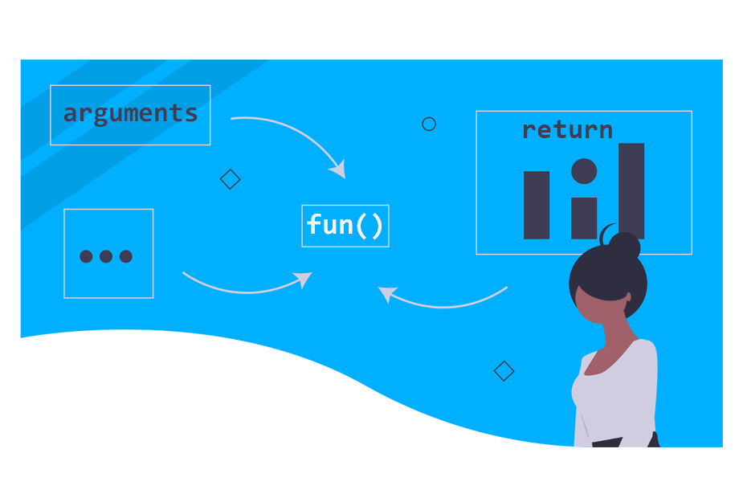
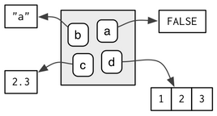
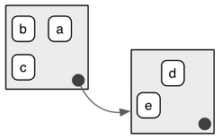
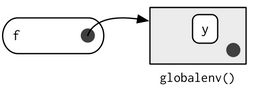
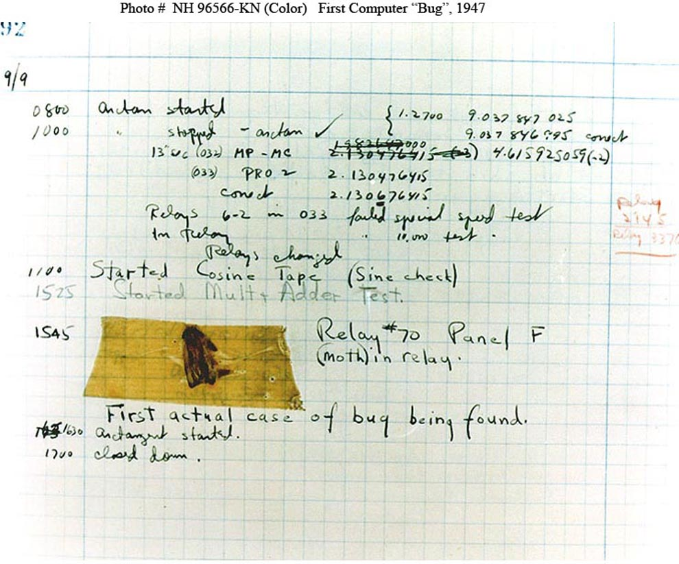

```{r setup, include=FALSE, purl=FALSE}
options(htmltools.dir.version = FALSE)
knitr::opts_chunk$set(comment = "##")
library(kableExtra)
```

```{css echo=FALSE}
.pull-left {
  float: left;
  width: 49%;
}
.pull-right {
  float: right;
  width: 49%;
}
.pull-right ~ p {
  clear: both;
}

pre code {
  white-space: pre-wrap;
}

```

# Outline

1. Writing Functions in R

2. Environments and Lazy Evaluations

3. R Coding Styles on Functions

4. Debugging Strategies

5. Testing


<font size="4">* Acknowledgement: Parts of the slides are modified from the course materials by Prof. Ryan Tibshirani, Prof. Yen-Chi Chen, and Prof. Deborah Nolan. </font>

---
class: inverse

# Part 1: Writing Functions in R

---

# Functional Programming

Functional programming in R comprises two basic types of things/objects: **data** and **functions**.

* We already discussed different data structures in R.

  - Vectors, arrays/matrices, lists, data frames, etc.
  
--

* **Functions** are some programs that turn input objects, or *arguments* (or *parameters*), into an output object or a return value (possibly with side effects), according to a definite rule.

<p align="center">

</p>

---

# Why do we need functions?

* Data types tie related values into one object.

* Functions combine related commands into one object.

--

* Good programming is writing functions to correctly and efficiently transform inputs into outputs.

  - The principle of good programming is to take a big transformation and break it down into smaller ones so that we can efficiently implement these smaller tasks (using built-in functions and/or control flows).
  
<p align="center">

</p>

---

# Function Format in R

```{r}
function_name = function(param1, param2 = "default") {
  # Body of the function
  return(output)
}
```

* `function_name` is the name of our function, i.e., what we will use to call it.

* `function()` is a build-in statement for defining a function.

--

* `param1`, `param2` are function parameters/arguments for the user to input some values. We can assign default values by setting them equal to something in the function definition.

--

* **Body** is the actual code that is executed.

* `return()` is what our function will return to the user. 

  - Note: R does not allow a function to have multiple outputs, but we can return a list.

---

# Steps in Writing a Function

- **Explain**: Describe the task in words.

- **Concrete**: Write code for a specific example.

- **Abstract**: Identify the variables and decide if they are required or should have defaults.

- **Encapsulate**: Wrap the code into a function where the parameters are the general variables.

- **Test**: Check if the function works as expected with our original data instances AND try the function on test cases with other data.

---

# Steps in Writing a Function (Example 1)

- **Explain**: Describe the task in words.

  - We want to write a function that converts a temperature value from Fahrenheit to Celsius.
  
- **Concrete**: Write code for a specific example.

  - For instance, if the current temperature is $50^{\circ}F$, then
  
```{r}
temp_fah = 50
temp_cel = (temp_fah - 32) * 5/9
cat("The corresponding Celsius value is", temp_cel, "C.")
```

---

# Steps in Writing a Function (Example 1)

- **Abstract**: Identify the variables and decide if they are required or should have defaults.

  - In this case, the function should have one input argument/parameter and one output value (with a possible message that is printed to the console).
  
- **Encapsulate**: Wrap the code into a function where the parameter is a general variable.

--

```{r}
FahToCel = function(temp_fah) {
  temp_cel = (temp_fah - 32) * 5/9
  cat("The corresponding Celsius value is", temp_cel, "C.\n")
  return(temp_cel)
}
```

---

# Steps in Writing a Function (Example 1)

- **Test**: Check if the function works as expected with our original data instances AND try the function on test cases with other data.

```{r}
temp_cel1 = FahToCel(temp_fah = 50)
temp_cel1
```

--

```{r error=TRUE}
temp_cel2 = FahToCel(temp_fah = "50F")
```

Note: Our function `FahToCel()` can't handle the non-numeric input!

---

# Steps in Writing a Function (Example 1)

Note: Our function `FahToCel()` can't handle the non-numeric input!

```{r error=TRUE}
FahToCel = function(temp_fah) {
  if(!is.numeric(temp_fah)) {
    stop("The input temperature must be a numeric value!!")
  }
  temp_cel = (temp_fah - 32) * 5/9
  cat("The corresponding Celsius value is", temp_cel, "C.\n")
  return(temp_cel)
}

temp_cel2 = FahToCel(temp_fah = "50F")
```

---

# Side Effects of A Function

A side effect of a function is something that happens during the execution of function's body, but is not returned. Examples:

* Print something out to the console, e.g., our previous function `FahToCel()`.

```{r}
temp_cel1 = FahToCel(temp_fah = 50)
```

* Generate a plot on the display.

* Save an R data file, or a PDF plot, etc.

---

# Steps in Writing a Function (Example 2)

- **Explain**: Describe the task in words.

  - We want to find several quantile values of a numeric vector.
  
- **Concrete**: Write code for a specific example.

```{r}
set.seed(123)
vec1 = rnorm(1000, mean = 0, sd = 1)
percentiles = c(0.1, 0.5, 0.95)
quantile(vec1, probs = percentiles)
```

---

# Steps in Writing a Function (Example 2)

- **Abstract**: Identify the variables and decide if they are required or should have defaults.

  - The function should have two input arguments and one output vector.
  
- **Encapsulate**: Wrap the code into a function where the parameters are the general variables.

--

```{r}
CompQt = function(vec, percentiles = c(0.25, 0.5, 0.75)) {
  if (!is.numeric(vec) | !is.numeric(percentiles)) {
    stop("The input and percentiles must be numeric!")
  }
  if (max(percentiles) > 1 | min(percentiles) < 0) {
    stop("Percentiles must all be in [0,1].")
  }
  quant = quantile(vec, probs = percentiles)
  return(quant)
}
```

---

# Steps in Writing a Function (Example 2)

- **Test**: Check if the function works as expected with our original data instances AND try the function on test cases with other data.

```{r}
CompQt(vec1, percentiles = c(0.1, 0.5, 0.95))

CompQt(vec1)
```


```{r error=TRUE}
CompQt(vec = c("2", "4", "10"))
```

---

# Steps in Writing a Function (Example 2)

- **Test**: Check if the function works as expected with our original data instances AND try the function on test cases with other data.

```{r error=TRUE}
CompQt(vec1, percentiles = c("0.1", "0.5", "0.9"))
CompQt(vec1, percentiles = c(0.1, 0.6, 1.3))
```

---

# Functions that Return Multiple Objects

R does not allow a function to have multiple outputs, but we can return a list.

* *Artificial Example*: We want to write a function that generates a sample point from a normal distribution that is greater than a threshold value. The return consists of both the sample point and the number of iterations.

--

```{r}
SampNormalThres = function(thres_val, mean = 0, sd = 1, seed = 123) {
  set.seed(seed)
  x = rnorm(1, mean = mean, sd = sd)
  iter_cnt = 1
  while (x <= thres_val) {
    x = rnorm(1, mean = mean, sd = sd)
    iter_cnt = iter_cnt + 1
  }
  res = list(samp_pt = x, num_iter = iter_cnt)
  return(res)
}
```

---

# Functions that Return Multiple Objects

R does not allow a function to have multiple outputs, but we can return a list.

* *Artificial Example*: We want to write a function that generates a sample point from a normal distribution that is greater than a threshold value. The return consists of both the sample point and the number of iterations.

```{r}
norm_pt = SampNormalThres(thres_val = 3, mean = 0, sd = 1, seed = 123)
norm_pt
```


---

# Use Our Customized Functions in `apply()`

For our customized function, we can define it beforehand and then use `apply()` as usual.

```{r}
# Recall the `state.x77` dataset that we used in Lecture 3
head(state.x77, n = 4)
```

---

# Use Our Customized Functions in `apply()`

For our customized function, we can define it beforehand and then use `apply()` as usual.

  - These usages are applicable to other functions in the `apply` family.

```{r}
# Our custom function: trimmed mean
trimmed.mean = function(v) {  
  q1 = quantile(v, prob = 0.1)
  q2 = quantile(v, prob = 0.9)
  return(mean(v[(v >= q1) & (v <= q2)]))
}

apply(state.x77, MARGIN = 2, FUN = trimmed.mean) 
```

---

# Use Our Customized Functions in `apply()`

For our customized function, we can define it beforehand and then use `apply()` as usual.

  - We can pass extra arguments to the function when using `apply()`. 

```{r}
# Our custom function: trimmed mean
trimmed.mean = function(v, p1, p2) {  
  q1 = quantile(v, prob = p1)
  q2 = quantile(v, prob = p2)
  return(mean(v[(v >= q1) & (v <= q2)]))
}

apply(state.x77, MARGIN = 2, FUN = trimmed.mean, p1 = 0.1, p2 = 0.9) 
```

---

# Anonymous Function

When applying our customized function through the `apply` family, it is sometimes more convenient to use an anonymous function.

```{r}
# Apply an anonymous function
apply(state.x77, MARGIN = 2, FUN = function(v) { 
  q1 = quantile(v, prob=0.1)
  q2 = quantile(v, prob=0.9)
  return(mean(v[(v >= q1) & (v <= q2)]))
})
```

--

- Note: One drawback of using anonymous function is that such function can only be used within the `apply()` function. On the contrary, if we define our function beforehand, we can use it in any subsequent part of the code.

---

# Anonymous Function

We can also pass extra arguments to the anonymous function when using `apply()`.

```{r}
apply(state.x77, MARGIN = 2, FUN = function(v, q1, q2) { 
  q1 = quantile(v, prob=q1)
  q2 = quantile(v, prob=q2)
  return(mean(v[(v >= q1) & (v <= q2)]))
}, q1=0.1, q2=0.9)
```

However, these extra arguments are redundant in this case. (Why?)

--

- The anonymous function can only be used within the `apply()` function, not somewhere else. It is more efficient to directly specify those values inside the function.

---
class: inverse

# Part 2: Environments and Lazy Evaluations

---

# Environments and Variable Scopes in R

- R has a special mechanism that allows us to use the same name in different places in our code and have it refer to different objects.

--

  - For example, we can create new variables in our functions without worrying if there are variables with the same names that are already defined in the work space.
  
- This mechanism relies on *environments* and the *variable scoping rules*.

---

# Environment Basics

The job of an environment is to associate, or **bind**, a set of names to a set of values. 

  - Each name points to an object stored elsewhere in memory:
  
```{r}
e = new.env()
e$a = FALSE
e$b = "a"
e$c = 2.3
e$d = 1:3

class(e)
```

<p align="center">

</p>

---

# Environment Basics

- Every name in an environment is unique.

- The names in an environment are not ordered (i.e., it doesn't make sense to ask what the first element of an environment is).

--

- Every environment has a parent, with the only exception as the **empty** environment. 

<p align="center">

</p>

- Environments have reference semantics.

---

# Special Environments

There are four special environments:

- The `globalenv()`, or global environment, is the interactive work space. This is the environment in which we normally work. The parent of the global environment is the last package that we attached with `library()` or `require()`.

- The `baseenv()`, or base environment, is the environment of the base package. Its parent is the empty environment.

```{r}
library(rlang)
env_parent(base_env())
```

---

# Special Environments

There are four special environments:

- The `emptyenv()`, or empty environment, is the ultimate ancestor of all environments, and the only environment without a parent.

- The `environment()` is the current environment.

```{r}
environment()
env_parent(environment())
```

---

# Global and Function Environments

- Global Environment contains objects that we defined or sourced into our work space.

- When we call a function, an enclosing environment is created **inside the function**, whose parent environment is the global environment in this case.

<p align="center">

</p>

```{r}
# The variables x,y,z are defined in the global environment
x = seq(1, 7, 2)
y = rep(2, 3)
z = 17
```

---

# Function Environment (Example)

```{r}
# The variables x,y,z are defined in the global environment
x = seq(1, 7, 2)
y = rep(2, 3)
z = 17

lookAt = function(x) {
  y = 3
  print(x)
  print(y)
  print(z)
}
```

```{r, eval=FALSE}
lookAt(x = c(1, 100))
```

--

```{r, echo=FALSE}
lookAt(x = c(1, 100))
```

Note: R looks for variables with that name in a sequence of environments, from the current one to its parent, grandparent, etc.

---

# Function Environment (Example)

Note: R looks for variables with that name in a sequence of environments, from the current one to its parent, grandparent, etc.

```{r}
lookAt = function(x) {
  y = 3
  print(x)
  print(y)
  print(z)
}
lookAt(x = c(1, 100))
```

In this case, R did not find `z` in the function environment defined by `lookAt`, so it went on to the next one, which is the *Global Environment*.

---

# Assignment in the Parent Environment

Recall that we can use either `=` or `<-` to assign values to variables.

If we want to assign values to variables in the parent environment, we will use `<<-`.

```{r}
y = 100
lookAt2 = function(x) {
  y = 3
  y <<- 50
  print(x)
  print(y)
}
lookAt2(x = c(1, 100))
```

```{r, eval=FALSE}
y
```

--

```{r, echo=FALSE}
y
```

---

# Finding the Environments of Objects in R

We can use `find()` function to look for the environment of an object in R.

```{r}
find("z")
find("lookAt")
```

Note: The function `lookAt()` is defined in the global environment, but its body code is executed inside a function environment.

### Useful Reference for R Environments

[Chapter 7 in Advanced R](https://adv-r.hadley.nz/environments.html) written by Hadley Wickham.

---

# Lazy Evaluation in R

**Definition:** The inputs for a function call are not evaluated until they are needed, i.e., only the needed objects in a function call will be loaded in memory and/or looked for.

--

- The lazy evaluation mechanism also appears in other functional programming languages, not just in R.

- It allows a R program to be more efficient when used interactively.

---

# Lazy Evaluation in R (Example)

```{r}
funnyMean = function(x, y = mean(x)) {
  set.seed(123)
  return(y)
}

set.seed(123)
mean(runif(4))

set.seed(123)
funnyMean(runif(4))
```

**Question:** When was the parameter `x` in the function `funnyMean()` assigned a value?

1. When we passed arguments to the function `funnyMean()`.

2. When the function `funnyMean()` returns the output.

Correct Answer: 2.
---

# Lazy Evaluation in R (Example)

```{r}
funnyMean = function(x, y = mean(x)) {
  set.seed(123)
  return(y)
}

set.seed(567)
mean(runif(4))
```

```{r eval=FALSE}
set.seed(567)
funnyMean(runif(4))
```

--

```{r echo=FALSE}
set.seed(567)
funnyMean(runif(4))
```

Note: The variable `x` in the function `funnyMean()` was NOT assigned a value until the program reached the line where `x` first appeared. In this case, it is when the function `funnyMean()` returns the output.

---

# Lazy Evaluation in R (Advanced Example)

```{r}
funnyMean2 = function(x, y = mean(x)) {
  if (any(is.na(x))) {
    warning("Found NA.")
  }
  set.seed(123)
  return(y)
}

set.seed(123)
mean(runif(4))
```

```{r}
set.seed(567)
mean(runif(4))
```

---

# Lazy Evaluation in R (Advanced Example)

```{r}
funnyMean2 = function(x, y = mean(x)) {
  if (any(is.na(x))) {
    warning("Found NA.")
  }
  set.seed(123)
  return(y)
}
```

What is the output of the following code? Why?

```{r eval=FALSE}
set.seed(567)
funnyMean2(runif(4))
```

--

```{r echo=FALSE}
set.seed(567)
funnyMean2(runif(4))
```

Note: This example also shows that it is not a good idea to set the seed inside a function, unless it is asked to do that via an input parameter.

Reference: [Section 6.5 in Advanced R](https://adv-r.hadley.nz/functions.html#lazy-evaluation) written by Hadley Wickham.

---
class: inverse

# Part 3: R Coding Styles on Functions

---

# Function Names

Strive to have function names based on verbs. Otherwise, we apply standard variable name style guidelines in Lecture 2!

```{r, eval = FALSE}
# Good
add_row() # snake case
addRow() # camel case
permute()

# Bad
row_adder()
permutation()
```

---

# Long Lines

There are two options if the function name and definition can't fit on a single line:

- **Function-indent:** place each argument on its own line, and indent to match the opening.

```{r}
long_function_name = function(a = "a long argument",
                              b = "another argument",
                              c = "another long argument") {
  # As usual code is indented by two spaces.
  x = paste(a, b, c)
  return(x)
}
```

---

# Long Lines

There are two options if the function name and definition can't fit on a single line:

- **Double-indent:** Place each argument of its own double indented line.

```{r}
long_function_name = function(
    a = "a long argument",
    b = "another argument",
    c = "another long argument") {
  # As usual code is indented by two spaces.
  x = paste(a, b, c)
  return(x)
}
```

---

# `return()` Statement

Only use `return()` for early returns. Otherwise, rely on R to return the result of the last evaluated expression.

```{r}
# Good
find_abs = function(x) {
  if (x > 0) {
    return(x)
  }
  x * -1
}

# Good
add_two = function(x, y) {
  x + y
}

# Bad
add_two = function(x, y) {
  return(x + y)
}
```

---

# Useful References for R Coding Style Guide

Again, we can refer to the following references for making our code tidy and understandable.

* [Tidyverse Style Guide](https://style.tidyverse.org/) by Hadley Wickham.

* [Google Style Guide](https://google.github.io/styleguide/Rguide.html).

---
class: inverse

# Part 4: Debugging Strategies

---

# Bugs in Computer Programs

- Definition of bugs: "an unexpected defect, fault, flaw, or imperfections."

--

- On September 9, 1947, a team of computer scientists and engineers reported the world’s first computer bug.

<p align="center">

</p>

Cited from [Sep 9, 1947 CE: World’s First Computer Bug](https://education.nationalgeographic.org/resource/worlds-first-computer-bug/) by National Geographic.

---

# Debugging: What and Why?

Debugging is a process of locating, understanding, and removing bugs from our code.

--

Why should we learn about debugging?

- The truth is that we have to debug, because we are not perfect (none of us are!) and no one can write perfect code in the first place.
    
- Debugging is frustrating and time-consuming, but it is essential.

- We should always write code that is easier to debug, even if it takes more time: use lots of comments, choose meaningful variable names, etc.

We now provide some useful guidelines for debugging.

---

# Step 1: Utilize the Internet

When we see an error code that we don't understand, always Google it or ask ChatGPT!

--

Seriously? 

Yes, the error message that we saw might already be asked or solved by other people on some online forums/posts.

---

# Step 2: Reproduce the Bug

Always ask ourselves the following two questions during the debugging:

- Can we produce it repeatedly when re-running the same code, with the same input values?

- And if we run the same code in a clean copy of R, does the same thing happen?

--

We should also remove as much code and simplify as much data as possible when trying to reproduce the bug.

- Example: if our function breaks with a large data matrix of real-world data, then consider creating a toy matrix, says, a $3\times 3$ matrix of 1's.

---

# Step 3: Locate the Bug

Figure out the exact line or portion of the code went wrong.

* This is the most difficult part of debugging!

--

* Luckily, there are some R build-in functions that can assist us to locate the bugs: `traceback()`, and `cat()`, `print()` are also very helpful.

* We can also leverage the interactive debugging tool triggered by `browser()` in R.

---

# `traceback()` Function

Calling `traceback()` after an error can trace back through all the function calls leading to the error.

```{r error=TRUE}
f <- function(a) g(a)
g <- function(b) h(b)
h <- function(c) i(c)
i <- function(d) {
  if (!is.numeric(d)) {
    stop("`d` must be numeric", call. = FALSE)
  }
  d + 10
}
f(5)

f("a")
```

---

# `traceback()` Function

<p align="center">

</p>

```{r, eval = FALSE}
traceback()
```

```{r echo=FALSE}
saveTraceback <- local({
  savedTraceback <- NULL
  saver <- function(e) {
    calls <- sys.calls()
    deparsed <- lapply(calls, deparse)
    deparsed <- deparsed[-length(deparsed) + 0:1] # leave off last 2
    lastjunk <- max(grep("withCallingHandlers", deparsed))
    deparsed <- deparsed[-seq_len(lastjunk)]
    savedTraceback <<- deparsed
  }
  function(expr)
    withCallingHandlers(expr, error = saver)
})

traceback <- function() {
  base::traceback(rev(environment(saveTraceback)$savedTraceback))
}
```


```{r, echo = FALSE, error=TRUE}
saveTraceback({f("a")})
traceback()
```

Or, we can just click the "`Show Traceback`" button after the code chunk in R markdown.

---

# Step 3: Locate the Bug

- The `traceback()` function can only locate a potential portion of the code that contains bugs.

--

- Using `print()` or `cat()` function to print the values of some suspicious variables and lines of the code helps us further identify the errors. Here is a quote from *stackoverflow*:

<p align="center">
<i>
I've been a software developer for over twenty years... I've never had a problem I could not debug using some careful thought, and well-placed debugging print statements. Many people say that my techniques are primitive, and using a real debugger in an IDE is much better. Yet from my observation, IDE users don't appear to debug faster or more successfully than I can, using my stone knives and bear skins.
</i>
</p>

---

# Step 3: Locate the Bug

- The `traceback()` function can only locate a potential portion of the code that contains bugs.

- Using `print()` or `cat()` function to print the values of some suspicious variables and lines of the code helps us further identify the errors.

```{r error=TRUE}
i <- function(d) {
  print(d)
  if (!is.numeric(d)) {
    stop("`d` must be numeric", call. = FALSE)
  }
  d + 10
}
f("a")
```

---

# Step 3: Locate the Bug

- The `traceback()` function can only locate a potential portion of the code that contains bugs.

- Using `print()` or `cat()` function to print the values of some suspicious variables and lines of the code helps us further identify the errors. 

```{r error=TRUE}
i <- function(d) {
  cat("The value of input parameter d is:", d, "\n")
  cat("The class of input parameter d is:", class(d), "\n")
  if (!is.numeric(d)) {
    stop("`d` must be numeric", call. = FALSE)
  }
  d + 10
}
f("a")
```

---

# Step 3: Locate the Bug

- The `traceback()` function can only locate a potential portion of the code that contains bugs.

- Using `print()` or `cat()` function to print the values of some suspicious variables and lines of the code helps us further identify the errors. 

- The main downside of using `print()` or `cat()` is that the output messages can get messy quickly if we use multiple print statements, and we can't further investigate the object. However, many bugs come down to typos or other trivial errors, and printing statements are often all we need!

---

# `browser()`: An Interative Debugging Tool

Sometimes, it may not be enough to just use `print()` statements to locate a bug. We can get more information and interact with our customized function using `browser()`, an interactive debugging tool.

```{r eval=FALSE}
my_fun = function(arg1, arg2, arg3) {
  # Some initial code 
  browser()
  # Some final code
}
```

Once execution gets to the line with `browser()`, we will enter an interactive debugging mode.

<!--
Within RStudio, we can also get right to an interactive debugging tool by clicking the "`Rerun with Debug`" button.
-->

---

# `browser()`: An Interative Debugging Tool

While in the interactive debugging mode triggered by `browser()`, we can type any normal R code into the console, to be executed within in the function environment. In other words, we can, e.g., investigate the values of variables defined in the function.

We can also type the following letter in the interative console:

- "n" (or simply return) to execute the next command.

- "s" to step into the next function.

- "f" to finish the current loop or function.

- "c" to continue execution normally.

- "Q" to stop the function and return to the console.

Note: To print any variables named `n, s, f, c`, or `Q`, defined in the function environment, use `print(n)`, `print(s)`, etc.

---

# `browser()`: An Interative Debugging Tool

```{r eval=FALSE}
# BROWSER DEMO
f <- function(a) g(a)
g <- function(b) h(b)
h <- function(c) i(c)
i <- function(d) {
  browser()
  if (!is.numeric(d)) {
    stop("`d` must be numeric", call. = FALSE)
  }
  d + 10
}
f("a")
```

---

# `debug()`: Debug A Function

- If we want to enter the debugging mode for a function within a package, it is impossible to insert a `browser()` function. 

- Even for our own functions, it may be more convenient to debug the entire function rather than edit the source code. Here comes the `debug()` function.

--

- When a function is in the debug mode, it will remain in the debug mode until we call `undebug()`.

```{r eval=FALSE}
# DEBUG DEMO
debug(lm)
lm(mpg ~ wt, data = mtcars)
debug(f)
f("a")
undebug(lm)
undebug(f)
```

Note: We can also use `debugonce()`, which will automatically "undebug" the function as soon as we exit the interactive debugging.

---

# Debugging Resources


* [Advanced R Debugging - Hadley Wickham ](https://adv-r.hadley.nz/debugging.html).

* [What they Forgot to Teach You About R - Jennifer Bryan and Jim Hester](https://rstats.wtf/debugging-r-code.html).

* [Debugging Techniques in RStudio - Amanda Gadrow](https://resources.rstudio.com/wistia-rstudio-conf-2018-2/debugging-techniques-in-rstudio-amanda-gadrow-4).

* [Debugging with RStudio Article - Jonathan McPherson](https://support.rstudio.com/hc/en-us/articles/200713843).

* [Introduction to debugging in R and RStudio - Jim Hester](https://www.jimhester.com/talk/2019-crug-debugging/).

<br/>

.center[[Cheatsheet](https://github.com/ajmcoqui/debuggingRStudio/blob/b70a3575a3ff5e7867b05fb5e84568abba426c4b/RStudio_Debugging_Cheatsheet.pdf)]

---
class: inverse

# Part 5: Testing

---

# What is testing?

Testing is the systematic writing of additional code to ensure that our functions behave properly. We will focus on two aspects:

- **Assertions:** checking if our function is being passed in proper inputs.

- **Unit tests:** checking if our function does the right thing in basic cases.

--

There are various benefits of testing:

- Enables us to catch problems early (easier debugging).

- Provides natural documentations of our functions.

- Encourages us to write simpler functions via re-factoring.

Of course, the testing required us to spend more time upfront, but it is often worth it (because it saves the time spent on debugging later).

---

# Assertions

Assertions are checks to ensure that the inputs to our function are properly formatted.

--

- For example, if our function expects a numeric value/vector, then we first check that it is actually a numeric value/vector (and not a character, say).

--

- An assertion stops the execution of the function as soon as it encounters an unexpected input.

```{r error=TRUE}
FahToCel = function(temp_fah) {
  if(!is.numeric(temp_fah)) {
    stop("The input temperature must be a numeric value!!")
  }
  temp_cel = (temp_fah - 32) * 5/9
  cat("The corresponding Celsius value is", temp_cel, "C.\n")
  return(temp_cel)
}
temp_cel2 = FahToCel(temp_fah = "50F")
```

---

# Assertions

Equivalently, we can also use `assert_that()` function in the `assertthat` package to make assertions.

  - It allows us to write customized and meaningful error messages.

```{r error=TRUE, message=FALSE}
FahToCel = function(temp_fah) {
  require(assertthat)
  assert_that(is.numeric(temp_fah), 
              msg = "The input temperature must be a numeric value!!")
  temp_cel = (temp_fah - 32) * 5/9
  cat("The corresponding Celsius value is", temp_cel, "C.\n")
  return(temp_cel)
}
temp_cel2 = FahToCel(temp_fah = "50F")
```

---

# Unit Tests

Unit tests are used to check that our code passes basic sanity checks at various stages of development. 

--

- We can use `test_that()` function in the `testthat` package to do unit tests. The code structure for the `test_that()` function is:

```{r error=TRUE, message=FALSE}
library(testthat)
test_that("Testing if the input value is numeric", {
  input = 50
  expect_true(is.numeric(input))
  FahToCel(temp_fah = input)
})
```

---

# Unit Tests

We can use `test_that()` function in the `testthat` package to do unit tests. The code structure for the `test_that()` function is:

```{r error=TRUE}
library(testthat)
test_that("Testing if the input value is numeric", {
  input = "50F"
  expect_true(is.numeric(input))
  FahToCel(temp_fah = input)
})
```

---

# Summary

- An R function is a formal encapsulation of a block of R code, which generally makes our code easier to understand, to work with, and to modify.

- A function's structure consists of three main parts: inputs, body, and output.

- R allows us to specify default values for any of the inputs. However, R doesn't allow us to return multiple outputs, but we can return a list.

- The job of an R environment is to bind a set of names to a set of values. 

- Lazy evaluation is critical to making R programs more efficient.

---

# Summary

- Debugging involves diagnosing our code when we encounter an error or unexpected behavior.
  - Step 0: Reproduce the error;
  - Step 1: Characterize the error;
  - Step 2: Localize the error;
  - Step 3: Modify the code.

- `traceback()`, `cat()`, `print()` are manual debugging tools, while `browser()` is an interactive debugging tool.

- Testing involves writing additional code to ensure our functions behave as expected.

Submit Lab 5 on Gradescope by the end of Thursday (February 22). Highly recommend you starting Lab 5 problems before the midterm exam (February 15)!!
