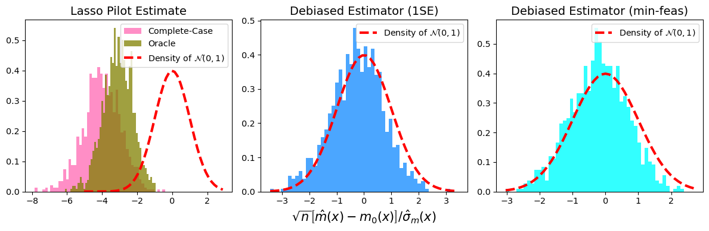
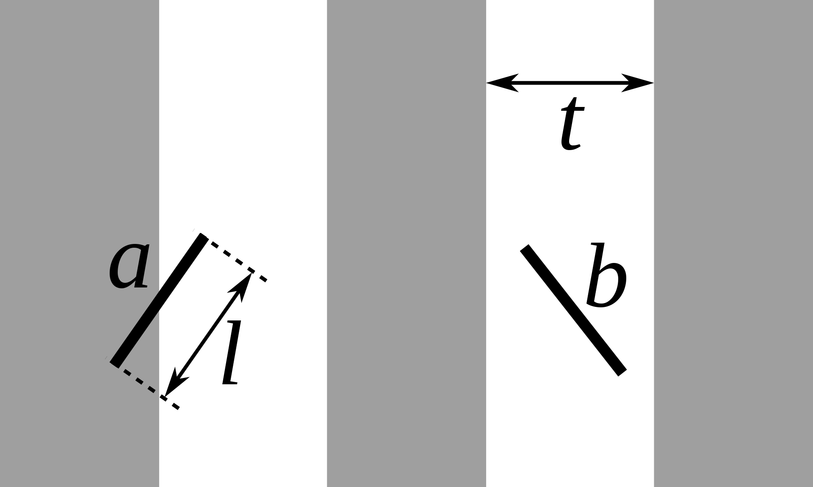
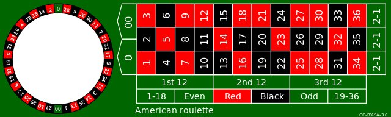
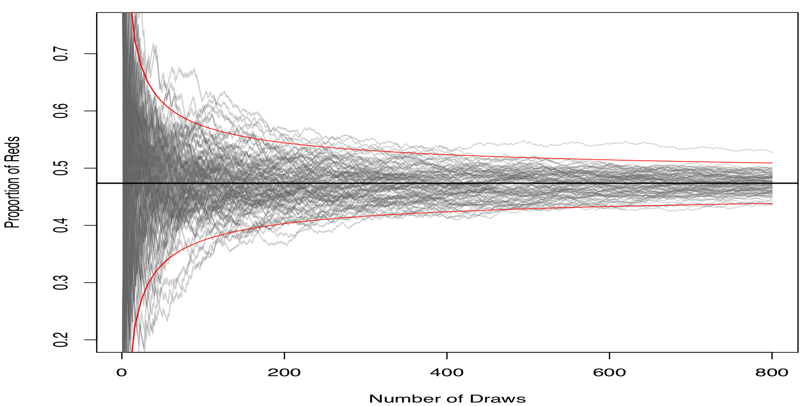
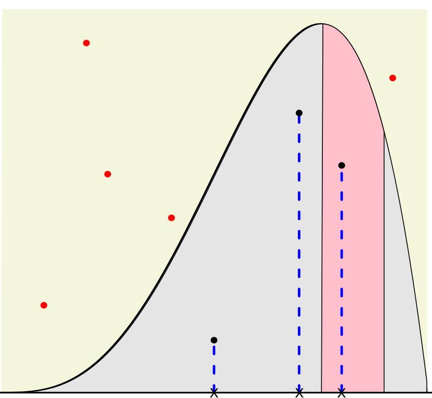
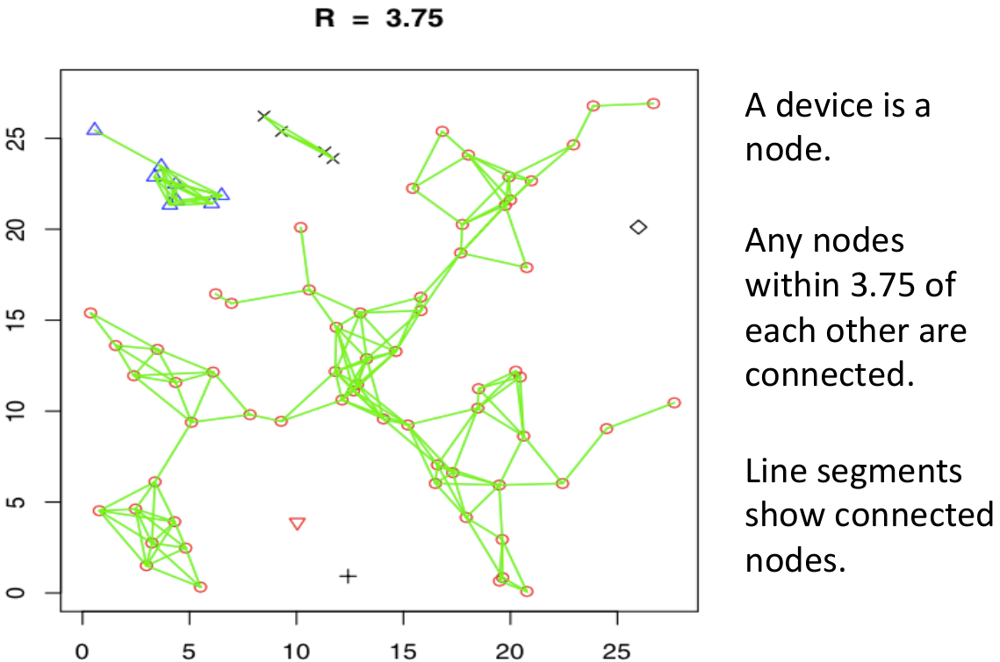
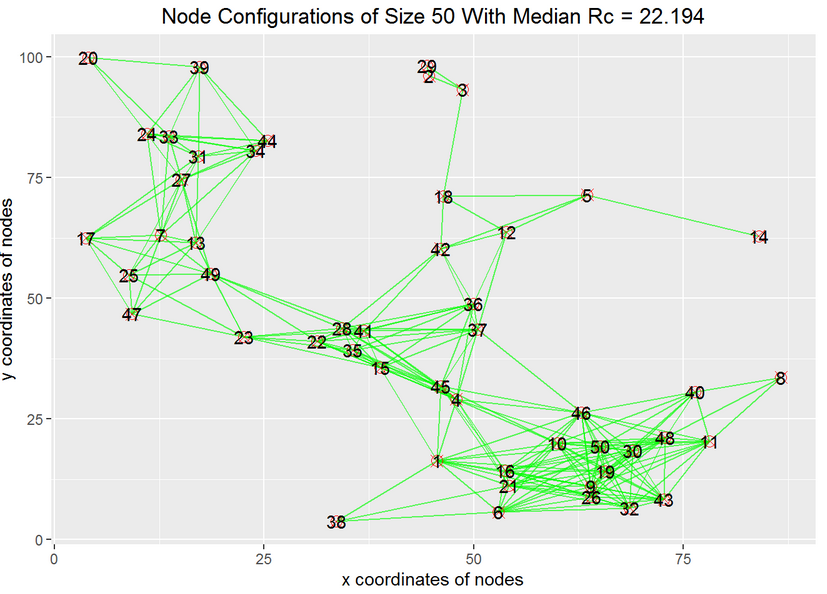
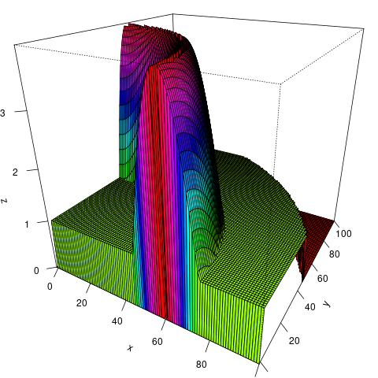
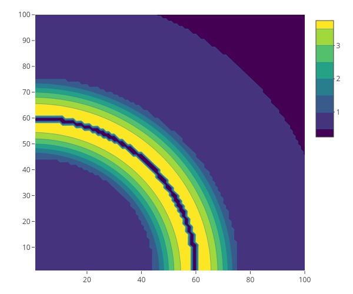

```{r setup, include=FALSE, purl=FALSE}
options(htmltools.dir.version = FALSE)
knitr::opts_chunk$set(comment = "##")
library(kableExtra)
```

# Outline

1. Simulation Basics

2. Pseudo-Randomness and Seeds

3. Simulation Tools in R

4. Integral Approximation via Monte Carlo Methods

5. Distribution Estimation and Sampling via Monte Carlo Methods

6. Ad hoc Network (Final Project)

<font size="4">* Acknowledgement: Parts of the slides are modified from the course materials by Prof. Ryan Tibshirani, Prof. Yen-Chi Chen, Prof. Deborah Nolan. </font>

---
class: inverse

# Part 1: Simulation Basics

---

# What is Simulation?

- A simulation imitates the operation of real-world processes or systems with the use of a computer software. 

--

  - In most cases, simulation involves creating data by (pseudo-)random number generators and using that data to study a problem of interest.
  
  - Such simulation process is also known as the [Monte Carlo Methods](https://en.wikipedia.org/wiki/Monte_Carlo_method), whose name originates from the Monte Carlo Casino in Monaco.
  
--
  
Can you think of any examples from this or other classes when you have used simulations to answer a question? 

---

# An Example of Simulation in Cosmology

<p align="center">

</p>
<p align="center">
Exterior view of the dark matter density distribution in the full simulation box at redshift zero for <a href="https://www.illustris-project.org/">Illustris Simulation Project</a>.
</p>

---

# Why Do We Need Simulations?

To answer some scientific questions, we often need data evidence and experimental results to support our findings.

--

- However, observational data are generally expensive to obtain.

--

- On the contrary, it is relatively at a lower cost to generate synthetic data and implement a computer programming to conduct experiments.

- In addition, simulations sometimes can be easier and more realistic than hand calculations.

---

# Concrete Motivations for Simulations

A well-designed simulation can provide a solid estimator to statistical quantities and their uncertainty measures that are analytically difficult to obtain the exact answer.

--

- What is the probability of flipping 10 fair coins and getting 9 heads and 1 tails?

  - We can compute by hand as ${10 \choose 9} \left(\frac{1}{2}\right)^9 \left(1-\frac{1}{2}\right) \approx 0.0097656$.
  
--
  
  - Nevertheless, the simulation-based approximation could be more convenient.
  
```{r}
set.seed(123)
coins = rbinom(n = 5000000, size = 10, prob = 0.5)
mean(coins == 9)
```

---

# Concrete Motivations for Simulations

It also helps evaluate the performance of our proposed statistical method, such as its asymptotic normality and time efficiency.

<p align="center">

</p>

--

Simulation can also lead to a more efficient hypothesis testing or other statistical procedures than the original one.

  - Example: The Monte Carlo alternative to the [permutation test](https://en.wikipedia.org/wiki/Permutation_test).

---

# Concrete Motivations for Simulations
  
Simulation also provides a feasible way to generate random samples from a "partially known" probability distribution.

<p align="center">

</p>
<p align="center">
<font size="5"> <a href="https://en.wikipedia.org/wiki/Rejection_sampling">Acceptance-Rejection Sampling</a></font>
</p>

---

# Concrete Motivations for Simulations

Does simulation only appear in Statistics? Can other fields benefit from the usage of simulation?

--

- Monte Carlo methods have been developed into a technique called [Monte Carlo tree search](https://en.wikipedia.org/wiki/Monte_Carlo_tree_search) that is useful for searching for the best move in a game.

<p align="center">

</p>

- The Monte Carlo tree search has been successfully combined with deep neural networks to tackle the multiple board games, such as Go, Chess, Texas hold 'em, etc. See the introduction to [AlphaGo](https://www.deepmind.com/research/highlighted-research/alphago).

---

# Overview of Monte Carlo Simulations

A typical Monte Carlo simulation often follows a procedure as:

1. Define a domain of possible inputs.

2. Generate inputs randomly from a probability distribution over the domain.

3. Perform a deterministic computation on the inputs.

4. Aggregate the results.

Do you know what the first known Monte Carlo simulation is?

--

<p align="center">

</p>
<p align="center">
<font size="4"> <a href="https://en.wikipedia.org/wiki/Buffon%27s_needle_problem">Buffon's Needle Problem</a> for Estimating $\pi$</font>
</p>

---

# An Example of Monte Carlo Simulation

```{r}
set.seed(123)
n = 400000
x = runif(n, min = 0, max = 1)
y = runif(n, min = 0, max = 1)
mean(x^2 + y^2 < 1) * 4
```

<p align="center">

</p>

---
class: inverse

# Part 2: Pseudo-Randomness and Seeds

---

# Random Number Generation in R

Most of the simulations require us to generate some random observations from a probability distribution.

--

Recall from Lab 2 that we have the utility functions:

- `rnorm()`: generates the normally distributed random variables/observations.

- `rbinom()`: generates the random variables from a binomial distribution.

We can replace "norm" or "binom" with the name of another distribution, and the same function applies, e.g., "t", "exp", "gamma", "chisq", "pois", etc. 

---

# How Does R Generate Random Numbers?

There are no computer software that can generate completely random numbers, neither did R.

--

Instead, R uses a **pseudo-random number generator**:

- It starts with a **seed** and an **algorithm** (i.e., a function).

- The **seed** is input into the algorithm, and a (pseudo-random) number is returned. This number is then plugged into the algorithm, and the next (pseudo-random) number is created.

- The **algorithm** guarantees that the output numbers behave like random values.

---

# Linear Congruential Generator

One example of such an algorithm is the **Linear Congruential Generator**, which uses modular arithmetic to generate "random" numbers:

- Based on two parameters $m$ and $b$ and the initial value $x_0$ (i.e., the seed), the first "random number" $x_1$ is generated as follows:
$$x_1 = b \cdot x_0 \mod m.$$
- The subsequent numbers are generated recursively,
$$x_{n+1} = b \cdot x_n \mod m$$
for $n=1,2,...$.

---

# Linear Congruential Generator (Small $m$)

```{r fig.align='center', fig.height=5}
LinCongGen = function(n, seed, m = 64, b = 3){
  pseudo_num = numeric(n+1)
  pseudo_num[1] = seed
  for(i in 1:n){
    pseudo_num[i+1] = (pseudo_num[i]*b) %% m
  }
  return(pseudo_num[2:(n+1)])
}
n = 1000
seed = 17
rand_num = LinCongGen(n, seed, m = 64, b = 3)
plot(c(seed, rand_num[1:(n-1)]), rand_num, xlab = "Input Numbers", ylab = "Output Numbers")
```

---

# Linear Congruential Generator (Large $m$)


```{r fig.align='center', fig.height=5}
n = 1000
seed = 17
rand_num = LinCongGen(n, seed, m = 2^32, b = 3)
plot(c(seed, rand_num[1:(n-1)]), rand_num, xlab = "Input Numbers", ylab = "Output Numbers")
```

The output numbers are still not "random" enough.

---

# Linear Congruential Generator (Large $m$, Large $b$)


```{r fig.align='center', fig.height=5.5}
n = 1000
seed = 17
rand_num = LinCongGen(n, seed, m = 2^32, b = 69069)
plot(c(seed, rand_num[1:(n-1)]), rand_num, xlab = "Input Numbers", ylab = "Output Numbers")
```

---

# Pseudo-Random Number Generator in R

- Studying algorithms of generating more "random" numbers is an interesting research area in its own right.

--

- The default algorithm in R (and in nearly all software languages) is called the "Mersenne-Twister".

- Type `?Random` in our R console to read more about this (and to read how to change the algorithm used for pseudo-random number generation, which we should never really have to do that).

---

# An Important Role of the "Seed"

One of the biggest advantages of pseudo-random number generators is that we can have some controls over the simulation results by setting the **seed** beforehand.

- The seed is just an integer, and can be set with `set.seed()`.

- It is very important to set our seed in the **proper** location of our code to make our simulation results _valid_ and _reproducible_.

<p align="center">

</p>

---

# Demonstrations of `set.seed()`

If we don't set the seed, it is not surprising to see different draws each time we call any random number generating functions.

```{r}
mean(rnorm(6))

mean(rnorm(6))
```

--

```{r}
set.seed(123)
mean(rnorm(6))

set.seed((123))
mean(rnorm(6))
```

---

# Demonstrations of `set.seed()`

Each time the seed is set, the same sequence follows (indefinitely).

```{r}
set.seed(123)
rnorm(3); rnorm(2); rnorm(1)
```

```{r}
set.seed(123)
rnorm(3); rnorm(2); rnorm(1)
```


---
class: inverse

# Part 3: Simulation Tools in R

---

# `sample()` Function

The `sample()` function takes a sample of the pre-specified size from the elements of `x` using either with or without replacement.

```{r}
sample(letters, size = 10, replace = FALSE, prob = NULL)
```

--

We can make the sampling results reproducible by setting the seed.

```{r}
set.seed(123)
sample(letters, size = 10, replace = FALSE, prob = NULL)
```

---

# Betting Red in Roulette

What is the chance that a spin of the Roulette wheel lands on red?

<p align="center">

</p>

- There are 38 pockets in the Roulette wheel:
  
  - 18 blacks, 18 reds, and 2 greens.

--

- We can estimate the chance by simulating the Roulette wheel many, many, many times via the `sample()` function in R:
$$\frac{\# \text{ reds}}{\# \text{ draws}} \approx \text{Chance of reds}.$$

---

# Betting Red in Roulette

What is the chance that a spin of the Roulette wheel lands on red?

```{r}
rou_vec = c(rep(c("black", "red"), each = 18), rep("green", 2))

set.seed(123)
samp_res = sample(rou_vec, size = 10000, replace = TRUE)
mean(samp_res == "red")
cat("The estimation error is ", abs(mean(samp_res == "red") - 18/38), ".", sep = "")
```

---

# Betting Red in Roulette

As the number of draws increases, the proportions of reds becomes closer to the true probability $\frac{18}{38}$.

```{r}
set.seed(123)
samp_res = sample(rou_vec, size = 1000000, replace = TRUE)
cat("The estimation error is ", abs(mean(samp_res == "red") - 18/38), ".", sep = "")
```

--

This reveals the principle of **Law of Large Numbers** in Statistics:
$$\frac{1}{n} \sum_{i=1}^n X_i \to p \quad \text{ in probability } \quad \text{or even} \quad \text{ almost surely},$$
where $p$ is the probability of lands on reds in the Roulette wheel, and 
$$
X_i = 
\begin{cases}
1 & \text{ when landing on reds for the i-th draw},\\
0 & \text{ when landing on other colors for the i-th draw}.\\
\end{cases}
$$

---

# Betting Red in Roulette

By increasing the sample size, the precision of the estimated probability of the Roulette wheel landing on reds can be improved.

- However, for any fixed sample size $n$, what are the typical deviations (or standard errors) from the average of these sample proportions of reds?

--

  - To quantify these deviations (or standard errors), we need to repeat the previous sampling procedure $B$ times, where $B$ is sufficiently large.
  
  - In R, such repetitions can be handled by the `replicate()` function.

---

# `replicate()` Function

Let's fix the sample size $n$ to be 10000 and repeat the entire procedure of estimating the probability of the Roulette wheel landing on reds $B=3000$ times.

```{r}
set.seed(123)   ## We should set the seed here!!
rep_means = replicate(3000, 
                      mean(sample(rou_vec, size = 10000, replace = TRUE) == "red"))
```

Note: The `replicate` function is a wrapper for the common use of `sapply()` for repeated evaluation of an expression.

--

```{r}
set.seed(123)   ## We should set the seed here!!
rep_means2 = replicate(3000, {
  samp_res = sample(rou_vec, size = 10000, replace = TRUE)
  mean(samp_res == "red")
})
all.equal(rep_means, rep_means2)
```

---

# Distribution of the Sample Proportions

```{r fig.align='center', fig.width=7, fig.height=6}
hist(rep_means, breaks = 30, freq = FALSE, xlab = "Sample Proportion of Reds", 
     main = "Histogram of the Sample Proportions")
```

---

# Rate of Convergence of the Sample Proportions

How quickly do the sample proportions approach the true probability $\frac{18}{38}$ as the sample size $n$ increases?

--

<p align="center">

</p>

Note: The red curves plot the trends $\pm \sqrt{\frac{p(1-p)}{n}}$.

---

# Distribution of the Sample Proportions

```{r fig.align='center', fig.width=7, fig.height=5, echo=FALSE}
hist(rep_means, breaks = 30, freq = FALSE, xlab = "Sample Proportion of Reds", 
     main = "Histogram of the Sample Proportions")
```

- The distribution of the sample proportions of reds looks roughly like the normal distribution with

  - Center: `mean`(sample proportions) $\approx \frac{18}{38}$.
  
  - Spread: `sd`(sample proportions) $\approx \sqrt{\frac{p(1-p)}{n}}$.
  
---

# Distribution of the Sample Proportions

```{r fig.align='center', fig.width=7, fig.height=5, echo=FALSE}
hist(rep_means, breaks = 30, freq = FALSE, xlab = "Sample Proportion of Reds", 
     main = "Histogram of the Sample Proportions")
```

This reveals the **Central Limit Theorem** in Statistics:
$$\frac{\sqrt{n} (\bar{X}_n - p) }{\sqrt{p(1-p)}} \to N(0,1) \quad \text{ in distribution},$$
where $\bar{X}_n = \frac{1}{n} \sum_{i=1}^n X_i$.

---

# Simulation Example: Drug Effect Model

Suppose that we had a model to quantify how a drug will reduce the tumor size of a patient in percentage.

--

- A patient who was not given the drug experiences the reduction of tumor size in percentage as:
$$X_{\text{no drug}} \sim 100 \cdot \text{Exponential}(\text{mean}=R), \quad R\sim \text{Uniform}(0,1).$$

- A patient who was given the drug experiences a reduction of tumor size in percentage as:
$$X_{\text{no drug}} \sim 100 \cdot \text{Exponential}(\text{mean}=2).$$

Note: Here, $\text{Exponential}(\text{mean}=\lambda)$ stands for the exponential distribution whose mean is $\lambda$, and $\text{Uniform}$ denotes the uniform distribution.

---

# Simulation Example: Drug Effect Model

Given such a drug effect model, our scientist collaborators ask us: 

- How many patients would we need to have in each group (drug, no drug), in order to reliably see that the average reduction in tumor size is large?

This question can be answered by complicated calculations or the _simulation_ methods that we learned.

--

```{r}
# Simulate, supposing 60 subjects in each group 
set.seed(123)
n = 60 
mu_drug = 2
mu_nodrug = runif(n, min = 0, max = 1)
x_drug = 100*rexp(n, rate = 1/mu_drug) 
x_nodrug = 100*rexp(n, rate = 1/mu_nodrug)
```

---

# Simulation Example: Drug Effect Model

```{r fig.align='center', eval=FALSE}
# Find the range of all the measurements together
x_range = range(c(x_nodrug, x_drug))
breaks = seq(min(x_range), max(x_range), length=20)

# Overlaid the histograms of no drug and drug measurements
hist(x_nodrug, breaks = breaks, probability=TRUE, xlim = x_range, col = "lightgray", xlab = "Percentage reduction in tumor size", main = "Comparison of tumor reduction")
hist(x_drug, breaks = breaks, probability = TRUE, col = rgb(1,0,0,0.2), add = TRUE) 

# Draw estimated densities on top
lines(density(x_nodrug), lwd=3, col=1)
lines(density(x_drug), lwd=3, col=2)
legend("topright", legend=c("No drug","Drug"), lty=1, lwd=3, col=1:2)
```

---

# Simulation Example: Drug Effect Model

```{r fig.align='center', echo=FALSE}
# Find the range of all the measurements together
x_range = range(c(x_nodrug, x_drug))
breaks = seq(min(x_range), max(x_range), length=20)

# Overlaid the histograms of no drug and drug measurements
hist(x_nodrug, breaks = breaks, probability=TRUE, xlim = x_range, col = "lightgray", xlab = "Percentage reduction in tumor size", main = "Comparison of tumor reduction")
hist(x_drug, breaks = breaks, probability = TRUE, col = rgb(1,0,0,0.2), add = TRUE) 

# Draw estimated densities on top
lines(density(x_nodrug), lwd=3, col=1)
lines(density(x_drug), lwd=3, col=2)
legend("topright", legend=c("No drug","Drug"), lty=1, lwd=3, col=1:2, cex = 1.5)
```

---

# Simulation Example: Drug Effect Model

A single simulation is generally not trustworthy, and we need to repeat the above simulation for many times. Here is a guideline:

1. Write a function to complete a single run of our simulation.

2. Set the seed to ensure reproducibility.

3. Use an iteration (via `replicate()` function) to run our simulation over and over again.

4. Save our simulation result as in `.rdata` or other format files.

We will revisit this drug effect model example in Lab 6.

---
class: inverse

# Part 4: Integral Approximation via Monte Carlo Methods

---

# Integration

The Riemann integral of the function $f$ on the interval $[a,b]$ is the following limit, provided it exists:
$$\int_a^b f(x) dx = \lim_{\max \Delta x_i \to 0} \sum_{i=1}^n f(z_i) \Delta x_i,$$
where the numbers $x_0,x_1,...,x_n$ satisfy $a=x_0\leq x_1 \leq \cdots \leq x_n=b$, where $\Delta x_i = x_i-x_{i-1}$ for each $i=1,2,...,n$ and $z_i$ is an arbitrary number in the interval $[x_{i-1}, x_i]$.

<p align="center">

</p>

---

# Fundamental Theorem of Calculus

- If $f\in \mathcal{C}[a,b]$ and we define $F(x)=\int_a^x f(t) dt$, then $F'(x)=f(x)$ for any $x\in (a,b)$. Hence, $F$ is an anti-derivative of $f$.

- If $f\in \mathcal{C}[a,b]$ and $F$ is any anti-derivative of $f$, then 
$$\int_a^b f(x) dx = F(x)\Big|_{x=a}^b = F(b) - F(a).$$

<p align="center">

</p>

---

# Integral Approximation

Assume that we want to evaluate the following integral:
$$\int_0^1 e^{-x^3} dx.$$

--

- There are no analytic anti-derivative of the function $e^{-x^3}$.

- Traditionally, we will use the Riemann sum to approximate this integral as:
$$\sum_{j=1}^m e^{-z_j^3} \Delta x_j,$$
where the numbers $x_0,x_1,...,x_n$ satisfy $a=x_0\leq x_1\leq \cdots \leq x_n=b$ with $\Delta x_j = x_j-x_{j-1}, i=1,...,n$ and $z_j$ is arbitrarily chosen in the interval $[x_{j-1}, x_j]$.

---

# Monte Carlo Integration

The Monte Carlo methods give us an alternative approach to evaluate this integral $\int_0^1 e^{-x^3} dx$.

--

- Note that we can rewrite this integral as:
$$\int_0^1 e^{-x^3} dx = \int_0^1 e^{-x^3} \cdot 1 \,dx = \mathbb{E}\left(e^{-U^3} \right),$$
where $U$ is a $\text{Uniform}[0,1]$ distributed random variable.

- Hence, we can generate random samples $U_1,...,U_n \sim \text{Uniform}[0,1]$ and then compute that
$$\frac{1}{n} \sum_{i=1}^n e^{-U_j^3}.$$

---

# Monte Carlo Integration

- By Law of Large Number, we know that
$$\frac{1}{n} \sum_{i=1}^n e^{-U_j^3} \to \mathbb{E}\left(e^{-U_1^3}\right) = \int_0^1 e^{-x^3} dx.$$

```{r}
set.seed(123)
n = 100000
x = runif(n, min = 0, max = 1)
mean(exp(-x^3))
```

---

# Importance Sampling

More generally, we consider evaluating the following quantity:
$$I = \mathbb{E}\left[g(X) \right] = \int g(x) \cdot p(x)\, dx,$$
where $g$ is a known function and $X$ is a random variable with density $p$.

--

We can approximate $I$ using a technique called _importance sampling_.

1. Pick a proposal density function (also called sampling density) $q$ from which we know how to generate random samples.

2. Generate random samples $Y_1,...,Y_n$ from the proposal density $q$.

3. Then, the importance sampling estimator is defined as:
$$\hat{I}_n = \frac{1}{n} \sum_{i=1}^n \frac{g(Y_i) \cdot p(Y_i)}{q(Y_i)}.$$

---

# Analysis on Importance Sampling

How good this importance sampling estimator is?

--

- $\hat{I}_n$ is an _unbiased_ estimator.
\begin{align*}
\text{Bias}\left(\hat{I}_n \right) &= \mathbb{E}\left(\hat{I}_n \right) - I\\
&= \mathbb{E}\left(\frac{g(Y_i) \cdot p(Y_i)}{q(Y_i)} \right) - I\\
&= \int \frac{g(y) \cdot p(y)}{q(y)} \cdot q(y) \, dy - I\\
&= \int g(y)\cdot p(y)\, dy - I =0.
\end{align*}

---

# Analysis on Importance Sampling

How good this importance sampling estimator is?

- The variance of $\hat{I}_n$ is
\begin{align*}
\text{Var}\left(\hat{I}_n \right) &= \frac{1}{n} \text{Var}\left[\frac{g(Y_i) \cdot p(Y_i)}{q(Y_i)} \right] \\
&= \frac{1}{n}\left\{\mathbb{E}\left[\frac{g^2(Y_i) \cdot p^2(Y_i)}{q^2(Y_i)} \right] - \underbrace{\mathbb{E}^2\left[\frac{g(Y_i) \cdot p(Y_i)}{q(Y_i)} \right]}_{I^2} \right\}\\
&= \frac{1}{n}\left[\int \frac{g^2(y) \cdot p^2(y)}{q(y)}\, dy - I^2  \right],
\end{align*}
which will converge to 0 as $n\to \infty$.

- Question: What will the optimal proposal density $q_{\text{opt}}$ be?
  
---

# Analysis on Importance Sampling

Question: What will the optimal proposal density $q_{\text{opt}}$ be?

- The optimal proposal density will be the one that minimizes the variance.

- Recall that Cauchy-Schwarz inequality is defined as:
$$\int A^2(y)\, dy \, \int B^2(y) \, dy \geq \left[\int A(y) B(y)\, dy \right]^2,$$
where $A(y)$ and $B(y)$ are two arbitrary functions and the equality holds when $A(y) \propto B(y)$.

---

# Analysis on Importance Sampling

Question: What will the optimal proposal density $q_{\text{opt}}$ be?

- Take $A^2(y) = \frac{g^2(y) \cdot p^2(y)}{q(y)}$ and $B^2(y)= q(y)$. Then, we have that
\begin{align*}
\int \frac{g^2(y) \cdot p^2(y)}{q(y)}\, dy &= \int \frac{g^2(y) \cdot p^2(y)}{q(y)}\, dy \cdot \underbrace{\int q(y)\, dy}_{=1} \\
&\geq \left[\int \frac{g(y) \cdot p(y)}{\sqrt{q(y)}} \cdot \sqrt{q(y)}\, dy \right]^2 \\
&= I^2.
\end{align*}

- It shows that the optimal proposal density $q_{\text{opt}}$ leads to 
$$\text{Var}\left(\hat{I}_{n,\text{opt}} \right) = \frac{1}{n} (I^2 -I^2) =0,$$
which is a **zero-variance** estimator!

---

# Analysis on Importance Sampling

Question: What will the optimal proposal density $q_{\text{opt}}$ be?

- The optimal proposal density $q_{\text{opt}}$ satisfies
$$\frac{g(y) \cdot p(y)}{\sqrt{q_{\text{opt}}(y)}} =A(y) \propto B(y) = \sqrt{q_{\text{opt}}(y)},$$
implying that 
$$q_{\text{opt}}(y) \propto g(y)\cdot p(y) \implies q_{\text{opt}}(y) = \frac{g(y)\cdot p(y)}{\int g(y)\cdot p(y)\, dy}.$$

--

- The above calculations tell us that the optimal proposal density $q_{\text{opt}}$ has 0 variance and it is unbiased. 

- Thus, we only need to sample from $q_{\text{opt}}$ once and will obtain the actual value of $I=\frac{g(Y_1) \cdot p(Y_1)}{q_{\text{opt}}(Y_1)}$ with $Y_1 \sim q_{\text{opt}}$.

---
class: inverse

# Part 5: Distribution Estimation and Sampling via Monte Carlo Methods

---

# Probability Distributions in Simulations

So far, the random numbers that we use in our simulations come from some well-known probability distributions, in which R provides some build-in functions to generate them.

- `rnorm()`, `rbinom()`, `rexp()`, `rt()`, `rgamma()`, `rchisq()`, `rpois()`, etc. See `?distributions` for details.

What if we don't have a build-in function for the probability distribution?

--

- If we only have the observed data $X_1,...,X_n$ from the target distribution and want to estimate the cumulative distribution function (CDF), we can consider using the empirical CDF (ECDF).

--

- If we know the density function $f$ (or an upper bound $M\geq \sup_x \frac{f(x)}{p(x)}$ with respect to some known density function $p$) and want to generate some random samples from $f$, we can consider using the Acceptance-Rejection sampling.

---

# Empirical CDF (ECDF)

Given the observed data $X_1,...,X_n$ from the target distribution, the ECDF is defined as:
$$\hat{F}_n(x) = \frac{1}{n} \sum_{i=1}^n I(X_i\leq x),$$
where $I: \mathbb{R} \to \{0,1\}$ is an indicator function.

```{r}
set.seed(123)
n = 600
z = rnorm(n, mean = 0, sd = 3)  # The observed data
x = seq(-3, 3, length = 100)
ecdf_fun = ecdf(z)
class(ecdf_fun)  # It is a function!
ecdf_fun(0)
```

---

# Empirical CDF (ECDF)

```{r fig.align='center', fig.height=6}
plot(x, ecdf_fun(x), lwd=2, col="red", type="l", ylab="CDF", main="ECDF")
lines(x, pnorm(x, mean = 0, sd = 3), lwd=2)
legend("topleft", legend=c("Empirical", "Actual"), lwd=2, col=c("red", "black"))
```

---

# Interlude: Kolmogorov-Smirnov Test

One application of ECDFs is the Kolmogorov-Smirnov test.

- The **Kolmogorov-Smirnoff (KS) statistic** is
$$\sqrt{\frac{n}{2}} \sup_{x} |F_n(x)-G_n(x)|,$$
where $F_n$ is the ECDF of $X_1,\ldots,X_n \sim F$ and $G_n$ is the ECDF of $Y_1,\ldots,Y_n \sim G$. 

--

- Under the null hypothesis $F=G$ (two distributions are the same), as $n \to \infty$, the KS statistic approaches the supremum of a Brownian bridge as:
$$\sup_{t \in [0,1]} |B(t)|,$$
where $B$ is a Gaussian process with $B(0)=B(1)=0$, mean $\mathbb{E}(B(t))=0$ for any $t\in [0,1]$, and covariance function $\mathrm{Cov}(B(s), B(t)) = \min\{s,t\} - st$ for any $t,s\in [0,1]$.

---

# Interlude: Kolmogorov-Smirnov Test

```{r fig.align='center', fig.height=6}
n = 500
t = 1:n/n
Sig = t %o% (1-t)
Sig = pmin(Sig, t(Sig))
eig = eigen(Sig)
Sig_half = eig$vec %*% diag(sqrt(eig$val)) %*% t(eig$vec)
B = Sig_half %*% rnorm(n)
plot(t, B, type="l")
```

---

# Interlude: Kolmogorov-Smirnov Test

Two facts about the Kolmogorov-Smirnov test:

1. It is *distribution-free*, meaning that the null distribution doesn't depend on $F,G$!

--

2. If the null distribution is known, we can use one-sample Kolmogorov-Smirnov test. 

```{r}
ks.test(rnorm(n), rt(n, df = 1)) # Normal versus t1
ks.test(rnorm(n), "pt", df = 10) # Normal versus t10
```

---

# Acceptance-Rejection Sampling

Recall our example of estimating $\pi$:

<p align="center">

</p>

--

- We sample points within the unit square and reject those points whose distances to the origin are larger than 1.

- Indeed, we already leverage the principle of Acceptance-Rejection sampling in this example.

---

# Acceptance-Rejection Sampling

Now, the density function $f$ is known, and we want to generate random samples from it.

1. We generate points uniformly from a larger region that includes the density function $f$.

2. Reject those points outside of the density region (red ones).

3. Keep the $x$-coordinates of the remaining points.

<p align="center">

</p>

---

# Acceptance-Rejection Sampling

To utilize the previous Acceptance-Rejection sampling procedures, we need to know the rectangular region that encompasses the graph of the density function $f$.

--

- This rectangular region is hard to identify in most of cases.

- Instead, it is relatively easy to sample from some known density function $p$ and assess the supremum number $M \geq \sup_x \frac{f(x)}{p(x)}$ in advance.

- This leads to a more general Acceptance-Rejection sampling procedure.

---

# Acceptance-Rejection Sampling

A general/standard Acceptance-Rejection sampling procedure:

1. Choose a number $M \geq \sup_x \frac{f(x)}{p(x)}$ with respect to a proposal density $p$ from which we know how to draw samples 

  - For instance, $p$ can be the density function of $N(0,1)$.

2. Generate a random number $Y$ from the proposal density $p$ and another random number $U \sim \text{Uniform}[0,1]$.

3. If $U < \frac{f(Y)}{M \cdot p(Y)}$, accept $X=Y$ as a sampling point from $f$. Otherwise, go back to the previous step to draw a new pair of $(Y,U)$.

---

# Why Does Acceptance-Rejection Sampling Work?

Consider the CDF of an accepted sampling point $X$:
\begin{align*}
P(X\leq x) &= P(Y\leq x| \text{Accept } Y)\\
&= P\left(Y\leq x \Big| U < \frac{f(Y)}{M \cdot p(Y)} \right) \\
&= \frac{P\left(Y\leq x, U < \frac{f(Y)}{M \cdot p(Y)} \right)}{P\left(U < \frac{f(Y)}{M \cdot p(Y)} \right)}.
\end{align*}

We compute the numerator and denominator separately.

---

# Why Does Acceptance-Rejection Sampling Work?

For the numerator, we compute that 
\begin{align*}
&P\left(Y\leq x, U < \frac{f(Y)}{M \cdot p(Y)} \right)\\ 
&= \int P\left(Y\leq x, U < \frac{f(Y)}{M \cdot p(Y)} \Big| Y=y \right) \cdot p(y)\, dy\\
&= \int P\left(y\leq x, U < \frac{f(y)}{M \cdot p(y)} \right) \cdot p(y)\, dy\\
&= \int I(y\leq x) \cdot P\left(U < \frac{f(y)}{M \cdot p(y)} \right) \cdot p(y)\, dy\\
&= \int_{-\infty}^x \frac{f(y)}{M \cdot p(y)} \cdot p(y)\, dy\\
&= \frac{1}{M} \int_{-\infty}^x f(y)\, dy.
\end{align*}

---

# Why Does Acceptance-Rejection Sampling Work?

For the denominator, we compute that
\begin{align*}
P\left(U < \frac{f(Y)}{M \cdot p(Y)} \right) &= \int p\left(U < \frac{f(Y)}{M \cdot p(Y)} \Big| Y=y \right) \cdot p(y) \, dy\\
&= \int P\left(U < \frac{f(Y)}{M \cdot p(Y)} \right) \cdot p(y) \, dy\\
&= \int P\left(U < \frac{f(y)}{M \cdot p(y)} \right) \cdot p(y) \, dy\\
&= \int \frac{f(y)}{M \cdot p(y)} \cdot p(y) \, dy\\
&= \frac{1}{M} \int f(y)\, dy \\
&= \frac{1}{M}.
\end{align*}

---

# Why Does Acceptance-Rejection Sampling Work?

Combining the above results tells us that
\begin{align*}
P(X\leq x) &= \frac{P\left(Y\leq x, U < \frac{f(Y)}{M \cdot p(Y)} \right)}{P\left(U < \frac{f(Y)}{M \cdot p(Y)} \right)} \\
&= \frac{\frac{1}{M} \int_{-\infty}^x f(y)\, dy}{\frac{1}{M}} \\
&= \int_{-\infty}^x f(y)\, dy.
\end{align*}
This shows that the accepted sampling point $X$ does have its density function as $f$.

---

# Comments on Acceptance-Rejection Sampling

- We can generate random observations via the Acceptance-Rejection sampling from any density $f$ as long as we can evaluate $f$ at every point of its domain.

--

- However, if we don't choose $M \geq \sup_x \frac{f(x)}{p(x)}$, then the Acceptance-Rejection sampling can be very inefficient, i.e., we may reject a lot of realizations of $Y,U$ in order to accept a single realization of $X=Y$.

  - Recall that $P(\text{Accept } Y) = P\left(U < \frac{f(Y)}{M \cdot p(Y)} \right)=\frac{1}{M}$.
  
- More about the acceptance-rejection sampling can be found in [Notes 1](http://faculty.washington.edu/yenchic/19A_stat535/Lec9_MC.pdf) and [Notes 2](http://www.columbia.edu/~ks20/4703-Sigman/4703-07-Notes-ARM.pdf).

---
class: inverse

# Part 6: Ad hoc Network (Final Project)

---

# What is an Ad Hoc Wireless Network?

- Nowadays, we rely heavily on our cell phones to receive messages and communicate with others around the world.

--

- Traditionally, our cell phones need to communicate with a nearby base station in order to send and received calls.

  - Calls	are relayed from base stations to base stations as the cell phone moves.
  
  - This may influence the quality of our calls when our cell phones are far away from the nearest base station.

--

- The **ad hoc wireless network** instead relays messages via other devices in the network.

  - There are no centralized nodes or fixed structures.
  
  - Devices can dynamically enter and exit the network.
  
  - A Message hops from one device to the next until it reaches its destination.
  
---

# An Example of the Ad Hoc Network

- An ad hoc network with 6 disconnected clusters/components.

<p align="center">

</p>

---

# Completely Connected Ad Hoc Network

- We are interested in those completely connected networks.
  
<!-- - There is at least one path between each pair of devices in the network.
-->
  
- Given a particular configuration of nodes, we want to know the smallest radius $R_c$ that makes a completely connected network.

<p align="center">

</p>

- We also want to study the distribution of $R_c$ for different configurations of the nodes.

---

# Simulation Study for Ad Hoc Network

1. We will randomly generate nodes for an ad hoc network according to some pre-specified node density (generally determined by the geographical information).


.pull-left[

<p align="center">

</p>

]

.pull-right[

<p align="center">

</p>

]

---

# Simulation Study for Ad Hoc Network

1. We will randomly generate $n$ nodes for an ad hoc network according to some pre-specified node density (generally determined by the geographical information). Specifically, we will use the acceptance-rejection algorithm.

- Generate points uniformly in a three-dimensional rectangle.

- If the points fall in the three-dimensional region beneath the density, then we keep them.

- Use the $(x,y)$ coordinates of these accepted points as our sample.

---

# Simulation Study for Ad Hoc Network

1. We will randomly generate $n$ nodes for an ad hoc network according to some pre-specified node density (generally determined by the geographical information).

2. Find the smallest $R_c$ such that the nodes are completely connected.

3. Repeat several times for each $n$.

4. Study the distribution of $R_c$.

[Project Description](https://raw.githubusercontent.com/zhangyk8/zhangyk8.github.io/master/_teaching/file_stat302/Lectures/Final_Project.pdf)

---
# Reminder

Submit Lab 6 on Canvas by the end of Wednesday (November 22) and the final project by the end of December 13!!
