```{r setup, include=FALSE, purl=FALSE}
options(htmltools.dir.version = FALSE)
knitr::opts_chunk$set(comment = "##")
library(kableExtra)
```

# Outline

1. Mathematical Preliminaries (Differentiation and Integration)

2. Computer Arithmetic and Error Analysis

3. Algorithmic Rate of Convergence

4. Solutions of Equations in One Variable

  - Bisection Method
  - Fixed-Point Iteration
  - Newton's Method
  - Aitken's $\Delta^2$ Method for Acceleration

5. Numerical Differentiation and Integration

<p><font size="4">* Acknowledgement: Parts of the slides are modified from the course materials by Prof. Deborah Nolan. </font></p>

<p><font size="4">* Reference: Numerical Analysis (9th Edition) by Richard L. Burden, J. Douglas Faires, Annette M. Burden, 2015. </font></p>

---
class: inverse

# Part 1: Mathematical Preliminaries (Differentiation and Integration)

---

# Limits and Continuity of A Function

A function $f$ defined on a set $\mathcal{X}$ of real numbers has the **limit** $L$ at $x_0\in \mathcal{X}$, written $\lim\limits_{x\to x_0} f(x) = L$, if, given any $\epsilon >0$, there exists a real number $\delta>0$ such that 
$$|f(x)-L| < \epsilon \quad \text{ whenever } \quad x\in \mathcal{X} \quad \text{ and } \quad 0< |x-x_0|  < \delta.$$

<p align="center">
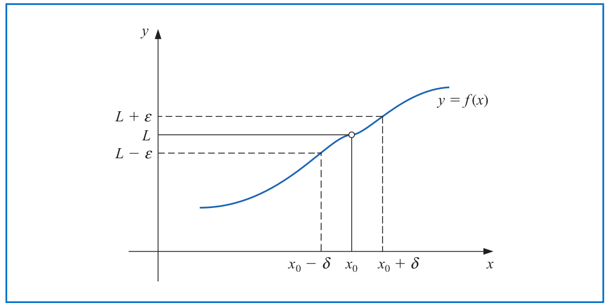
</p>

--

- Then, $f$ is **continuous** at $x_0$ if $\lim\limits_{x\to x_0} f(x) = f(x_0)$.
- $f$ is **continuous on the set $\mathcal{X}$** if it is continuous at each point in $\mathcal{X}$. We denote it by $f\in \mathcal{C}(\mathcal{X})$.

---

# Limits and Continuity of A Function

Let $\{x_n\}_{n=1}^{\infty}$ be an infinite sequence of real numbers. This sequence has the **limit** $x$ (i.e., **converges to** $x$) if, for any $\epsilon>0$, there exists a positive integer $N(\epsilon)$ such that 
$$|x_n -x| < \epsilon \quad \text{ whenever } \quad n>N(\epsilon).$$
We denote it by $\lim\limits_{n\to\infty} x_n =x$.

--

**Theorem.** If $f$ is a function defined on a set $\mathcal{X}$ and $x_0 \in \mathcal{X}$, the the following statements are equivalent:

a. $f$ is continuous at $x_0$;

b. If $\{x_n\}_{n=1}^{\infty}$ is any sequence in $\mathcal{X}$ converging to $x_0$, then 
$$\lim\limits_{n\to\infty} f(x_n) = f(x_0).$$

---

# Differentiability of A Function

Let $f$ be a function defined in an open set containing $x_0$. The function $f$ is **differentiable** at $x_0$ if 
$$f'(x_0) = \lim_{x\to x_0} \frac{f(x)-f(x_0)}{x-x_0}$$
exists. The number $f'(x)$ is called the **derivative** of $f$ at $x_0$. A function that has a derivative at each point in a set $\mathcal{X}$ is **differentiable on** $\mathcal{X}$.

--

- The derivative of $f$ at $x_0$ is the slope of the tangent line to the graph of $f$ at $(x_0,f(x_0))$.

<p align="center">
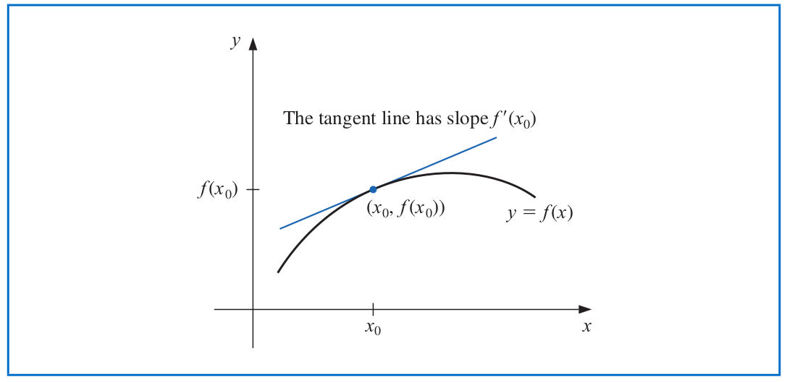
</p>

---

# Taylor's Theorem

Assume that $f$ is $n$-times continuously differentiable and $f^{(n+1)}$ exists on $x_0\in [a,b]$. For every $x\in [a,b]$, there exists a number $\xi(x)$ between $x_0$ and $x$ such that
\begin{align*}
f(x) &= P_n(x) + R_n(x)\\
&= \underbrace{\sum_{k=0}^n \frac{f^{(k)}(x_0)}{k!}\cdot (x-x_0)^k}_{n^{th} \text{ Taylor's polynomial}} + \underbrace{\frac{f^{(n+1)}(\xi(x))}{(n+1)!} \cdot (x-x_0)^{n+1}}_{\text{Remainder term or Truncation error}}.
\end{align*}

--

- As $n\to \infty$, $\lim\limits_{n\to\infty} P_n(x)$ becomes an infinite Taylor series of $f$ at around the point $x_0$.

---

# Theorems Related to Differentiability

**Theorem.** If the function $f$ is differentiable at $x_0$, then $f$ is continuous at $x_0$.

--

**Rolle's Theorem.** Suppose that $f\in \mathcal{C}[a,b]$ and $f$ is differentiable on $(a,b)$. If $f(a) = f(b)$, then there exists a number $c\in (a,b)$ such that $f'(c)=0$.

<p align="center">
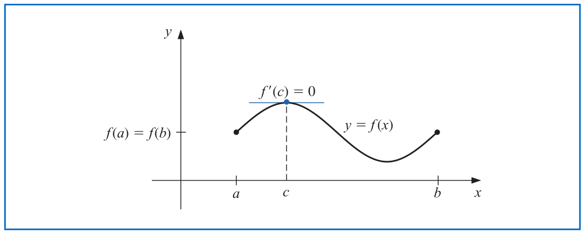
</p>

---

# Theorems Related to Differentiability

**Mean Value Theorem.** If $f\in \mathcal{C}[a,b]$ and $f$ is differentiable on $(a,b)$, then there exists a number $c\in (a,b)$ such that 
$$f'(c)=\frac{f(b) -f(a)}{b-a}.$$

<p align="center">
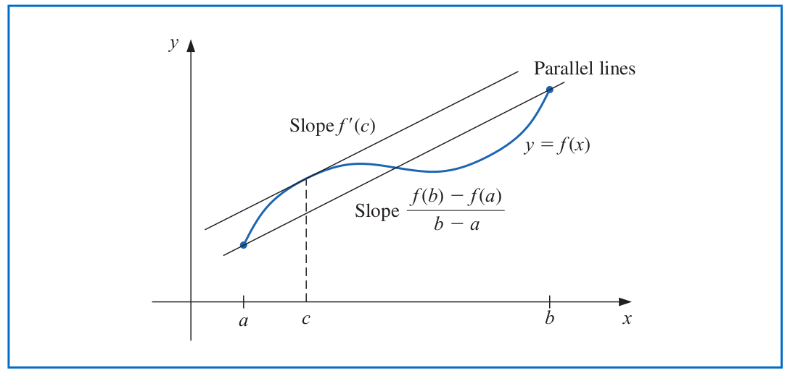
</p>

---

# Theorems Related to Differentiability

**Extreme Value Theorem.** If $f\in \mathcal{C}[a,b]$, then there exist $c_1,c_2 \in [a,b]$ such that
$$f(c_1) \leq f(x) \leq f(c_2) \quad \text{ for all } \quad x\in [a,b].$$
In addition, if $f$ is differentiable on $(a,b)$, then the numbers $c_1$ and $c_2$ occur either at the endpoints of $[a,b]$ or at the point where $f'$ is zero.

<p align="center">
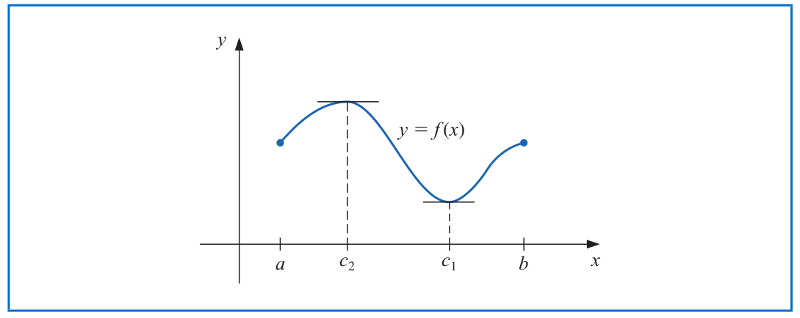
</p>

---

# Other Generalized Theorems

**Generalized Rolle's Theorem.** Suppose that $f \in \mathcal{C}[a,b]$ is $n$ times differentiable on $(a,b)$. If $f(x)=0$ at the $(n+1)$ distinct numbers $a\leq x_0 < x_1 < \cdots < x_n\leq b$, then there exists a number $c\in (x_0,x_n)$ such that $f^{(n)}(c)=0$.

--

**Intermediate Value Theorem.** If $f\in \mathcal{C}[a,b]$ and $K$ is any number between $f(a)$ and $f(b)$, then there exists a number $c\in (a,b)$ for which $f(c)=K$.

<p align="center">
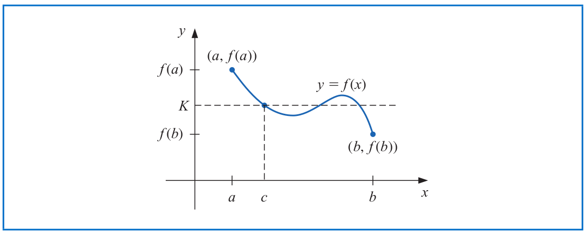
</p>

---

# Compute Derivatives in R

We can use the build-in function `D()` in R to compute the derivative of a function.

```{r}
f = expression(x^2 + 3*x)
class(f)
```

--

```{r}
# First-order derivative
D(f, 'x')
# Second-order and third-order derivatives
D(D(f, 'x'), 'x')
D(D(D(f, 'x'), 'x'), 'x')
```

---

# Compute Derivatives in R

It is _inconvenient_ to compute the high-order derivatives by using `D()` in a nested way.

--

- Instead, we can write our customized function in a recursive way to compute the high-order derivative.

```{r}
compDeriv = function(expr, name, order = 1) {
   if(order < 1) stop("'order' must be >= 1")
   if(order == 1) {
     return(D(expr, name))
   } else {
     return(compDeriv(D(expr, name), name, order - 1))
   }
}
exp1 = expression(x^3)
compDeriv(exp1, 'x', 3)
```

Note: The process where a function calls itself directly or indirectly is called _recursion_, and the corresponding function is called a recursive function. 

---

# Compute Derivatives in R

If the expression has more than one independent variable, we can calculate the partial derivative with respect to each of them.

```{r}
g = expression(x^2 + y^3 + 2*x*y - 3*x + 4*y + 4)
D(g, 'x')

D(g, 'y')

compDeriv(g, 'x', 2)

compDeriv(g, 'y', 3)
```

---

# Evaluate R Expression and its Derivatives

We can evaluate the function expression and its derivative using the build-in function `eval()`.

```{r, warning=FALSE}
x = 1:5
f = expression(x^2 + 3*x)
eval(f)
```
--

```{r, error=TRUE}
df = D(f, 'x')
class(df)
df(1:3)
eval(D(f, 'x'))
```

---

# Evaluate R Expression and its Derivatives

We can evaluate the function expression and its derivative using the build-in function `eval()`.

```{r}
g = expression(x^2 + y^3 + 2*x*y - 3*x + 4*y + 4)
x = 1:5
y = 3:7
eval(g)
eval(compDeriv(g, 'y', 2))
eval(compDeriv(g, 'x', 2))
```

---

# Evaluate R Expression and its Derivatives

Using the `eval()` function requires us to assign correct values to the R variables as those in our expression.

```{r, error=TRUE}
remove(x)
eval(f)
```

--

Alternatively, we can use the build-in function `deriv()` to compute the derivatives of a function.

- The return value of `deriv()` with argument `function.arg = TRUE` is an R function!

```{r}
g = expression(x^2 + y^3 + 2*x*y - 3*x + 4*y + 4)
dx = deriv(g, 'x', function.arg = TRUE)
dxy = deriv(g, c('x', 'y'), function.arg = TRUE)
class(dx)
```

---

# Evaluate R Expression and its Derivatives

```{r}
D(g, 'x')
y = 4:8
dx_res = dx(10)
dx_res

dx_res[1]
```

---

# Evaluate R Expression and its Derivatives

We can access the "gradient" attribute using the `attr()` function in R.

```{r}
attr(dx_res, "gradient")

dxy(1:3, 3:5)
```


---

# Integration

The Riemann integral of the function $f$ on the interval $[a,b]$ is the following limit, provided it exists:
$$\int_a^b f(x) dx = \lim_{\max \Delta x_i \to 0} \sum_{i=1}^n f(z_i) \Delta x_i,$$
where the numbers $x_0,x_1,...,x_n$ satisfy $a=x_0\leq x_1 \leq \cdots \leq x_n=b$, where $\Delta x_i = x_i-x_{i-1}$ for each $i=1,2,...,n$ and $z_i$ is an arbitrary number in the interval $[x_{i-1}, x_i]$.

<p align="center">

</p>

---

# Fundamental Theorem of Calculus

- If $f\in \mathcal{C}[a,b]$ and we define $F(x)=\int_a^x f(t) dt$, then $F'(x)=f(x)$ for any $x\in (a,b)$. Hence, $F$ is an anti-derivative of $f$.

- If $f\in \mathcal{C}[a,b]$ and $F$ is any anti-derivative of $f$, then 
$$\int_a^b f(x) dx = F(x)\Big|_{x=a}^b = F(b) - F(a).$$

<p align="center">

</p>

---

# Weighted Mean Value Theorem for Integrals

Suppose that $f\in \mathcal{C}[a,b]$, the Riemann integral of $g$ exists on $[a,b]$, and $g(x)$ does not change sign on $[a,b]$. Then, there exists a number $c\in (a,b)$ such that
$$\int_a^b f(x) g(x)\, dx = f(c) \int_a^b g(x)\, dx.$$

- When $g(x)\equiv 1$, it leads to the usual Mean Value Theorem for integrals: $f(c) = \frac{1}{b-a} \int_a^b f(x)\, dx$.

<p align="center">
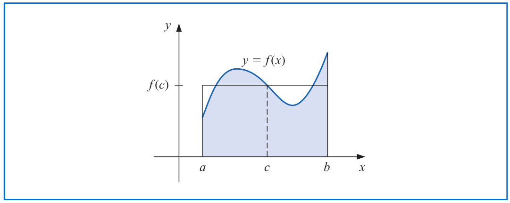
</p>

---

# Compute Integrals in R

A Riemann integral can be computed via a build-in function `integrate()` in R.

```{r}
inteFun1 = function(x) { x^2 + 3*x }
integrate(inteFun1, lower = 0, upper = 2)

# An integral that converges slowly
inteFun2 = function(x) {
  return(1/((x+1)*sqrt(x)))
}
integrate(inteFun2, lower = 0, upper = Inf)
```

--

```{r, error=TRUE}
integrate(inteFun1, lower = 0, upper = Inf)
```

---

# Compute Multiple Integrals in R

Compute a multiple integral $\int_0^1 \int_0^2 \int_0^{\frac{1}{2}} (xy + z^2 + 3yz) \,dxdydz$.

```{r}
library(cubature)
mulFun1 = function(x) { 
  return(x[1]*x[2] + x[3]^2 + 3*x[2]*x[3])
}
# "x" is a vector and x[1], x[2], x[3] refers to x, y, and z, respectively.
mul_int = adaptIntegrate(mulFun1, lowerLimit = c(0, 0, 0), upperLimit = c(0.5, 2, 1))
mul_int
```

---
class: inverse

# Part 2: Computer Arithmetic and Error Analysis

---

# Numbers and Characters in Computer Systems

How does our computer store and recognize numbers and characters?

--

- It encodes every number/character as a sequence of **bits** (i.e., binary digits 0 or 1).

- It was [John Tukey](https://en.wikipedia.org/wiki/John_Tukey), a prestigious statistician, who first coined the term "bit".

- A byte is a collection of 8 bits, e.g., 0001 0011.

---

# Character Encoding Systems

There are several standard encoding systems with bits for characters. 

- [ASCII](https://en.wikipedia.org/wiki/ASCII) -- American Standard Code for Information Interchange. 

  - Each upper and lower case letter in the English alphabet and other characters is represented as a sequence of 7 bits.

<p align="center">

</p>

---

# Character Encoding Systems

There are several standard encoding systems with bits for characters. 

- Nowadays, [Unicode](https://en.wikipedia.org/wiki/Unicode) is more commonly used for text encoding, including [UTF-8](https://en.wikipedia.org/wiki/UTF-8), UTF-16, etc.

  - It encodes not just English letters but also special characters and emojis.

<p align="center">

</p>

---

# Binary Number Representations

Commonly, we write a number in the base-10 decimal system.

- For instance, we write a 3-digit number **105**, representing 1 hundred, 0 tens, and 5 ones.

- That is, $105= 1\times 10^2 + 0 \times 10^1 + 5\times 10^0$.

--

In our computer systems, however, 105 is stored as **110 1001**, because
\begin{align*}
105 &= (1\times 2^6) + (1\times 2^5) + (0\times 2^4) \\
&\quad + (1\times 2^3) + (0\times 2^2) + (0\times 2^1) + (1\times 2^0).
\end{align*}

- What is the base-10 decimal value of the 8-digit binary number **0011 0011**?

--

- Answer: $1\times 2^0 + 1\times 2^1+ 1\times 2^4+ 1\times 2^5=51$.

---

# Scientific Notations

Integer types can be stored in our computer using the binary representation.

How about other numeric types, e.g., 0.25, 1/7, $\pi$, etc?

--

- The computer system uses the notion of **scientific notation** to store numbers.

--

- A general scientific notation in base-10 is written as: 
$$a\times 10^{b}.$$

  - Terminology: $\,a$ --> mantissa; $\quad \; b$ --> exponent.

  - Examples: $\,0.023$	--> $2.3 \times 10^{-2}$; $\quad$ $-2600$ --> $-2.6\times 10^3$.

Note: The computer cannot store 1/7 and $\pi$ as their exact values because the total number of digits is limited.

---

# Double-Precision Floating Point

IEEE (Institute for Electrical and Electronic Engineers) in 1985 (updated in 2008) published a report to standardize 

- Binary and decimal floating numbers;

- Formats for data interchange;

- Algorithms for rounding arithmetic operations;

- Handling exceptions.

--

A 64-bit (binary digit) representation is used for a real number (i.e., the numeric data type in R).

<p align="center">
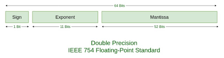
</p>

---

# Double-Precision Floating Point

<p align="center">
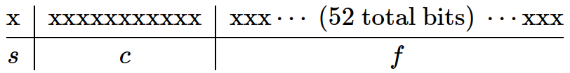
</p>

Under base-2 system, 

- the first bit $s$ is a sign indicator;

- it is followed by an 11-bit exponent (or characteristic) $c$;

- it is ended with a 52-bit binary fraction (or mantissa) $f$.

The represented number in the base-10 decimal system is
$$(-1)^s\cdot 2^{c-1023}\cdot (1+f).$$

---

# Double-Precision Floating Point

The smallest normalized positive number that can be represented has $s=0$, $c=1$, and $f=0$ and is equivalent to
$$2^{-1022} \cdot (1+0) \approx 2.2251 \times 10^{-308},$$
and the largest has $s=0$, $c=2046$, and $f=1-2^{-52}$ and is equivalent to
$$2^{1023} \cdot (2- 2^{-52}) \approx 1.7977 \times 10^{308}.$$

```{r}
.Machine$double.xmin
.Machine$double.xmax
```

---

# Underflow and Overflow

- Numbers occurring in calculations that have a magnitude less than $2^{-1022} \cdot (1+0)$ 
result in **underflow** and are generally set to 0.

- Numbers greater than $2^{1023} \cdot (2-2^{-52})$ result in **overflow** and typically cause the computations to stop. In R, it will be denoted by `Inf`.


Note: Recall that
$$(-1)^s\cdot 2^{c-1023}\cdot (1+f).$$
There are two representations for the
number 0.

- A positive 0 when $s = 0$, $c = 0$, and $f = 0$; 

- A negative 0 when $s = 1$, $c = 0$, and $f = 0$.

---

# Decimal Machine Numbers

The use of binary digits may conceal the computational difficulties that occur when a finite collection of machine numbers is used to represent all the real numbers.

--

- For simplicity, we use base-10 decimal numbers in our analysis:
$$\pm 0.d_1d_2\cdots d_k \times 10^n \quad \text{with}\quad 1\leq d_1 \leq 9 \; \text{ and } \; 0\leq d_i \leq 9 \;\text{ for }\; i=2,...,k.$$
This is called $k$-digit _decimal machine numbers_.

- Any positive real number (within the numerical range of the machine) can be written as:
$$y=0.d_1d_2\cdots d_kd_{k+1} d_{k+2} \cdots \times 10^n.$$

---

# Decimal Machine Numbers

- There are two ways to represent $y$ with $k$ digits:
  
  - _Chopping_: chop off after $k$ digits:
  $$fl(y)=0.d_1d_2\cdots d_k \times 10^n.$$

--

  - _Rounding_: Add $5\times 10^{n-(k+1)}$ and chop:
  $$fl(y)=0.\delta_1\delta_2\cdots \delta_k \times 10^n.$$

Note: We make two remarks for rounding.

- When $d_{k+1} \geq 5$, we add $1$ to the digit $d_k$ to obtain the final floating point number $fl(y)$, i.e., we _round up_.

- When $d_{k+1} < 5$, we simply chopp off all but the first $k$ digits, i.e., we _round down_.

---

# Absolute and Relative Errors

Suppose that $\hat{p}$ is an approximation (or rounding number) to $p^*$.

- The **absolute error** is $|\hat{p} -p^*|$.

- The **relative error** is $\frac{|\hat{p} -p^*|}{|p^*|}$, provided that $p^*\neq 0$.

--

```{r}
p_star = pi
p_hat = round(p_star, digits = 7)
cat("The absolute error is ", abs(p_star - p_hat), ".", sep = "")
cat("The relative error is ", abs(p_star - p_hat)/abs(p_star), ".", sep = "")
```

---

# Significant Digits

The number $\hat{p}$ is said to approximate $p^*$ to $t$ **significant digits** (or figures) if $t$ is the largest nonnegative integer for which
$$\frac{|\hat{p} -p^*|}{|p^*|} \leq 5\times 10^{-t}.$$

--

```{r}
sigDigit = function(x_app, x_true) {
  t = 0
  while(abs(x_app - x_true)/abs(x_true) <= 5*10^(-t)) {
    t = t + 1
  }
  return(t-1)
}
p_star = pi
p_hat = round(p_star, digits = 7)
sigDigit(p_hat, p_star)
```

---

# Floating Point Operations in Computers

Assume that the floating-point representations $fl(x)$ and $fl(y)$ are given for the real numbers $x$ and $y$. Let $\oplus, \ominus, \otimes, \oslash$ represent machine addition, subtraction, multiplication, and division operations.

--

- Then, the finite-digit arithmetics for floating points are
\begin{align*}
x \oplus y &= fl\left(fl(x) + fl(y) \right), \quad x\otimes y = fl\left(fl(x) \times fl(y) \right),\\
x \ominus y &= fl\left(fl(x) - fl(y) \right), \quad x\oslash y = fl\left(fl(x) / fl(y) \right).
\end{align*}

- "Round input, perform exact arithmetic, and round the result".

--

```{r}
x = round(1/3, digits = 4)
y = round(5/7, digits = 4)
print(1/3 + 5/7)
# 3-digit arithmetic
round(x + y, digits = 4)
```

---

# Error Growth and Stability

Those floating point rounding errors or other systematic errors can propagate as our computations/algorithms proceed.

--

Suppose that $E_0 >0$ denotes an initial error at some stage of the calculations and $E_n$ represents the magnitude of the error after $n$ subsequent operations.

- If $E_n \approx C \cdot nE_0$, then the growth of error is said to be **linear**.

- If $E_n \approx C^n E_0$ for some $C>1$, then the growth of error is called **exponential**.

Note: Here, $C>0$ is a constant independent of $n$.

---

# Error Growth and Stability

- **Stable** algorithm: Small changes in the initial data only produce small changes in the final result.

- **Unstable** or **Conditionally Stable** algorithm: Large errors in the final result for all or some initial data with small changes.

<p align="center">
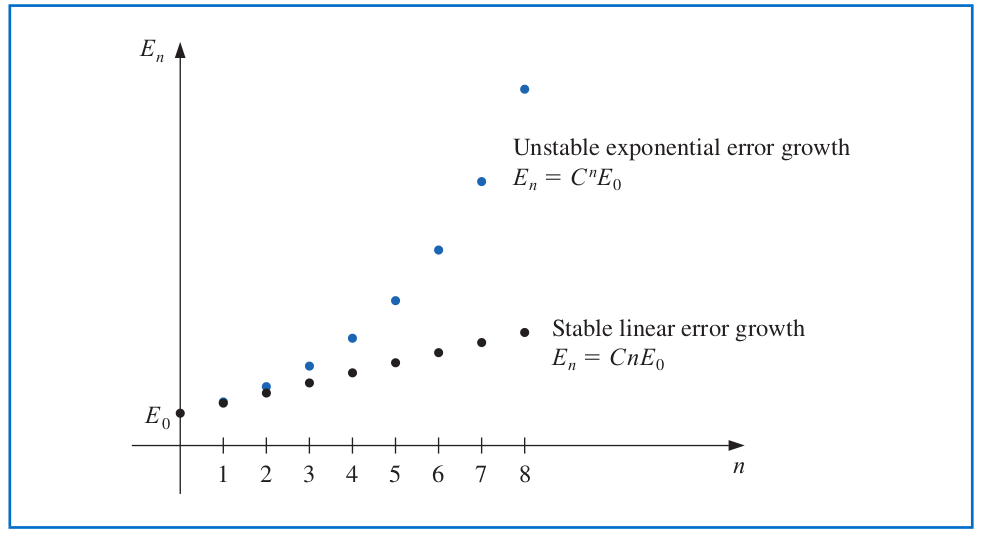
</p>

---
class: inverse

# Part 3: Algorithmic Rate of Convergence

---

# Rate/Order of Convergence

Suppose that $\{x_n\}_{n=0}^{\infty} \subset \mathbb{R}^d$ converges to $x^*\in \mathbb{R}^d$ and $\{\alpha_n\}_{n=0}^{\infty} \subset \mathbb{R}$ is a sequence known to converge to 0.

--

- If there exists a constant $C>0$ independent of $n$ with
$$\|x_n -x^* \|_2 \leq C |\alpha_n| \quad \text{ for large } n,$$
then we say that $\{x_n\}_{n=0}^{\infty}$ converges to $x^*$ with **rate, or order, of convergence** $O(\alpha_n)$.

--

- We can write 
$$\|x_n-x^*\|_2 = O(\alpha_n)$$ 
or $x_n=x^* + O(\alpha_n)$ when $\{x_n\}_{n=0}^{\infty}$ is a sequence of numbers.

--

- In many cases, we can take $\alpha_n = \frac{1}{n^p}$ for some number $p>0$, and generally, the _largest_ value of $p$ with $\|x_n-x^*\|_2= O\left(\frac{1}{n^p} \right)$ will be of interest.

---

# Linear Convergence

When $\|x_n-x^*\|_2= O\left(\frac{1}{n^p} \right)$ for the largest possible value of $p$, $x_n$ is also known to converge to $x^*$ in a polynomial/sublinear rate of convergence.

- The algorithm or sequence that polynomially/sublinearly converges to $x^*$ is relatively _slow_, in the sense that
$$\lim_{n\to\infty} \frac{\|x_{n+1}-x^*\|_2}{\|x_n -x^*\|_2}=1.$$

--

The convergence $x_n\to x^*$ is said to be **linear** if there exists a number $0< r< 1$ such that
$$\lim_{n\to\infty} \frac{\|x_{n+1}-x^*\|_2}{\|x_n -x^*\|_2}= r.$$

- The **linear convergence** means that 
$$\|x_n -x^*\|_2= r^n \|x_0 -x^*\|_2 = O(r^n).$$

---

# Q-Linear and R-Linear Convergences

The linear convergence can be further categorized into two types:

- Q-Linear Convergence: $\frac{\|x_{n+1}-x^*\|_2}{\|x_n -x^*\|_2}\leq r$ for some $r\in (0,1)$ when $n$ is sufficiently large. This is the same as our previous definition.

--

- R-Linear Convergence of $\{x_n\}_{n=0}^{\infty} \subset \mathbb{R}^d$: there exists a sequence $\{\epsilon_n\}_{n=0}^{\infty}$ such that
$$\|x_n-x^*\|_2 \leq \epsilon_n \quad \text{ for all } n$$
and $\epsilon_n$ converges Q-linearly to 0.

- The "Q" stands for "quotient", while the "R" stands for "root".

--

- Examples: 
  - $\left\{\frac{1}{2^n} \right\}_{n=0}^{\infty}$ converges Q-linearly to 0.
  - $\left\{1,1, \frac{1}{4},\frac{1}{4},\frac{1}{16},\frac{1}{16},...,\frac{1}{4^{\left\lfloor \frac{k}{2} \right\rfloor}},... \right\}$ converges R-linearly to 0.

---

# Superlinear Convergence

The convergence $x_n\to x^*$ is said to be **superlinear** if 
$$\lim_{n\to\infty} \frac{\|x_{n+1}-x^*\|_2}{\|x_n -x^*\|_2}= 0.$$

--

- **Quadratic Convergence**: We say that $\{x_n\}_{n=0}^{\infty}$ converges quadratically to $x^*$ if there exists a constant $M>0$ such that
$$\lim_{n\to\infty} \frac{\|x_{n+1}-x^*\|_2}{\|x_n -x^*\|_2^2}= M.$$

- Example: $\left\{\left(\frac{1}{n} \right)^{2^n} \right\}_{n=0}^{\infty}$ converges quadratically to 0, because
$$\frac{\|x_{n+1}-x^*\|_2}{\|x_n -x^*\|_2^2} = \frac{\left(\frac{1}{n+1} \right)^{2^{n+1}}}{\left(\frac{1}{n} \right)^{(2^n)\cdot 2}} = \left(\frac{n}{n+1} \right)^{2^{n+1}}\leq 1.$$

---

# Plots for Different Types of Convergence

<p align="center">

</p>

---

# Plots for Different Types of Convergence

```{r, fig.align='center', fig.height=6, fig.width=8.5}
library(latex2exp)
k = 1:30
par(mar = c(4, 5.5, 1, 0.8)) 
plot(k, log(1/k), type="l", lwd=5, col="green", 
     xlab = "Number of iterations", ylab = TeX("$||x_n - x^*||_2$"), 
     cex.lab=2, cex.axis=2, cex=0.7)
lines(k, log((7/10)^k), col="red", lwd=5)
lines(k, log((1/k)^(2^k)), col="blue", lwd=5)
legend(20, -0.1, legend=c("Sublinear", "Linear", "Superlinear"), fill=c("green", "red", "blue"), cex=1.5)
```

---

# Rate of Convergence for Functions

Suppose that $\lim\limits_{h\to 0} g(h)=0$ with $g(h)>0$ for $h\in \mathbb{R}$ and $\lim\limits_{h\to 0} f(h)=L$. If there exists a constant $C>0$ such that
$$|f(h) -L| \leq C|g(h)| \quad \text{ for sufficiently small } |h|,$$
then we write $|f(h)-L|=O(g(h))$ or $f(h)=L+O(g(h))$. 

--

- Generally, $g(h)$ has the form $g(h)=|h|^p$ for some $p>0$.

- We are interested in the largest value of $p>0$ for which $f(h) = L+ O(|h|^p)$.

Note: Other definitions of big-O and little-o notations can be found in the [Wikipedia page](https://en.wikipedia.org/wiki/Big_O_notation).

---
class: inverse

# Part 4: Solutions of Equations in One Variable

---

# Root-Finding Problems

One of the most basic problems of numerical analysis is the **root-finding** problem.

- Given a function $f:\mathbb{R}^{d_1} \to \mathbb{R}^{d_2}$, we want to solve the equation $f(x)=0$.

--

- A root of this equation $f(x)=0$ is also called a **zero** of the function $f$.

- In most cases, we will focus on the cases where $d_1=d_2=1$.

--

- The root-finding methods that we will discuss include
  
  - Bisection method;
  
  - Fixed-point iteration;
  
  - Newton's method and its variants.
  
---

# Bisection Method

Suppose that $f$ is a _continuous_ function defined on $[a,b]$ with $f(a)$ and $f(b)$ of opposite sign.

--

- The Intermediate Value Theorem implies that there exists a number $x^*\in (a,b)$ such that $f(x^*)=0$.

- Note that the solution $x^*$ to $f(x)=0$ needs not be unique.

<p align="center">
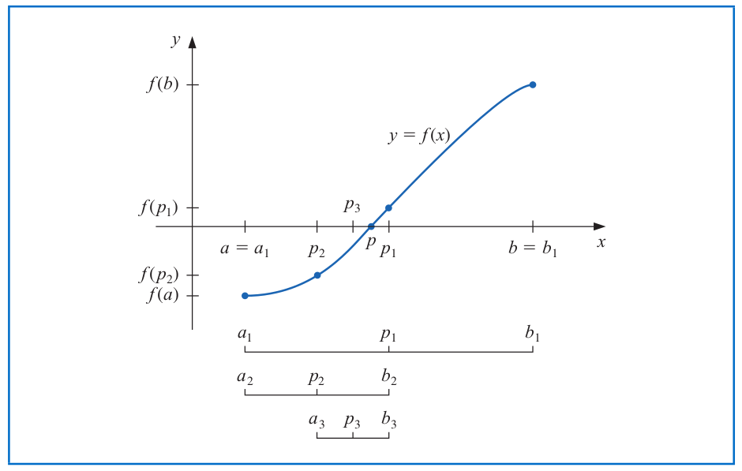
</p>

---

# Bisection Method

The **bisection method** uses the following procedure to approximate a solution to $f(x)=0$.

1. Initialize the endpoints $L=a, U=b$, and a tolerance level $\epsilon>0$.

--

2. Compute the midpoint of the current interval $[L,U]$ as $p_n=\frac{L+U}{2}$ for the $n^{th}$ iteration.

--

  - If $f(p_n)=0$, then $x^*=p_n$, and we are done.
  
  - If $f(p_n)$ and $f(L)$ have the same sign, then set $L=p_n$ and $U=U$.
  
  - If $f(p_n)$ and $f(U)$ have the same sign, then set $U=p_n$ and $L=L$.
  
3. Repeat Step 2 until $|U-L| < \epsilon$. Then, use $p_n=\frac{L+U}{2}$ as the approximated solution.

---

# Bisection Method (Example)

Verify that the function $f(x)=x^3+7x^2-10=0$ has at least one root in $[1,2]$, and use the bisection method to find an approximated root that has an accuracy within $10^{-7}$.

--

- $f$ is continuous with $f(1)=-2$ and $f(2)=26$.

```{r}
f = function(x) { x^3 + 7*x^2 - 10 }
biSect = function(L, U, fun, tol=1e-7) {
  while(abs(L-U) > tol) {
    p = (U + L)/2
    if(fun(p) * fun(U) > 0) {
      U = p
    } else if (fun(p) * fun(U) < 0) {
      L = p
    } else {
      break
    }
  }
  return(p)
}
x_app = biSect(L = 1, U = 2, fun = f, tol = 1e-7)
cat("The approximated solution is ", x_app, ".", sep = "")
f(x_app)
```

---

# Rate of Convergence for the Bisection Method

Let $[a,b]$ be the initial interval for the bisection method and $p_n$ be the midpoint of the interval in the $n^{th}$ iteration.

--

- Then, the difference between $p_n$ and a solution $x^*$ is upper bounded by
$$\|p_n -x^* \|_2 \leq \frac{b-a}{2^n}.$$

- Hence, the bisection method produce a sequence $\{p_n\}_{n=1}^{\infty}$ that _converges (R-)linearly_ to the solution $x^*$.

---

# Caveats About the Bisection Method

- The _continuity_ of the function $f$ within the interval of interest is critical for finding the root of $f(x)=0$.

<p align="center">
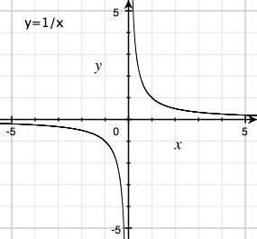
</p>

---

# Caveats About the Bisection Method

- The choice of the initial interval can affect the convergence speed and the output approximated solution as well.

```{r, fig.align='center', fig.height=5, fig.width=7.5}
x = seq(-8, 3, by = 0.1)
par(mar = c(4, 5.5, 1, 0.8)) 
plot(x, f(x), lwd = 5, type = "l")
abline(h = 0, col="red", lty=2, lwd = 5)
legend(-3, -50, legend=c(TeX("$f(x)=x^3+7x^2-10$")), fill=c("black"), cex=1.5)
```

---

# Caveats About the Bisection Method

```{r, fig.align='center', fig.height=5, fig.width=7.5, echo=FALSE}
x = seq(-8, 3, by = 0.1)
par(mar = c(4, 5.5, 1, 0.8)) 
plot(x, f(x), lwd = 5, type = "l")
abline(h = 0, col="red", lty=2, lwd = 5)
legend(-3, -50, legend=c(TeX("$f(x)=x^3+7x^2-10$")), fill=c("black"), cex=1.5)
```

```{r}
x_app = biSect(L = 1, U = 2, fun = f, tol = 1e-7)
cat("The approximated solution is ", x_app, ".", sep = "")

x_app = biSect(L = -8, U = 3, fun = f, tol = 1e-7)
cat("The approximated solution is ", x_app, ".", sep = "")
```

---

# More General Binary-Search Method

Suppose that we want to search for an item in a (discrete) ordered list or a solution to a problem within an interval.

<p align="center">
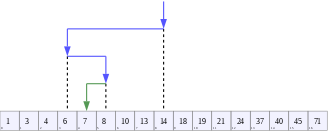
</p>

--

- The two endpoints of the ordered list or the interval characterize two different states with respect to the target. (Recall that $f\in \mathcal{C}[a,b]$ has two different signs at $a$ and $b$.)

--

- We can also determine the state of the midpoint and update the search interval accordingly.

--

- Keep dividing the ordered list or interval into a half until the target item is found or reaching the tolerance level.

---

# Searching for $R_c$ in the Final Project

We will write a function `findRc()` in the [final project](https://zhangyk8.github.io/teaching/file_stat302/Lectures/Final_Project.pdf) to search for $R_c$, which is the smallest possible radius such that a given ad hoc network is completely connected.

1. Denote the endpoints of the interval returned from `findRange()` (i.e., a helper function in the [final project](https://zhangyk8.github.io/teaching/file_stat302/Lectures/Final_Project.pdf)) by $\bar{R}_{\min}$ and $\bar{R}_{\max}$, respectively.

2. Compute the middle point as $\bar{R}_0=\frac{\bar{R}_{\min}+\bar{R}_{\max}}{2}$. 

3. If $\bar{R}_0$ gives a completely connected network, then we assign $\bar{R}_{\max}\gets \bar{R}_0$. Otherwise, we assign $\bar{R}_{\min}\gets \bar{R}_0$.
	
4. Repeat Steps 2 and 3 until $|\bar{R}_{\min} - \bar{R}_{\max}|$ is less than the tolerance level `tol`.

---

# Fixed Points and Root-Finding

The point $p\in \mathbb{R}^d$ is a **fixed point** for a given function $g$ if $g(p) =p$.

--

- Given a root-finding problem $f(p)=0$, we can define the function $g$ with a fixed point at $p$ in various ways:
$$g(x) = x-f(x), \quad g(x)=x+3f(x), \quad \text{etc.}$$
Both of them satisfy $g(p)=p$.

- Conversely, if the function $g$ has a fixed point at $p$, then the function defined by 
$$f(x)=x-g(x)$$
has a zero at $p$.

---

# Fixed Points and Root-Finding

Example: Determine any fixed points of the function $g(x)=x^2-2$.

--

<p align="center">
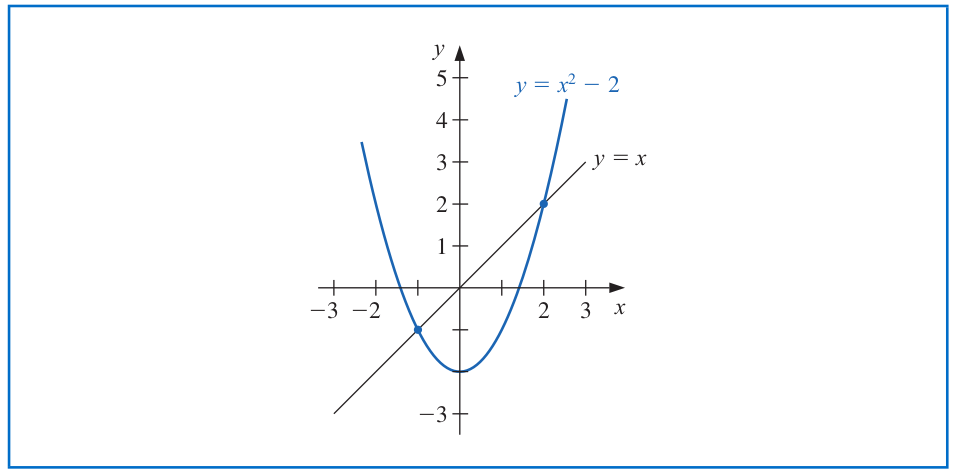
</p>

- The function $g(x)=x^2-2$ has two fixed points $x=-1$ and $x=2$.

---

# Existence and Uniqueness of Fixed Points

**Theorem.** 

1. (_Existence_) If $g\in \mathcal{C}[a,b]$ and $g(x) \in [a,b]$ for all $x\in [a,b]$, then $g$ has at least one fixed point in $[a,b]$.

2. (_Uniqueness_) If, in addition, $g'(x)$ exists on $(a,b)$ and there exists a positive constant $k<1$ such that
$$|g'(x)| \leq k \quad \text{ for all } x\in (a,b),$$
then there exists exactly one fixed point in $[a,b]$.

<p align="center">
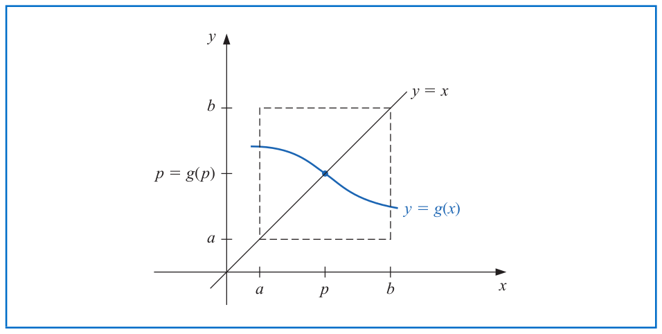
</p>

More general results for the uniqueness of the fixed point can be found as [Banach fixed-point theorem](https://en.wikipedia.org/wiki/Banach_fixed-point_theorem) and [this paper](https://www.ams.org/journals/proc/1976-060-01/S0002-9939-1976-0423137-6/S0002-9939-1976-0423137-6.pdf).

---

# Fixed-Point Iteration

The **fixed-point iteration** solves for the fixed point $p$ (with $p=g(p)$) via the following procedure:

1. Choose an initial approximation $p_0$;

2. Generate the sequence $\{p_n\}_{n=0}^{\infty}$ by letting 
$$p_n=g(p_{n-1}) \quad \text{ for each } n\geq 1.$$

If the sequence $\{p_n\}_{n=0}^{\infty}$ converges to $p$ and $g$ is continuous, then
$$p=\lim_{n\to\infty} p_n = \lim_{n\to\infty} g(p_{n-1})= g\left(\lim_{n\to\infty} p_{n-1} \right) = g(p).$$

<p align="center">
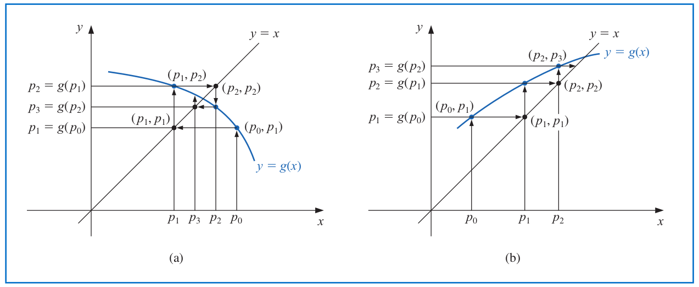
</p>

---

# Convergence of Fixed-Point Iteration

**Theorem.** Let $g\in \mathcal{C}[a,b]$ be such that $g(x)\in [a,b]$ for all $x\in [a,b]$. Suppose, in addition, that $g'$ exists on $(a,b)$ and that a constant $0<k<1$ exists with
$$|g'(x)| \leq k \quad \text{ for all } x\in (a,b).$$
Then, for any number $p_0\in [a,b]$, the sequence $\{p_n\}_{n=0}^{\infty}$ defined by 
$$p_n=g(p_{n-1}), \quad n\geq 1,$$
converges to the unique fixed point $p\in [a,b]$.

--

**Corollary.** If $g$ satisfies the hypotheses above, then bounds for the error at the $n^{th}$ step of the fixed-point iteration are given by
\begin{align*}
&|p_n -p| \leq k^n \max\left\{p_0-a, b-p_0\right\},\\
&|p_n -p| \leq \frac{k^n}{1-k} \cdot |p_1-p_0| \quad \text{ for all } n\geq 1.
\end{align*}

---

# Rate of Convergence for Fixed-Point Iterations

The previous corollary tells us that the fixed-point iteration 
$$p_n=g(p_{n-1}) \quad \text{ for } \quad n\geq 1$$
converges (at least) _linearly_ to the fixed-point solution $p=g(p)$.

- Question: Can the fixed-point iteration converges at a faster rate?

--

Let $g\in \mathcal{C}[a,b]$ be such that $g(x)\in [a,b]$ for all $x\in [a,b]$, $g'$ is _continuous_ on $(a,b)$ with $|g'(x)| \leq k <1$ for all $x\in (a,b)$.

- If $g'(p)\neq 0$, then for any $p_0 \neq p$ in $[a,b]$, the fixed-point iteration converges **only linearly** to the unique fixed point $p$.

- Suppose, in addition, that $g'(p)=0$ and $g''$ is continuous with $|g''(x)| < M$ on an open interval containing $p$. Then, there exists a $\delta >0$ such that for $p_0 \in [p-\delta, p+\delta]$, the fixed-point iteration converges **at least quadratically** to $p$ and
$$|p_{n+1}-p| < \frac{M}{2} |p_n-p|^2 \quad \text{ for sufficiently large } n.$$

---

# Fixed-Point Iteration (Example)

Suppose that we want to find the solution to $f(x) = x-2^{-x}$. 

- Show that $g(x)=2^{-x}$ has a unique fixed point on $[\frac{1}{3},1]$.

  - $\max_{x\in [\frac{1}{3},1]} |g'(x)| = \frac{1}{2^{1/3}} < 1$.
  
```{r}
g = function(x) { return(2^{-x}) }
fixedPoint = function(fun, p_0, tol = 1e-7) {
  p_next = fun(p_0)
  iter_seq = c(p_0, p_next)
  while(abs(p_next - p_0) > tol) {
    p_0 = p_next
    p_next = fun(p_0)
    iter_seq = c(iter_seq, p_next)
  }
  res = list(fixed_pt = p_next, iter_seq = iter_seq)
  return(res)
}
fix_pts_res = fixedPoint(fun = g, p_0 = 1, tol = 1e-10)
fix_pts_res$fixed_pt
```

---

# Fixed-Point Iteration (Example)

```{r, fig.align='center', fig.height=5.5, fig.width=8}
err_seq = abs(fix_pts_res$iter_seq - fix_pts_res$fixed_pt)
par(mar = c(4, 5.5, 1, 0.8)) 
plot(0:(length(err_seq) - 1), log(err_seq), type="l", lwd=5, col="blue", xlab = "Number of iterations", ylab = TeX("$\\log (||p_n - p||_2)$"), cex.lab=2, cex.axis=2, cex=0.7)
```

---

# Fixed-Point Iteration (Example: Dominating Eigenvalue)

A more interesting example for the fixed-point iteration is to find the largest eigenvalue in its absolute value of a (symmetric) matrix $A\in \mathbb{R}^{d\times d}$ via the **power iteration**.

- $\lambda\in \mathbb{R}$ is an eigenvalue of $A$ if there exists a nonzero (eigen)vector $\mathbf{x}\in \mathbb{R}^d$ such that
$$A\mathbf{x} = \lambda \mathbf{x}.$$

- Assume that $A$ has $d$ eigenvalues $\lambda_1,...,\lambda_d$ (counting algebraic multiplicity) with
$$|\lambda_1| > |\lambda_2| \geq \cdots \geq |\lambda_d| \geq 0.$$

--

- Given an initial vector $\mathbf{b}_0 \in \mathbb{R}^d$, the **power iteration** runs
$$\mathbf{b}_n = \frac{A\mathbf{b}_{n-1}}{\|A\mathbf{b}_{n-1}\|_2} \quad \text{ for } n=0,1,...$$
until $\|\mathbf{b}_{n-1} -\mathbf{b}_n\|_2 < \epsilon$.

---

# Applications of Power Iteration

- Google uses the power iteration to calculate the _PageRank_ of documents in their search engine.

<p align="center">
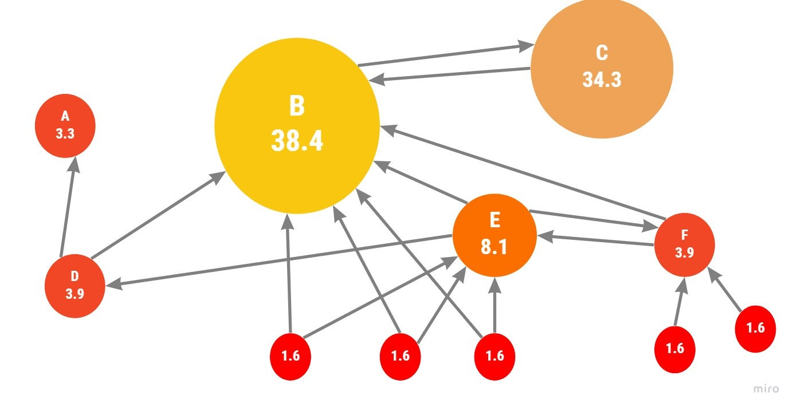
</p>

The mechanism behind _PageRank_ algorithm is well-explained in this [tutorial](https://zhangyk8.github.io/teaching/file_spring2018/Page_Rank_Algorithm.pdf).

- Twitter uses the power iteration to show users recommendations of whom to follow; see this [paper](https://web.stanford.edu/~rezab/papers/wtf_overview.pdf).

---

# Convergence of Power Iteration

Given an initial vector $\mathbf{b}_0 \in \mathbb{R}^d$, the **power iteration** runs
$$\mathbf{b}_n = \frac{A\mathbf{b}_{n-1}}{\|A\mathbf{b}_{n-1}\|_2} \quad \text{ for } n=0,1,...$$
until $\|\mathbf{b}_{n-1} -\mathbf{b}_n\|_2 < \epsilon$.

- The yielded sequence $\{x_n\}_{n=0}^{\infty}$ from the power iteration for approximating $\lambda_1$ is determined by the Rayleigh quotient:
$$x_n = \frac{\mathbf{b}_n^* A \mathbf{b}_n}{\mathbf{b}_n^*\mathbf{b}_n},\quad n=0,1,...$$
and when $\mathbf{b}_n$ is of real values, $x_n = \frac{\mathbf{b}_n^T A \mathbf{b}_n}{\|\mathbf{b}_n\|_2^2}$.

--

- It can be shown that the [power iteration](https://en.wikipedia.org/wiki/Power_iteration) sequence $\{x_n\}_{n=0}^{\infty}$ converges to $\lambda_1$ in the rate $|x_n-\lambda_1| = O\left(\left|\frac{\lambda_2}{\lambda_1} \right|^n \right)$. In other words, the power iteration converges linearly.

---

# Power Iteration (Example)

We use the power iteration to approximate the dominant eigenvalue of the matrix
$$A = \begin{bmatrix}
-4 & 14 & 0\\
-5 & 13 & 0\\
-1 & 0 & 2
\end{bmatrix}.$$

```{r}
A =  matrix(c(-4, 14, 0, -5, 13, 0, -1, 0, 2), ncol = 3, byrow = TRUE)
eigen(A)
```

---

# Power Iteration (Example)

```{r}
powerIter = function(mat, b_0 = NULL, tol = 1e-7) {
  if(is.null(b_0)) {
    b_0 = numeric(length = nrow(mat))
    b_0[1:length(b_0)] = 1
  }
  curr_eig = (t(Conj(b_0)) %*% mat %*% b_0)/(t(Conj(b_0)) %*% b_0)
  eig_seq = c(curr_eig)
  b_new = (mat %*% b_0) / sqrt(sum(mat %*% b_0))
  while(sqrt(sum((b_new - b_0)^2)) > tol) {
    b_0 = b_new
    curr_eig = (t(Conj(b_0)) %*% mat %*% b_0)/(t(Conj(b_0)) %*% b_0)
    eig_seq = c(eig_seq, curr_eig)
    b_new = (mat %*% b_0) / sqrt(sum(mat %*% b_0))
  }
  res_lst = list(eig_vec = b_0, eig_val = curr_eig, eig_val_seq = eig_seq)
  return(res_lst)
}
pow_iter_res = powerIter(A, b_0 = c(1,2,4), tol = 1e-8)
pow_iter_res
```

---

# Power Iteration (Example)

```{r, fig.align='center', fig.height=5.5, fig.width=8}
err_seq = abs(pow_iter_res$eig_val_seq - 6)
par(mar = c(4, 5.5, 1, 0.8)) 
plot(0:(length(err_seq) - 1), log(err_seq), type="l", lwd=5, col="blue", xlab = "Number of iterations", ylab = TeX("$\\log (||x_n - \\lambda_1||_2)$"), cex.lab=2, cex.axis=2, cex=0.7)
```

---

# Newton's Method

**Newton's** (or _Newton-Raphson_) method is one of the most well-known numerical methods for solving a root-find problem $f(p)=0$.

--

- Suppose that $f\in \mathcal{C}^2[a,b]$. Let $p_0$ be an approximation to $p$ such that $f'(p_0)\neq 0$ and 
$$f(p) = f(p_0) + (p-p_0) f'(p_0) + \frac{(p-p_0)^2}{2} \cdot f''(\xi(p)),$$
where $\xi(p)$ lies between $p$ and $p_0$.

--

- Set $f(p)=0$ and assume that $(p-p_0)^2$ is negligible:
$$0\approx f(p_0) + (p-p_0) f'(p_0).$$

--

- Solving for $p$ yields that
$$p\approx p_0 - \frac{f(p_0)}{f'(p_0)}.$$

---

# Newton's Method

The previous derivation leads to the iterative formula of Newton's method for solving $f(p)=0$:
$$p_n = p_{n-1} - \frac{f(p_{n-1})}{f'(p_{n-1})} \quad \text{ for } \quad n\geq 1.$$

<p align="center">
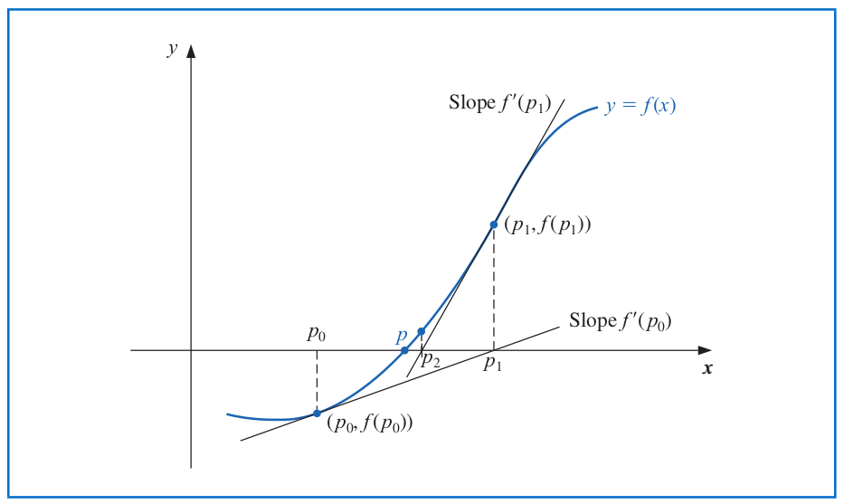
</p>

---

# Convergence of Newton's Method

Newton's method can be regarded as a fixed-point iteration $p_n=g(p_{n-1})$ for $n\geq 1$ with
$$g(x) = x - \frac{f(x)}{f'(x)}.$$

- The convergence of Newton's method follows from the analysis of a fixed-point iteration with $g(x) = x - \frac{f(x)}{f'(x)}$.

--

**Theorem.** Let $f\in \mathcal{C}^2[a,b]$. If $p\in (a,b)$ satisfies $f(p)=0$ and $f'(p)\neq 0$, then there exists a $\delta>0$ such that Newton's method generates a sequence $\{p_n\}_{n=1}^{\infty}$ converging to $p$ for any initial approximation $p_0 \in [p-\delta, p+\delta]$.

---

# Rate of Convergence for Newton's Method

Recall that for any $g\in \mathcal{C}^2[a,b]$ with (i) $|g'(x)| < 1, x\in (a,b)$, (ii) $g'(p)=0$, and (iii) $|g''(x)|$ being bounded, the fixed-point iteration 
$$p_n=g(p_{n-1})$$ 
converges at least quadratically to $p$ for $p_0$ within some closed interval containing $p$.

--

The easiest way to construct a fixed-point iteration for solving $f(x)=0$ is to add/subtract a multiple of $f(x)$ from $x$ as:
$$g(x) = x-\phi(x) \cdot f(x).$$

- Find a differentiable function $\phi$ such that $g'(p)=0$ when $f(p)=0$:
\begin{align*}
g'(x) &= 1-\phi'(x) f(x) - f'(x) \phi(x),\\
g'(p) &= 1- \phi'(p) \cdot 0 - f'(p)\phi(p),
\end{align*}
so $g'(p)=0$ if and only if $\phi(p)=\frac{1}{f'(p)}$.

---

# Rate of Convergence for Newton's Method

- Taking $\phi(p)=\frac{1}{f'(p)}$ exactly leads to Newton's method
$$p_n = g(p_{n-1}) = p_{n-1} - \frac{f(p_{n-1})}{f'(p_{n-1})},$$

- Therefore, if $f$ is continuously differentiable, $f'(p)\neq 0$, and $f''$ exists at $p$, then Newton's method converges at least **quadratically** to $p$ for $p_0$ within some closed interval containing $p$.

--

Examples of Newton's method that fails to converge quadratically:

  - Consider $f(x)=x+x^{\frac{4}{3}}$ so that $f''(x) = \frac{4}{9} x^{-\frac{2}{3}}$ does not exist at the root $p=0$. We will revisit it in Lab 7.

  - Consider $f(x)=x^2$ with $f'(0)=0$. Newton's method iterates $p_n=\frac{p_{n-1}}{2}$ so that $|p_n-p|=\frac{|p_0|}{2^n}$, which converges linearly to $p=0$.

---

# Multiplicity of Zeros in Newton's Method

A solution $p$ of $f(x)=0$ is a zero of **multiplicity** m of $f$ if for $x\neq p$, we can write 
$$f(x) = (x-p)^m q(x) \quad \text{ with } \quad \lim_{x\to p} q(x) \neq 0.$$
--

1. The function $f\in \mathcal{C}^1[a,b]$ has a simple zero at $p\in (a,b)$ if and only if $f(p)=0$ but $f'(p)\neq 0$.

2. The function $f\in \mathcal{C}^m[a,b]$ has a zero of multiplicity $m$ at $p\in (a,b)$ if and only if
$$0=f(p)=f'(p)=\cdots = f^{(m-1)}(p) \quad \text{ but } \quad f^{(m)}(p)\neq 0.$$

Hence, in the previous example, $f(x)=x^2$ has a zero of multiplicity $2$ at $x=0$.

---

# Multiplicity of Zeros in Newton's Method

If $f(x)=(x-p)^m q(x)$ with $\lim_{x\to p} q(x) \neq 0$, then Newton's method can only converge linearly to the solution $p$ within its small neighborhood, because
\begin{align*}
p_n - p &= p_{n-1} -p - \frac{(p_{n-1} - p) q(p_{n-1})}{m\cdot q(p_{n-1}) + (p_{n-1}-p) q'(p_{n-1})},
\end{align*}
which in turn implies that
$$\lim_{n\to\infty} \frac{|p_n - p|}{|p_{n-1} - p|} = \lim_{n\to\infty} \left|\frac{(m-1) q(p_{n-1}) + (p_{n-1} - p) q'(p_{n-1})}{m\cdot q(p_{n-1}) + (p_{n-1} -p) q'(p_{n-1})} \right| = \frac{m-1}{m}.$$

<!--
- In other words, $|p_n-p| = O\left(\left(\frac{m-1}{m}\right)^n \right)$.
-->

--

- If we know the multiplicity $m$ in advance, then we can use the modified Newton's method
$$p_n = p_{n-1} - m\cdot \frac{f(p_{n-1})}{f'(p_{n-1})}$$
to achieve quadratic convergence.

---

# Newton's Method (Example 1)

Use Newton's method to find a solution to 
$$f(x)=e^x +2^{-x} + 2\cos x - 6=0.$$

```{r}
f = function(x) {
  return(exp(x) + 2^(-x) + 2*cos(x) - 6)
}
f_deriv = function(x) {
  return(exp(x) - log(2) * (2^(-x)) - 2*sin(x))
}

NewtonIter = function(fun, fun_deriv, p_0, tol = 1e-7) {
  p_new = p_0 - fun(p_0) / fun_deriv(p_0)
  pt_seq = c(p_0, p_new)
  while(abs(p_new - p_0) > tol) {
    p_0 = p_new
    p_new = p_0 - fun(p_0) / fun_deriv(p_0)
    pt_seq = c(pt_seq, p_new)
  }
  res = list(sol = p_new, pt_seq = pt_seq)
  return(res)
}
```

---

# Newton's Method (Example 1)

```{r}
newton_res = NewtonIter(f, f_deriv, p_0 = 1, tol = 1e-14)
newton_res$sol
```

```{r, fig.align='center', fig.height=5.5, fig.width=8}
err_seq = abs(newton_res$pt_seq - newton_res$sol)
par(mar = c(4, 5.5, 1, 0.8)) 
plot(0:(length(err_seq) - 1), log(err_seq), type="l", lwd=5, col="blue", xlab = "Number of iterations", ylab = TeX("$\\log (||p_n - p^*||_2)$"), cex.lab=2, cex.axis=2, cex=0.7)
```

---

# Newton's Method (Example 2)

Use Newton's method and modified version to find a solution to 
$$f(x)=e^x -\frac{x^2}{2} -x -1=0.$$

- Notice that $f$ has a zero of multiplicity 2 at $p=0$.

```{r}
f2 = function(x) {
  return(exp(x) - x^2/2 - x - 1)
}
f_deriv2 = function(x) {
  return(exp(x) - x - 1)
}
f2_m = function(x) {
  return(2*(exp(x) - x^2/2 - x - 1))
}
newton_res2 = NewtonIter(f2, f_deriv2, p_0 = 1/2, tol = 1e-10)
newton_res2$sol

newton_mod2 = NewtonIter(f2_m, f_deriv2, p_0 = 1/2, tol = 1e-10)
newton_mod2$sol
```

---

# Newton's Method (Example 2)

Use Newton's method and modified version to find a solution to 
$$f(x)=e^x -\frac{x^2}{2} -x -1=0.$$

```{r, fig.align='center', fig.height=5.5, fig.width=8}
err_seq = abs(newton_res2$pt_seq - newton_res2$sol)
err_seq_mod = abs(newton_mod2$pt_seq - newton_mod2$sol)
par(mar = c(4, 5.5, 1, 0.8)) 
plot(0:(length(err_seq) - 1), log(err_seq), type="l", lwd=5, col="blue", xlab = "Number of iterations", ylab = TeX("$\\log (||p_n - p^*||_2)$"), cex.lab=2, cex.axis=2, cex=0.7)
lines(0:(length(err_seq_mod) - 1), log(err_seq_mod), lwd=5, col="red")
legend(13, -1, legend=c("Newton's method", "Modified Newton's method"), fill=c("blue", "red"), cex=1.5)
```

---

# Caveats About Newton's Method

- The derivative of the function $f$ should exist and is easy to compute. In addition, $f'(p_n)\neq 0$ along the sequence $\{p_n\}_{n=0}^{\infty}$. (That is, no stationary points exist along the sequence.)

  - Consider $f(x)=1-x^2=0$. If we start Newton's method at $p_0=0$, then $p_1$ will be undefined.
  
--

To circumvent the derivative calculation in Newton's method, we first note that
$$f'(p_{n-1}) \approx \frac{f(p_{n-2}) - f(p_{n-1})}{p_{n-2} - p_{n-1}} = \frac{f(p_{n-1}) - f(p_{n-2})}{p_{n-1} - p_{n-2}}.$$

Using this approximation for $f'(p_{n-1})$ in Newton's method leads to
$$p_n = p_{n-1} - \frac{f(p_{n-1}) (p_{n-1} - p_{n-2})}{f(p_{n-1}) - f(p_{n-2})}.$$
This technique is called the **Secant Method**.

---

# Secant Method

The **secant method** iterates the following formula:
$$p_n = p_{n-1} - \frac{f(p_{n-1}) (p_{n-1} - p_{n-2})}{f(p_{n-1}) - f(p_{n-2})}.$$

<p align="center">
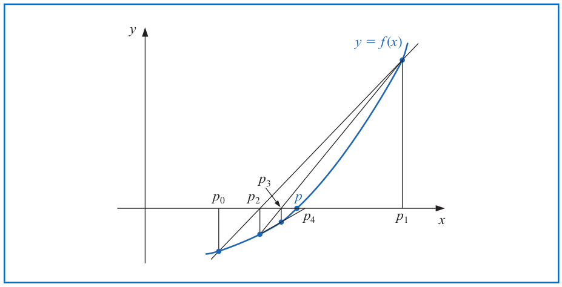
</p>

Note: We can also incorporate the root bracketing idea in the bisection method into the secant method as the **method of False Position** (also called _Regula Falsi_).

---

# Method of False Position

1. Choose initial approximations as $p_0$ and $p_1$ with $f(p_0)\cdot f(p_1) < 0$;

2. Compute $p_2$ using the secant method;

3. If $f(p_2)\cdot f(p_1) < 0$, take $p_3$ as the $x$-intercept of the line joining $\left(p_1, f(p_1)\right)$ and $\left(p_2,f(p_2)\right)$. Otherwise, choose $p_3$ as the $x$-intercept of the line joining $\left(p_0, f(p_0)\right)$ and $\left(p_2,f(p_2)\right)$, and then swap the values of $p_0$ and $p_1$.

In a similar manner, once $p_3$ is found, the sign of $f(p_3) \cdot f(p_2)$ determines whether we use $p_2$ and $p_3$ or $p_3$ and $p_1$ to compute $p_4$.

<p align="center">
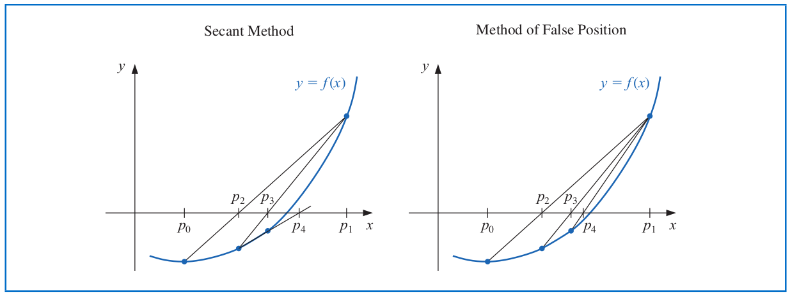
</p>

---

# Caveats About Newton's Method

- Newton's method may overshoot the root $f(p)=0$ (i.e., diverge from the root $p$).

  - Consider $f(x)=|x|^a$ with $0<a<\frac{1}{2}$. Newton's method iterates
\begin{align*}
  p_n &= \begin{cases}
  p_{n-1} - \frac{p_{n-1}^a}{a\cdot p_{n-1}^{a-1}} & \text{ when } p_{n-1} >0,\\
  p_{n-1} - \frac{(-p_{n-1})^a}{a (-1)^a\cdot p_{n-1}^{a-1}} & \text{ when } p_{n-1} < 0,
  \end{cases} \\
  &= \left(1 - \frac{1}{a}\right) p_{n-1}.
\end{align*}
  Since $\left|1-\frac{1}{a}\right| > 1$, we know that 
  $$p_n=\left(1 - \frac{1}{a}\right)^n p_0 \to \infty \text{ or } -\infty$$ 
  so that Newton's method will diverge.
  
---

# Caveats About Newton's Method

- The bad starting point of Newton's method may also lead to a diverging or _cyclic_ sequence.

  - Consider $f(x)=x^3-2x+2$ and take $p_0=0$.
  
  - Then, $p_n=p_{n-1} - \frac{f(p_{n-1})}{f'(p_{n-1})} = \frac{2p_{n-1}^3 -2}{3p_{n-1}^2 -2}$ so that $p_0=0$, $p_1=1$, $p_2=0$, $p_3=1$, $p_4=0$,...

```{r}
NewtonIter = function(fun, fun_deriv, p_0, tol = 1e-7, N = 100) {
  p_new = p_0 - fun(p_0) / fun_deriv(p_0)
  pt_seq = c(p_0, p_new)
  n = 1
  while((abs(p_new - p_0) > tol) & (n < N)) {
    p_0 = p_new
    p_new = p_0 - fun(p_0) / fun_deriv(p_0)
    pt_seq = c(pt_seq, p_new)
    n = n + 1
  }
  res = list(sol = p_new, pt_seq = pt_seq)
  return(res)
}
```

---

# Caveats About Newton's Method

- The bad starting point of Newton's method may also lead to a diverging or cyclic sequence.

  - Consider $f(x)=x^3-2x+2$ and take $p_0=0$.
  
  - Then, $p_n=p_{n-1} - \frac{f(p_{n-1})}{f'(p_{n-1})} = \frac{2p_{n-1}^3 -2}{3p_{n-1}^2 -2}$ so that $p_0=0$, $p_1=1$, $p_2=0$, $p_3=1$, $p_4=0$,...

```{r}
f = function(x) {
  return(x^3 - 2*x + 2)
}
f_deriv = function(x) {
  return(3*x^2 - 2)
}

NewtonIter(fun = f, fun_deriv = f_deriv, p_0 = 0, tol = 1e-7, N = 50)
```

---

# Accelerate Linearly Convergent Sequence

For any sequence $\{p_n\}_{n=0}^{\infty}$ that converges linearly to $p$, we can construct another sequence $\{\hat{p}_n\}_{n=0}^{\infty}$ that converges more rapidly to $p$ than $\{p_n\}_{n=0}^{\infty}$, i.e., _accelerate a linearly convergent sequence_.

- Assume that
$$\frac{p_{n+1}-p}{p_n-p} \approx \frac{p_{n+2} - p}{p_{n+1} -p}.$$

--

- Solving for $p$ leads to
$$p\approx \frac{p_{n+2} p_n - p_{n+1}^2}{p_{n+2} - 2p_{n+1} + p_n}.$$

- Adding and subtracting $p_n^2$ and $2p_n p_{n-1}$ in the numerator yields
\begin{align*}
p & \approx \frac{p_{n+2} p_n -2p_n p_{n+1}+p_n^2- p_{n+1}^2 + 2p_n p_{n+1} -p_n^2}{p_{n+2} - 2p_{n+1} + p_n}\\
&= p_n - \frac{(p_{n+1} - p_n)^2}{p_{n+2} -2p_{n+1} + p_n}.
\end{align*}

---

# Aitken's $\Delta^2$ Method

The previous formula can be used to define a new sequence $\{\hat{p}_n\}_{n=0}^{\infty}$
$$\hat{p}_n = p_n - \frac{(p_{n+1} - p_n)^2}{p_{n+2} -2p_{n+1} + p_n}$$
that converges much faster to $p$ than the original sequence $\{p_n\}_{n=0}^{\infty}$. This is known as **Aitken's $\Delta^2$ Method**.

--

**Theorem.** Suppose that $\{p_n\}_{n=0}^{\infty}$ is a sequence that converges linearly to the limit $p$ and that
$$\lim\limits_{n\to \infty} \frac{p_{n+1}-p}{p_n-p} < 1.$$
Then, the Aitken's $\Delta^2$ sequence $\{\hat{p}_n\}_{n=0}^{\infty}$ converges to $p$ faster than $\{p_n\}_{n=0}^{\infty}$ in the sense that
$$\lim_{n\to\infty} \frac{\hat{p}_n - p}{p_n-p}=0.$$

---

# Aitken's $\Delta^2$ Method with Delta Notation

For a given sequence $\{p_n\}_{n=0}^{\infty}$, the **forward difference** $\Delta p_n$ is defined by
$$\Delta p_n = p_{n+1}-p_n \quad \text{ for } n\geq 0.$$

Higher powers of the operator $\Delta$ are defined recursively by 
$$\Delta^k p_n = \Delta\left(\Delta^{k-1} p_n \right) \quad \text{ for } k\geq 2.$$
- For example, 
$$\Delta^2 p_n = \Delta (p_{n+1}-p_n) = \Delta p_{n+1} - \Delta p_n = (p_{n+2}-p_{n+1}) - (p_{n+1}-p_n).$$

--

Thus, the Aitken's $\Delta^2$ iteration can be written as:
$$\hat{p}_n = p_n - \frac{\left(\Delta p_n \right)^2}{\Delta^2 p_n} \quad \text{ for } n\geq 0.$$

---

# Aitken's $\Delta^2$ Method (Example)

Previously, we use Newton's method to find the solution $p=0$ to 
$$f(x)=e^x -\frac{x^2}{2} -x -1=0.$$
Now, we consider accelerating it via Aitken's $\Delta^2$ method.

```{r}
AitkenAcc = function(in_seq) {
  n = length(in_seq)
  seq_new = in_seq[1:(n-2)] - (in_seq[2:(n-1)] - in_seq[1:(n-2)])^2/(in_seq[3:n] - 2*in_seq[2:(n-1)] + in_seq[1:(n-2)])
  # seq_new = numeric(length = n-2)
  # for (i in 1:(n-2)) {
  #   seq_new[i] = in_seq[i] - (in_seq[i+1] - in_seq[i])^2/(in_seq[i+2] - 2*in_seq[i+1] + in_seq[i])
  # }
  return(seq_new)
}
acc_seq = AitkenAcc(newton_res2$pt_seq)
```

---

# Aitken's $\Delta^2$ Method (Example)

```{r, fig.align='center', fig.height=5.5, fig.width=8}
err_seq = abs(newton_res2$pt_seq - newton_res2$sol)
acc_err = abs(acc_seq - newton_res2$sol)
par(mar = c(4, 5.5, 1, 0.8)) 
plot(0:(length(err_seq) - 1), log(err_seq), type="l", lwd=5, col="blue", xlab = "Number of iterations", ylab = TeX("$\\log (||p_n - p^*||_2)$"), cex.lab=2, cex.axis=2, cex=0.7, ylim = c(-15, -1))
lines(0:(length(acc_err) - 1), log(acc_err), lwd=5, col="red")
legend(22, -2, legend=c("Original", TeX("Aitken's $\\Delta^2$")), fill=c("blue", "red"), cex=1.5)
```

---

# Steffensen's Method

Recall that the fixed-point iteration $p_n = g(p_{n-1})$ can only converge linearly when $g'(p)\neq 0$ at the fixed point $p=g(p)$.

- We can apply the Aitken's $\Delta^2$ method to a linearly convergent fixed-point iteration as:
\begin{align*}
& p_0, \quad p_1=g(p_0), \quad p_2=g(p_1), \quad \hat{p}_0 = p_0 - \frac{(p_1-p_0)^2}{p_2-2p_1+p_0},\\
& p_3 = g(p_2), \quad \hat{p}_1 = p_1 - \frac{(p_2-p_1)^2}{p_3-2p_2 + p_1}, ...
\end{align*}

--

- **Steffensen's Method** modifies the above sequence by assuming that $\hat{p}_0$ is better than $p_2$ in applying the fixed-point iteration:
\begin{align*}
& p_0^{(0)}, \quad p_1^{(0)}=g(p_0^{(0)}), \quad p_2^{(0)}=g(p_1^{(0)}), \quad p_0^{(1)} = p_0^{(0)} - \frac{(p_1^{(0)}-p_0^{(0)})^2}{p_2^{(0)}-2p_1^{(0)}+p_0^{(0)}},\\
& p_1^{(1)} = g(p_0^{(1)}), \quad p_2^{(1)} = g(p_1^{(1)}), \quad p_0^{(2)} = p_0^{(1)} - \frac{(p_1^{(1)}-p_0^{(1)})^2}{p_2^{(1)}-2p_1^{(1)}+p_0^{(1)}}, ...
\end{align*}
The output sequence from Steffensen's method is $\left\{p_0^{(0)}, p_1^{(0)}, p_2^{(0)}, p_0^{(1)}, p_1^{(1)}, p_2^{(1)},... \right\}$.

---

# Steffensen's Method (Example)

Steffensen's method generates the sequence $\left\{p_0^{(0)}, p_1^{(0)}, p_2^{(0)}, p_0^{(1)}, p_1^{(1)}, p_2^{(1)},... \right\}$ as:
\begin{align*}
& p_0^{(0)}, \quad p_1^{(0)}=g(p_0^{(0)}), \quad p_2^{(0)}=g(p_1^{(0)}), \quad p_0^{(1)} = p_0^{(0)} - \frac{(p_1^{(0)}-p_0^{(0)})^2}{p_2^{(0)}-2p_1^{(0)}+p_0^{(0)}},\\
& p_1^{(1)} = g(p_0^{(1)}), \quad p_2^{(1)} = g(p_1^{(1)}), \quad p_0^{(2)} = p_0^{(1)} - \frac{(p_1^{(1)}-p_0^{(1)})^2}{p_2^{(1)}-2p_1^{(1)}+p_0^{(1)}}, ...
\end{align*}

**Theorem.** Suppose that $x=g(x)$ has the solution $p$ with $g'(p)\neq 1$. If there exists a $\delta >0$ such that $g\in \mathcal{C}^3[p-\delta, p+\delta]$, then Steffensen's method gives _quadratic convergence_ for any $p_0\in [p-\delta, p+\delta]$.

---

# Steffensen's Method (Example)

Recall our fixed-point iteration example with $g(x)=2^{-x}$ that has a unique fixed point in $\left[\frac{1}{3}, 1\right]$.

```{r}
g = function(x) { return(2^(-x)) }
SteffenMet = function(g_fun, p_0, tol = 1e-7) {
  p_1 = g_fun(p_0)
  p_2 = g_fun(p_1)
  iter_seq = c(p_0, p_1, p_2)
  p_next = p_0 - (p_1 - p_0)^2/(p_2 - 2*p_1 + p_0)
  while(abs(p_next - p_0) > tol) {
    p_0 = p_next
    p_1 = g_fun(p_0)
    p_2 = g_fun(p_1)
    iter_seq = c(iter_seq, p_0, p_1, p_2)
    if (abs(p_2 - 2*p_1 + p_0) == 0) break
    p_next = p_0 - (p_1 - p_0)^2/(p_2 - 2*p_1 + p_0)
  }
  res = list(fixed_pt = p_next, iter_seq = iter_seq)
  return(res)
}
steff_res = SteffenMet(g_fun = g, p_0 = 1, tol = 1e-30)
steff_res$fixed_pt
```

---

# Steffensen's Method (Example)

```{r, fig.align='center', fig.height=5.5, fig.width=8}
err_seq = abs(fix_pts_res$iter_seq - fix_pts_res$fixed_pt)
acc_err = abs(steff_res$iter_seq - fix_pts_res$fixed_pt)
par(mar = c(4, 5.5, 1, 0.8)) 
plot(0:(length(err_seq) - 1), log(err_seq), type="l", lwd=5, col="blue", xlab = "Number of iterations", ylab = TeX("$\\log (||p_n - p^*||_2)$"), cex.lab=2, cex.axis=2, cex=0.7)
lines(0:(length(acc_err) - 1), log(acc_err), lwd=5, col="red")
legend(16, -2, legend=c("Original", "Steffensen's method"), fill=c("blue", "red"), cex=1.5)
```

---

# Zeros of Polynomials

A _polynomial of degree_ $n$ has the form
$$P(x)=a_nx^n + a_{n-1}x^{n-1} + \cdots + a_1 x+a_0$$
with coefficients $a_i$ and $a_n\neq 0$.

**Fundamental Theorem of Algebra.** If $P(x)$ is a polynomial of degree $n\geq 1$ with real or complex coefficients, then $P(x)=0$ has at least one (possibly complex) root.

--

- To utilize Newton's method, we can evaluate the polynomial and its derivative via [Horner's method](https://en.wikipedia.org/wiki/Horner%27s_method).

- When complex zeros of a polynomial are encountered, [Muller's method](https://en.wikipedia.org/wiki/Muller%27s_method) is an ideal approach for solving these complex zeros.

Note: More details can be found in Section 2.6 of _Numerical Analysis (9th Edition)_ by Richard L. Burden, J. Douglas Faires, Annette M. Burden, 2015.

---
class: inverse

# Part 5: Numerical Differentiation and Integration

---

# Numerical Differentiation

Recall that the derivative of a function $f$ at $x_0$ is defined as:
$$f'(x_0) = \lim_{h\to 0} \frac{f(x_0+h) -f(x_0)}{h}.$$

Thus, we can simply approximate $f'(x_0)$ with a small value of $h$ as:
$$f'(x_0) \approx \frac{f(x_0+h) -f(x_0)}{h}.$$

- This formula is known as the **forward-difference** formula if $h>0$ and the **backward-difference** formula if $h<0$.

--

- By Taylor's theorem, the approximation error is $O(h)$ when $|f''(\xi)|$ is bounded for $\xi$ between $x_0$ and $x_0+h$, because
\begin{align*}
f'(x_0) &= \frac{f(x_0+h) - f(x_0)}{h} - \frac{h}{2}\cdot f''(\xi)\\
&= \frac{f(x_0+h) - f(x_0)}{h} + O(h).
\end{align*}

---

# Numerical Differentiation: Forward-Difference

The following figure presents the forward-difference approximation to $f'(x_0)$ with a small value of $h>0$ as:
$$f'(x_0) \approx \frac{f(x_0+h) -f(x_0)}{h}.$$

<p align="center">
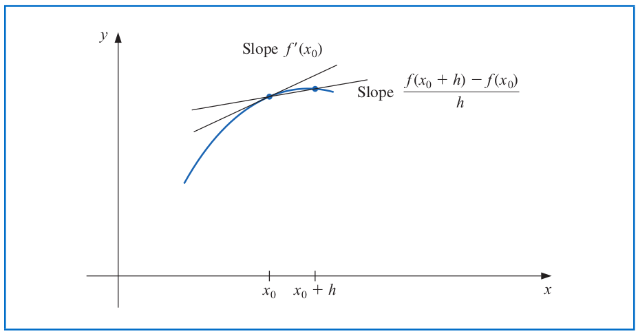
</p>

---

# Lagrange Interpolating Polynomial

Before introducing the general derivative approximation formula, we need some prerequisites about polynomial interpolation.

- We want to determine a polynomial of degree 1 that passes through (or _interpolates_) two distinct points $(x_0,f(x_0))$ and $(x_1, f(x_1))$.

--

- Define the functions
$$L_0(x) = \frac{x-x_1}{x_0-x_1} \quad \text{ and } \quad L_1(x) = \frac{x-x_0}{x_1-x_0}.$$

--

- The linear **Lagrange interpolating polynomial** through $(x_0,y_0)$ and $(x_1,y_1)$ is
$$P(x) = L_0(x)f(x_0) + L_1(x)f(x_1) =\frac{x-x_1}{x_0-x_1} \cdot f(x_0) + \frac{x-x_0}{x_1-x_0} \cdot f(x_1).$$

- $P$ is also the unique polynomial of degree at most 1 that interpolates $(x_0,y_0)$ and $(x_1,y_1)$.

---

# Lagrange Interpolating Polynomial

To generalize the linear interpolation, we consider constructing a polynomial of degree at most $n$ that interpolates the $(n+1)$ points:
$$(x_0,f(x_0)),\, (x_1,f(x_1)),\,..., (x_n,f(x_n)).$$

<p align="center">
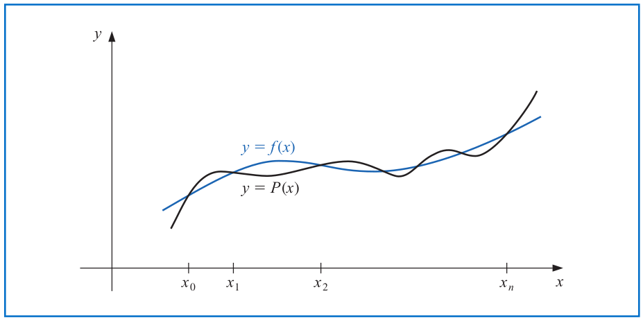
</p>

Define the functions
$$L_{n,k}(x) = \frac{(x-x_0)\cdots (x - x_{k-1}) (x-x_{k+1}) \cdots (x -x_n)}{(x_k-x_0)\cdots (x_k - x_{k-1}) (x_k-x_{k+1}) \cdots (x_k -x_n)}=\prod_{i=0\\ i\neq k}^n \frac{(x-x_i)}{(x_k-x_i)}$$
for $k=0,1,...,n$.

---

# Lagrange Interpolating Polynomial

One example graph of the functions
$$L_{n,k}(x) = \frac{(x-x_0)\cdots (x - x_{k-1}) (x-x_{k+1}) \cdots (x -x_n)}{(x_k-x_0)\cdots (x_k - x_{k-1}) (x_k-x_{k+1}) \cdots (x_k -x_n)}=\prod_{i=0\\ i\neq k}^n \frac{(x-x_i)}{(x_k-x_i)}$$
for $k=0,1,...,n$ looks as follows.

<p align="center">
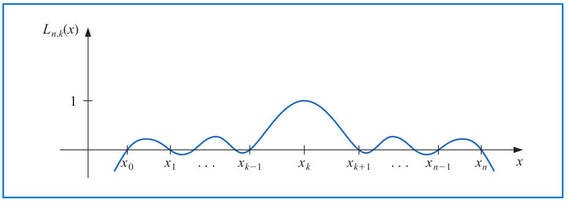
</p>

The $n^{th}$ **Lagrange (interpolating) polynomial** is defined as:
$$P(x) = f(x_0) L_{n,0}(x) + \cdots + f(x_n) L_{n,n}(x) = \sum_{k=0}^n f(x_k) L_{n,k}(x).$$

---

# Polynomial Approximation Theory

**Theorem.** Suppose that $x_0,x_1,...,x_n$ are distinct numbers in $[a,b]$ and $f\in \mathcal{C}^{n+1}[a,b]$. Then, for each $x\in [a,b]$, there exists a number $\xi(x)\in (a,b)$ such that
$$f(x) = \sum_{k=0}^n f(x_k) L_{n,k}(x) + \frac{f^{(n+1)}(\xi(x))}{(n+1)!} \cdot (x-x_0) (x-x_1) \cdots (x-x_n).$$

--

More generally, **Weierstrass Approximation Theorem** tells us that for each $\epsilon >0$ and $f\in \mathcal{C}[a,b]$, there exists a polynomial $P(x)$ such that
$$|f(x) - P(x)| < \epsilon \quad \text{ for all } x\in [a,b].$$
In other words, any continuous function can be well-approximated by polynomials of certain degrees.

---

# Differentiation: $(n+1)$-Point Formula

The above Lagrange polynomial approximation to $f\in \mathcal{C}^{n+1}$ reads
$$f(x) = \sum_{k=0}^n f(x_k) L_{n,k}(x) + \frac{f^{(n+1)}(\xi(x))}{(n+1)!} \cdot (x-x_0) (x-x_1) \cdots (x-x_n).$$

- Differentiating this expression gives
\begin{align*}
f'(x) &= \sum_{k=0}^n f(x_k) L_{n,k}'(x) + \left[\frac{d}{dx}\frac{f^{(n+1)}(\xi(x))}{(n+1)!}\right] \prod_{k=0}^n(x-x_k) \\
&\quad + \frac{f^{(n+1)}(\xi(x))}{(n+1)!} \cdot \frac{d}{dx} \prod_{k=0}^n(x-x_k).
\end{align*}

--

- Plugging any $x_j,j=0,...,n$ into the above expression gives
$$f'(x_j) = \sum_{k=0}^n f(x_k) L_{n,k}'(x_j) + \frac{f^{(n+1)}(\xi(x_j))}{(n+1)!} \prod_{k=0\\ k\neq j}^n (x_j-x_k),$$
which is called an $(n+1)$-point formula to approximate $f'(x_j)$.

---

# Three-Point Formula

When there are only three distinct points $\{x_0,x_1,x_2\}$ in the interval of interest, we know that 
$$L_0(x) = \frac{(x-x_1)(x-x_2)}{(x_0-x_1)(x_0-x_2)} \quad \text{ so that } \quad L_0'(x) = \frac{2x - x_1-x_2}{(x_0-x_1)(x_0-x_2)}.$$
Similarly, $L_1'(x) = \frac{2x - x_0-x_2}{(x_1-x_0)(x_1-x_2)}$ and $L_2'(x)=\frac{2x - x_0-x_1}{(x_2-x_0)(x_2-x_1)}$.

--

Thus, based on the previous $(n+1)$-point formula, we obtain that
\begin{align*}
f'(x_j) &= f(x_0)\left[\frac{2x_j - x_1-x_2}{(x_0-x_1)(x_0-x_2)} \right] + f(x_1) \left[\frac{2x_j - x_0-x_2}{(x_1-x_0)(x_1-x_2)} \right] \\
& \quad + f(x_2)\left[\frac{2x_j - x_0-x_1}{(x_2-x_0)(x_2-x_1)} \right] + \frac{f^{(3)}(\xi_j)}{6} \prod_{k=0\\ k\neq j}^2 (x_j-x_k)
\end{align*}
for each $j=0,1,2$, where $\xi_j$ depends on $x_j$.

---

# Three-Point Formula

Most commonly, we choose equally spaced nodes
$$x_j=x_0, \quad x_1=x_0+h, \quad x_2=x_0+2h \quad \text{ for some } h\neq 0$$
and use the three-point formula to obtain that
\begin{align*}
f'(x_0) &= \frac{1}{h}\left[-\frac{3}{2} f(x_0) + 2f(x_0+h) -\frac{1}{2} f(x_0+2h) \right] + \frac{h^2}{3} f^{(3)}(\xi_0),\\
f'(x_0+h) &= \frac{1}{h}\left[-\frac{1}{2} f(x_0) + \frac{1}{2} f(x_0+2h) \right] - \frac{h^2}{6} f^{(3)}(\xi_1),\\
f'(x_0+2h) &= \frac{1}{h}\left[\frac{1}{2} f(x_0) - 2f(x_0+h) + \frac{3}{2} f(x_0+2h) \right] + \frac{h^2}{3} f^{(3)}(\xi_2).
\end{align*}

--

Using variable substitutions $x_0\gets x_0-h$ and $x_0\gets x_0-2h$ in the latter two expressions gives
\begin{align*}
f'(x_0) &= \frac{1}{h}\left[-\frac{1}{2} f(x_0-h) + \frac{1}{2} f(x_0+h) \right] - \frac{h^2}{6} f^{(3)}(\xi_1),\\
f'(x_0) &= \frac{1}{h}\left[\frac{1}{2} f(x_0-2h) - 2f(x_0-h) + \frac{3}{2} f(x_0) \right] + \frac{h^2}{3} f^{(3)}(\xi_2).
\end{align*}

---

# Three-Point Formula

When $|f^{(3)}(x)|$ is bounded between $x_0-2h$ and $x_0+2h$, we have the following results.

_Three-Point Endpoint Formula_: For $\xi_0$ lying between $x_0$ and $x_0+2h$,
\begin{align*}
f'(x_0) &= \frac{1}{2h}\left[-3 f(x_0) + 4f(x_0+h) - f(x_0+2h) \right] + \frac{h^2}{3} f^{(3)}(\xi_0)\\
&= \frac{1}{2h}\left[-3 f(x_0) + 4f(x_0+h) - f(x_0+2h) \right] + O(h^2).
\end{align*}

--

_Three-Point Midpoint Formula_: For $\xi_1$ lying between $x_0-h$ and $x_0+h$,
\begin{align*}
f'(x_0) &= \frac{1}{2h}\left[f(x_0+h) - f(x_0-h) \right] - \frac{h^2}{6} f^{(3)}(\xi_1)\\
&= \frac{1}{2h}\left[f(x_0+h) - f(x_0-h) \right] + O(h^2).
\end{align*}
Note: The three-point formulas have smaller approximation errors $O(h^2)$ than the direct approximation $f'(x_0)= \frac{f(x_0+h) - f(x_0)}{h} + O(h)$ when $h$ is small.

---

# Five-Point Formula

When $|f^{(5)}(x)|$ is bounded between $x_0-4h$ and $x_0+4h$, we have the following results.

_Five-Point Midpoint Formula_: For $\xi$ lying between $x_0-2h$ and $x_0+2h$,
\begin{align*}
f'(x_0) &= \frac{1}{12h}\left[f(x_0-2h) -8f(x_0-h)+ 8f(x_0+h) - f(x_0+2h) \right] \\
&\quad + \frac{h^4}{30} f^{(5)}(\xi).
\end{align*}

_Five-Point Endpoint Formula_: For $\xi$ lying between $x_0-2h$ and $x_0+2h$,
\begin{align*}
f'(x_0) &= \frac{1}{12h}\Big[-25f(x_0) +48f(x_0+h) - 36 f(x_0+2h) \\
&\quad \quad + 16 f(x_0+3h) - 3f(x_0+4h) \Big] + \frac{h^4}{5} f^{(5)}(\xi).
\end{align*}
Note: The five-point formulas have even smaller approximation errors $O(h^4)$ than the three-point formulas when $h$ is small.

---

# Numerical High-Order Differentiation

The numerical approximation to high-order derivatives can be defined recursively based on the first-order or lower order derivatives.

- However, approximation errors will propagate as we approach higher order derivatives.

--

- An alternative way is to utilize the Taylor polynomial or Lagrange polynomial around $x_0$ to construct approximation formulas for higher order derivatives that depend only on the function values around $x_0$.

- _Second-Order Derivative Midpoint formula_: For $\xi$ between $x_0-h$ and $x_0+h$,
$$f''(x_0) = \frac{1}{h^2}\left[f(x_0-h) -2f(x_0) + f(x_0+h) \right] - \frac{h^2}{12} f^{(4)}(\xi).$$

---

# Numerical Differentiation (Example)

We want to compute the derivatives $f'(1),f''(1)$ of 
$$f(x)=e^x+\sin(x) -x^3.$$

```{r}
f = function(x) { return(exp(x) + sin(x) - x^3) }
cat("f'(1) =", exp(1)+cos(1)-3)
h = 0.005
# Forward-difference for f'(1)
(f(1+h) - f(1))/h
# Backward-difference for f'(1)
(f(1-h) - f(1))/(-h)
```

---

# Numerical Differentiation (Example)

We want to compute the derivatives $f'(1),f''(1)$ of 
$$f(x)=e^x+\sin(x) -x^3.$$

```{r}
cat("f'(1) =", exp(1)+cos(1)-3)
# Three-point endpoint formula for f'(1)
(-3*f(1) + 4*f(1+h) - f(1+2*h))/(2*h)
# Three-point midpoint formula for f'(1)
(f(1+h) - f(1-h))/(2*h)
# Five-point midpoint formula for f'(1)
(f(1-2*h) -8*f(1-h) + 8*f(1+h) - f(1+2*h))/(12*h)
# Five-point endpoint formula for f'(1)
(-25*f(1) + 48*f(1+h) - 36*f(1+2*h) + 16*f(1+3*h) - 3*f(1+4*h))/(12*h)
```

---

# Numerical Differentiation (Example)

We want to compute the derivatives $f'(1),f''(1)$ of 
$$f(x)=e^x+\sin(x) -x^3.$$

```{r}
cat("f''(1) =", exp(1)-sin(1)-6)
# Second-order derivative midpoint formula
(f(1-h) -2*f(1) + f(1+h))/(h^2)
h = 0.000005
# Second-order derivative midpoint formula
(f(1-h) -2*f(1) + f(1+h))/(h^2)
```

Note: Choosing a smaller $h$ is not always better.

---

# Round-Off Error Instability

Why shouldn't we always use a very small $h$ in the derivative approximation formulas?

Consider the three-point midpoint formula:
$$f'(x_0) = \frac{1}{2h}\left[f(x_0+h) - f(x_0-h) \right] - \frac{h^2}{6} f^{(3)}(\xi_1).$$

--

- Suppose that we have round-off errors $e(x_0+h)$ and $e(x_0-h)$ in evaluating $f(x_0+h), f(x_0-h)$, i.e., the actual values that we use are
\begin{align*}
\tilde{f}(x_0+h) &= f(x_0+h) + e(x_0+h) \quad \text{ and }\\ 
\tilde{f}(x_0-h) &= f(x_0-h) + e(x_0-h).
\end{align*}

---

# Round-Off Error Instability

Why shouldn't we always use a very small $h$ in the derivative approximation formulas?

- Thus, when the round-off errors $e(x_0\pm h) \leq \epsilon$ for some $\epsilon >0$ and $|f^{(3)}(x)|\leq M$ in the region of interest, the total error in the approximation becomes
\begin{align*}
&\left|f'(x_0) - \frac{\tilde{f}(x_0+h) - \tilde{f}(x_0-h)}{2h} \right| \\
&= \left|-\frac{e(x_0+h) -e(x_0-h)}{2h}- \frac{h^2}{6} f^{(3)}(\xi_1) \right|\\
&\leq \underbrace{\frac{\epsilon}{h}}_{\text{Round-off error}} + \underbrace{\frac{h^2 \cdot M}{6}}_{\text{Truncation error}}.
\end{align*}

- When $h$ is small, the truncation error reduces but round-off error increases.

- When $h$ is large, the round-off error is small but the truncation error grows.


---

# Round-Off Error Instability

Why shouldn't we always use a very small $h$ in the derivative approximation formulas?
\begin{align*}
&\left|f'(x_0) - \frac{\tilde{f}(x_0+h) - \tilde{f}(x_0-h)}{2h} \right|
&\leq \underbrace{\frac{\epsilon}{h}}_{\text{Round-off error}} + \underbrace{\frac{h^2 \cdot M}{6}}_{\text{Truncation error}}.
\end{align*}

- The optimal $h$ is $\left(\frac{3\epsilon}{M}\right)^{\frac{1}{3}}$, which can't be computed in practice!

- The choice of $h$ resembles the bias-variance trade-off in statistical prediction.

<p align="center">
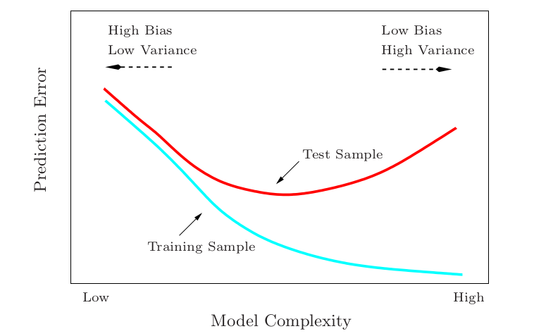
</p>

---

# Numerical Integration

Recall that the Riemann integral of a function $f$ on the interval $[a,b]$ is defined as:
$$\int_a^b f(x) dx = \lim_{\max \Delta x_i \to 0} \sum_{i=1}^n f(z_i) \Delta x_i.$$

- It provides a basic method called **numerical quadrature** for approximating $\int_a^b f(x) dx$ via a sum $\sum_{i=0}^n a_i f(x_i)$.

--

- The idea is to select a set of distinct nodes $\{x_0,...,x_n\}$ from the interval $[a,b]$ and integrate the Lagrange (interpolating) polynomial $P_n(x) = \sum_{i=0}^n f(x_i) L_{n,i}(x)$ as:
\begin{align*}
\int_a^b f(x) dx &= \int_a^b \sum_{i=0}^n f(x_i) L_{n,i}(x) dx + \int_a^b \prod_{i=0}^n (x-x_i) \frac{f^{(n+1)}(\xi(x))}{(n+1)!} dx\\
&= \sum_{i=0}^n a_i f(x_i) + \frac{1}{(n+1)!} \int_a^b \prod_{i=0}^n (x-x_i) f^{(n+1)}(\xi(x)) dx.
\end{align*}

---

# Numerical Integration

The quadrature formula is thus given by
$$\int_a^b f(x) dx \approx \sum_{i=0}^n a_i f(x_i) \quad \text{ with } \quad a_i=\int_a^b L_{n,i}(x) dx, i=0,1,...,n.$$

Before discussing the general situation of quadrature formulas, we first consider formulas produced by using the first and second Lagrange polynomials with equally-spaced nodes:

- **Trapezoidal rule** produced by the first Lagrange polynomial with $x_0=a$, $x_1=b$, and $h=b-a$.

- **Simpson's rule** produced by the second Lagrange polynomial with $x_0=a$, $x_2=b$, $x_1=a+h$, and $h=\frac{b-a}{2}$.

---

# Trapezoidal Rule

To approximate $\int_a^b f(x) dx$, consider the linear Lagrange polynomial:
$$P_1(x) = \frac{(x-x_1)}{(x_0-x_1)} f(x_0) + \frac{(x-x_0)}{(x_1-x_0)} f(x_1).$$

- Then, with $x_0=a$ and $x_1=b$, we have that
\begin{align*}
\int_a^b f(x) dx &= \int_{x_0}^{x_1} \left[\frac{(x-x_1)}{(x_0-x_1)} f(x_0) + \frac{(x-x_0)}{(x_1-x_0)} f(x_1) \right] dx \\
&\quad + \frac{1}{2} \int_{x_0}^{x_1} f''(\xi(x)) (x-x_0) (x-x_1) dx.
\end{align*}

--

- By Weighted Mean Value Theorem for Integrals, there exists $\xi\in (x_0,x_1)$ such that when $h=b-a$, 
\begin{align*}
\int_{x_0}^{x_1} f''(\xi(x)) (x-x_0) (x-x_1) dx &= f''(\xi) \int_{x_0}^{x_1} (x-x_0) (x-x_1) dx\\
&= -\frac{h^3}{6} f''(\xi).
\end{align*}

---

# Trapezoidal Rule

Therefore, the Trapezoidal rule approximates $\int_a^b f(x) dx$ by
\begin{align*}
\int_a^b f(x) dx &= \frac{h}{2} \left[f(a) + f(b)\right] -\underbrace{\frac{h^3}{12} f''(\xi)}_{\text{Truncation error}} \quad \text{ with } \quad h=b-a.
\end{align*}

<p align="center">
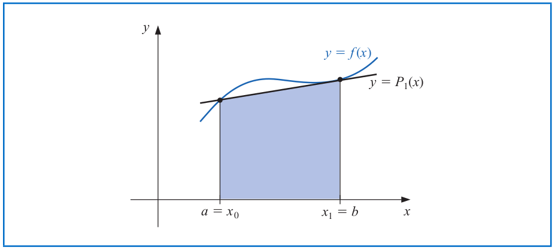
</p>

Note: This is called the Trapezoidal rule because when $f$ is a function with positive values, $\int_a^b f(x) dx$ is approximated by the area of a trapezoid.

---

# Simpson's Rule

Simpson's rule results from integrating the second Lagrange polynomial over $[a,b]$ with $x_0=a$, $x_2=b$, $x_1=a+h$, and $h=\frac{b-a}{2}$ as:
\begin{align*}
\int_a^b f(x) dx &= \int_{x_0}^{x_2} \Bigg[ \frac{(x-x_1)(x-x_2)}{(x_0-x_1)(x_0-x_2)} f(x_0) + \frac{(x-x_0)(x-x_2)}{(x_1-x_0)(x_1-x_2)} f(x_1) \\
&\quad \quad + \frac{(x-x_0)(x-x_2)}{(x_2-x_0)(x_2-x_1)} f(x_2) \Bigg] dx \\
&\quad + \int_{x_0}^{x_2} \frac{(x-x_0)(x-x_1)(x-x_2)}{6} f^{(3)}(\xi(x)) dx.
\end{align*}

--

By some tedious algebra and the Weighted Mean Value Theorem for Integrals, we obtain that
\begin{align*}
\int_a^b f(x) dx &= \frac{h}{3} \left[f(x_0) + 4f(x_1) + f(x_2)\right] -\underbrace{\frac{h^5}{90} f^{(4)}(\xi)}_{\text{Truncation error}}
\end{align*}
for some $\xi \in (a,b)$.

---

# Simpson's Rule

\begin{align*}
\int_a^b f(x) dx &= \frac{h}{3} \left[f(a) + 4f\left(\frac{a+b}{2} \right) + f(b)\right] -\underbrace{\frac{h^5}{90} f^{(4)}(\xi)}_{\text{Truncation error}}
\end{align*}
with $h=\frac{b-a}{2}$.

<p align="center">
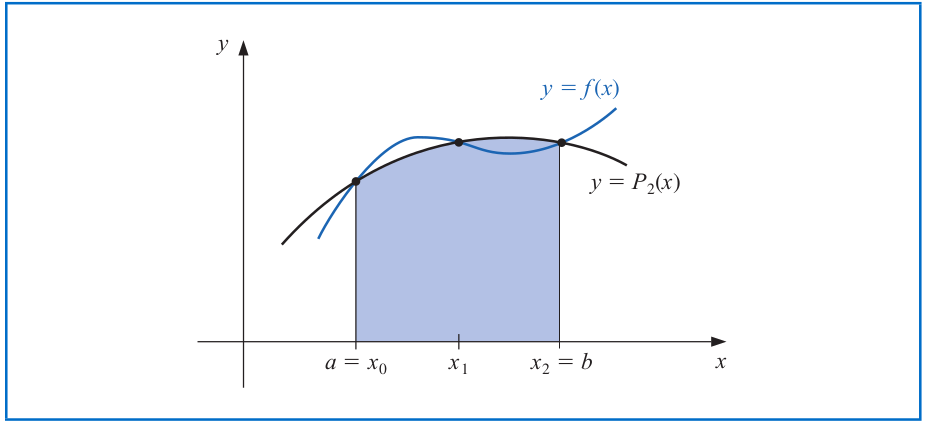
</p>


---

# Closed Newton-Cotes Formulas

More generally, the $(n+1)$-point **closed Newton-Cotes formula** uses nodes $x_i=x_0+ih$ for $i=0,1,...,n$, where $x_0=a$, $x_n=b$, and $h=\frac{b-a}{n}$, in the quadrature formula:
$$\int_a^b f(x) dx = \begin{cases}
\sum\limits_{i=0}^n a_i f(x_i) + \frac{h^{n+3} f^{(n+2)}(\xi)}{(n+2)!} \int_0^n r^2 (t-1)\cdots (t-n) dt \,\text{ if } n \text{ is even},\\
\sum\limits_{i=0}^n a_i f(x_i) + \frac{h^{n+2} f^{(n+2)}(\xi)}{(n+1)!} \int_0^n r^2 (t-1)\cdots (t-n) dt\, \text{ if } n \text{ is odd},
\end{cases}$$
for some $\xi\in (a,b)$ and $f\in \mathcal{C}^{n+2}[a,b]$.

<p align="center">
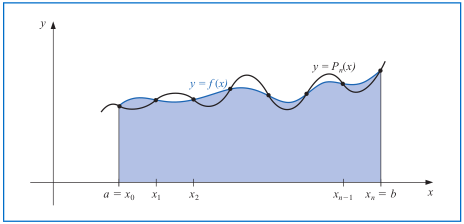
</p>

---

# Closed Newton-Cotes Formulas

Some of the common closed Newton-Cotes formulas are:

- $n=1$: Trapezoidal rule
$$\int_{x_0}^{x_1} f(x) dx = \frac{h}{2}\left[f(x_0) + f(x_1) \right] - \frac{h^3}{12} f''(\xi) \quad \text{ with } \quad x_0 < \xi < x_1.$$

- $n=2$: Simpson's rule
$$\int_{x_0}^{x_2} f(x) dx = \frac{h}{3}\left[f(x_0) + 4f(x_1) + f(x_2) \right] - \frac{h^5}{90} f^{(4)}(\xi) \, \text{ with } \, x_0 < \xi < x_2.$$

- $n=3$: Simpson's Three-Eighths rule
\begin{align*}
\int_{x_0}^{x_3} f(x) dx &= \frac{3h}{8}\left[f(x_0) + 3f(x_1) + 3f(x_2) + f(x_3)\right] - \frac{3h^5}{80} f^{(4)}(\xi) \\
& \text{ with } \quad x_0 < \xi < x_3.
\end{align*}

---

# Composite Numerical Integration

The Newton-Cotes formulas are generally _unsuitable_ for use over large integration intervals.

- High-degree formulas would be required, and the values of the coefficients in these formulas are difficult to obtain.

- The equally-spaced nodes may lead to high errors of the low-order Newton-Cotes formulas due to the oscillatory nature of high-degree polynomials.

--

**Solution.** To evaluate $\int_a^b f(x)dx$,

1. Choose an even integer $n$;

2. Subdivide $[a,b]$ into $n$ subintervals;

3. Apply Simpson's rule on each consecutive pair of subintervals.

---

# Composite Numerical Integration

Let $f\in \mathcal{C}^4[a,b]$, $n$ be even, $h=(b-a)/n$, and $x_j=a+jh$ for each $j=0,1,...,n$. There exists a $\mu\in (a,b)$ such that
\begin{align*}
\int_a^b f(x) dx &= \frac{h}{3}\left[f(a) + 2\sum_{j=1}^{(n/2)-1} f(x_{2j}) + 4 \sum_{j=1}^{n/2} f(x_{2j-1}) + f(b)\right] \\
&\quad - \frac{(b-a)}{180} h^4 f^{(4)}(\mu).
\end{align*}
Note: The error term for the above **Composite Simpson's rule** is $O(h^4)$ with $h=(b-a)/n$, whereas it was $O(h^5)$ with $h=(b-a)/2$ for the standard Simpson's rule. Thus, the truncation error of Composite Simpson's rule is smaller when $n$ is large.

<p align="center">
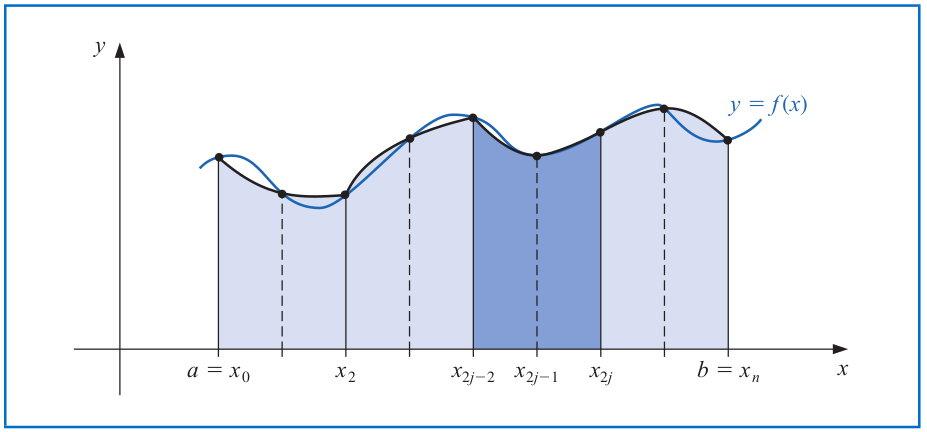
</p>

---

# Composite Numerical Integration

Similarly, we have the **Composite Trapezoidal rule** as follows. Let $f\in \mathcal{C}^2[a,b]$, $h=(b-a)/n$, and $x_j=a+jh$ for each $j=0,1,...,n$. There exists a $\mu\in (a,b)$ such that
\begin{align*}
\int_a^b f(x) dx &= \frac{h}{2}\left[f(a) + 2\sum_{j=1}^{n-1} f(x_j) + f(b)\right] - \frac{(b-a)}{12} h^2 f''(\mu).
\end{align*}

<p align="center">
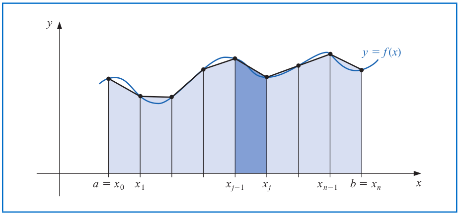
</p>

---

# Composite Numerical Integration

Finally, we have the **Composite Midpoint rule** as follows. Let $f\in \mathcal{C}^2[a,b]$, $n$ be even, $h=(b-a)/(n+2)$, and $x_j=a+(j+1)h$ for each $j=-1,0,...,n+1$. There exists a $\mu\in (a,b)$ such that
\begin{align*}
\int_a^b f(x) dx &= 2h\sum_{j=0}^{n/2} f(x_{2j}) + \frac{(b-a)}{6} h^2 f''(\mu).
\end{align*}

<p align="center">
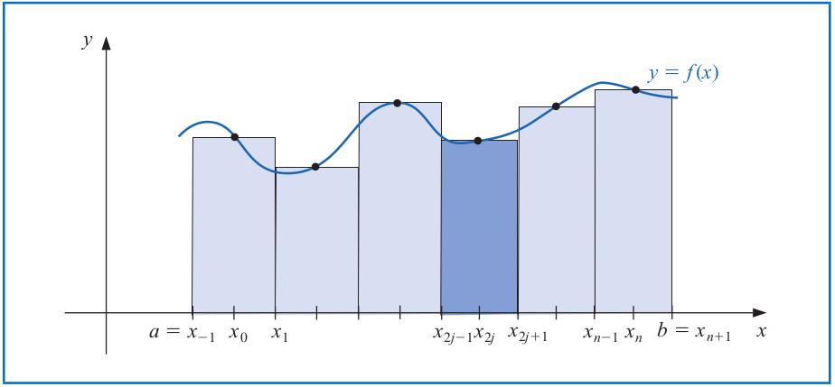
</p>

---

# Numerical Integration (Example)

Suppose that we want to evaluate the integral $\int_0^3 e^{-x^3} dx$.

```{r}
f = function(x) { return(exp(-x^3)) }
integrate(f, lower = 0, upper = 3)
# Trapezoidal rule
(f(0) + f(3))*3/2
# Simpson's rule
(f(0) + 4*f(3/2) + f(3))*3/6
# Simpson's Three-Eighths rule
(f(0) + 3*f(1) + 3*f(2) + f(3))*3/8
```

---

# Numerical Integration (Example)

Suppose that we want to evaluate the integral $\int_0^3 e^{-x^3} dx$.

```{r}
integrate(f, lower = 0, upper = 3)
# Composite Simpson's rule
compSimpson = function(f, lower = 0, upper = 1, n = 10) {
  if (n %% 2 != 0) stop("The input n should be an even integer")
  pts = seq(lower, upper, by = (upper - lower)/n)
  pts = pts[2:(n-1)]
  odd_ind = rep(c(TRUE, FALSE), times = (n-2)/2)
  res = (f(lower) + 4*sum(f(pts[odd_ind])) + 2*sum(f(pts[!odd_ind])) + f(upper)) * (upper - lower)/(3*n)
  return(res)
}
compSimpson(f, lower = 0, upper = 3, n = 30)
```

---

# Numerical Integration (Example)

Suppose that we want to evaluate the integral $\int_0^3 e^{-x^3} dx$.

```{r}
integrate(f, lower = 0, upper = 3)
# Composite Trapezoidal rule
compTrape = function(f, lower = 0, upper = 1, n = 10) {
  pts = seq(lower, upper, by = (upper - lower)/n)
  return((2*sum(f(pts)) - f(lower) - f(upper)) * (upper - lower)/(2*n))
}
compTrape(f, lower = 0, upper = 3, n = 30)
```

---

# Numerical Integration (Example)

Suppose that we want to evaluate the integral $\int_0^3 e^{-x^3} dx$.

```{r}
integrate(f, lower = 0, upper = 3)
# Composite Midpoint rule
compMidpoint = function(f, lower = 0, upper = 1, n = 10) {
  if (n %% 2 != 0) stop("The input n should be an even integer")
  pts = seq(lower, upper, by = (upper - lower)/n)
  even_ind = rep(c(TRUE, FALSE), times = n+1)
  return(sum(f(pts[even_ind]))*(2*(upper - lower)) / (n+2))
}
compTrape(f, lower = 0, upper = 3, n = 30)
```

---

# Laplace's Method of Integration

Consider an integral of the form $I=\int_a^b e^{-\lambda g(x)} h(x) dx$,
where 
1. $g(x)$ is a smooth function that has a local minimum at $x^* \in (a,b)$;

2. $h(x)$ is smooth and $\lambda > 0$ is large.

_Example_: 
- The integral $I$ can be the moment generating function of $g(Y)$ when $Y$ has density $h$.

- The integral $I$ could be a posterior expectation of $h(Y)$.

--

_Key observation_:
- When $\lambda$ is large, the integral $I$ is essentially determined by the values of $e^{-\lambda g(x)} h(x)$ around $x^*$.

---

# Laplace's Method of Integration

We formalize the observation by Taylor's theorem of $g$ around $x^*$:
$$g(x) = g(x^*) + g'(x^*) (x-x^*) + \frac{g''(x^*)}{2} (x-x^*)^2+o\left(|x-x^*|^2\right).$$

--

- Since $x^*$ is a local minimum, we have $g'(x^*)=0$, $g''(x^*)>0$, and
$$g(x) - g(x^*) = \frac{g''(x^*)}{2} (x-x^*)^2+o\left(|x-x^*|^2\right).$$

--

- If we further approximate $h(x)$ linearly around $x^*$, we obtain that
\begin{align*}
I &= \int_a^b e^{-\lambda g(x)} h(x) dx\\
&\approx e^{-\lambda g(x^*)} h(x^*) \int_{-\infty}^{\infty} \underbrace{e^{-\frac{\lambda g''(x^*)}{2}(x-x^*)^2}}_{\text{Density of }Normal\left(x^*, \frac{1}{\lambda g''(x^*)}\right)} dx \\
&\quad + e^{-\lambda g(x^*)} h'(x^*) \underbrace{\int_{-\infty}^{\infty} (x-x^*) e^{-\frac{\lambda g''(x^*)}{2}(x-x^*)^2} dx}_{=0}\\
&= e^{-\lambda g(x^*)} h(x^*) \sqrt{\frac{2\pi}{\lambda g''(x^*)}}
\end{align*}

---

# Laplace's Method of Integration

The Laplace's method for approximating the integral is typically very accurate, in that
\begin{align*}
I &= \int_a^b e^{-\lambda g(x)} h(x) dx\\
&= e^{-\lambda g(x^*)} h(x^*) \sqrt{\frac{2\pi}{\lambda g''(x^*)}} \left[1+ O\left(\frac{1}{\lambda}\right) \right]\\
&\equiv A\left[1+ O\left(\frac{1}{\lambda}\right) \right].
\end{align*}

- The relative error $\frac{I-A}{A}$ is of order $O\left(\frac{1}{\lambda}\right)$ and thus remains bounded _even when multiplied with $\lambda$_ for $\lambda \to \infty$.

---

# Laplace's Method of Integration (Example)

Consider the Gamma function $\Gamma(x)=\int_0^{\infty} t^{x-1} e^{-t} dt$.

- Recall that $\Gamma(n+1)=n!$ for an integer $n\geq 0$.

- In general, $\Gamma(\lambda+1)=\int_0^{\infty} t^{\lambda} e^{-t} dt$.

Substituting $t=\lambda x$ and letting $g(x)=x-\log x$, we obtain that
\begin{align*}
\Gamma(\lambda +1) =\lambda \int_0^{\infty} (\lambda x)^{\lambda} e^{-\lambda x} dx &=\lambda^{\lambda +1} \int_0^{\infty} e^{-\lambda (x-\log x)}dx \\
&= \lambda^{\lambda +1} \int_0^{\infty} e^{-\lambda g(x)}dx.
\end{align*}

---

# Laplace's Method of Integration (Example)

To use Laplace's method, we compute that
$$g'(x)=1-\frac{1}{x} \quad\text{ and }\quad g''(x)=\frac{1}{x^2}$$
so that $x^*=1$, $g(x^*)=1$, and $g''(x^*)=1$.

- Laplace's method now yields that
\begin{align*}
\Gamma(\lambda +1) &\approx \lambda^{\lambda+1} e^{-\lambda g(x^*)} \sqrt{\frac{2\pi}{\lambda g''(x^*)}} \\
&= \lambda^{\lambda+\frac{1}{2}} e^{-\lambda} \sqrt{2\pi},
\end{align*}
which is known as **Stirling's formula**.

---

# Laplace's Method of Integration (Example)

By expanding the function $g$ further in Laplace's method, the error of approximation can be improved for a constant function $h$ as:
\begin{align*}
\tilde{I} &= \int_a^b e^{-\lambda g(x)} dx\\
&= e^{-\lambda g(x^*)} \sqrt{\frac{2\pi}{\lambda g''(x^*)}} \left[1 + \frac{5\rho_3^* -3\rho_4^*}{24\lambda} + O\left(\frac{1}{\lambda^2} \right) \right],
\end{align*}
where 
$$\rho_3^* = \frac{g^{(3)}(x^*)}{\left[g''(x^*)\right]^{\frac{3}{2}}} \quad \text{ and } \quad \rho_4^* = \frac{g^{(4)}(x^*)}{\left[g''(x^*)\right]^2}.$$

---

# Laplace's Method of Integration (Example)

- In this fashion, we can also get **Stirling's improved formula** as:
$$\Gamma(\lambda+1)=\lambda^{\lambda+\frac{1}{2}} e^{-\lambda} \sqrt{2\pi}\left[1+\frac{1}{12\lambda} + O\left(\frac{1}{\lambda^2} \right) \right],$$
which is remarkably accurate even for relatively small $\lambda$.

<p align="center">
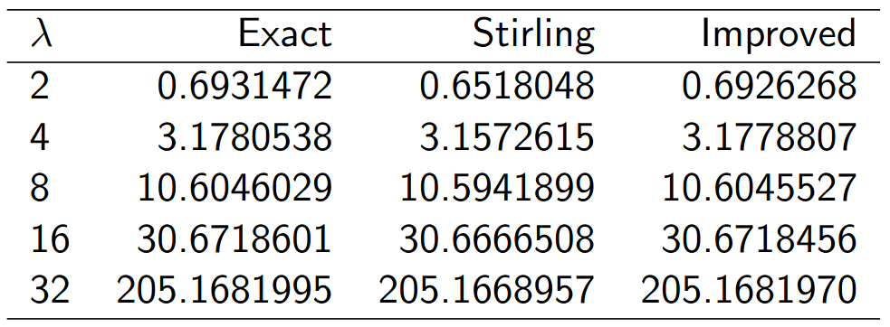
</p>

- Laplace's method also works for integrating multivariate function; see the [notes](https://www.stats.ox.ac.uk/~steffen/teaching/bs2HT9/laplace.pdf).

---
# Summary

- Computers store and recognize numbers and characters as a sequence of bits (binary digits).

- Double-precision floating point number uses a 64-bit representation for a real number.

- Generally, the concept of linear convergence serves as a criterion for a fast convergence of an algorithm/sequence.

- The root-finding problem focuses on solving the equation $f(x)=0$ for some function $f:\mathbb{R}^{d_1} \to \mathbb{R}^{d_2}$.

  - Bisection method;

  - Fixed-point iteration and its connection to power iteration;

  - Newton's method and its variants.
  
---
# Summary

- Numerical differentiation and integration rely on the Lagrange (interpolating) polynomial.

  - We discuss the $(n+1)$-point formula for numerical differentiation.
  
  - We study Trapezoidal rule, Simpson's rule, and their composite versions for numerical integration.

Submit Lab 7 on Gradescope by the end of Friday (March 8) and the final project by the end of March 13!!
