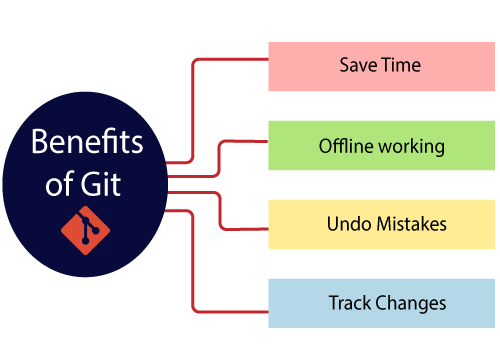
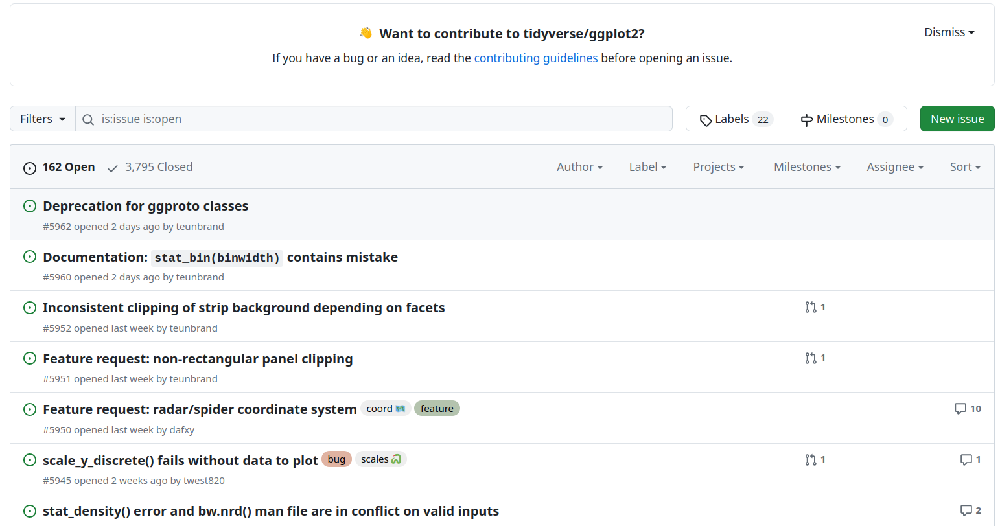
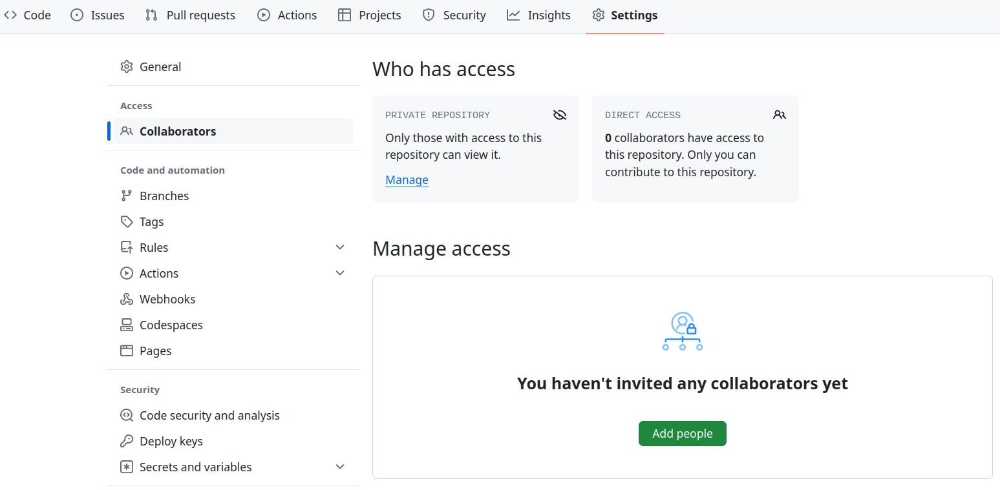
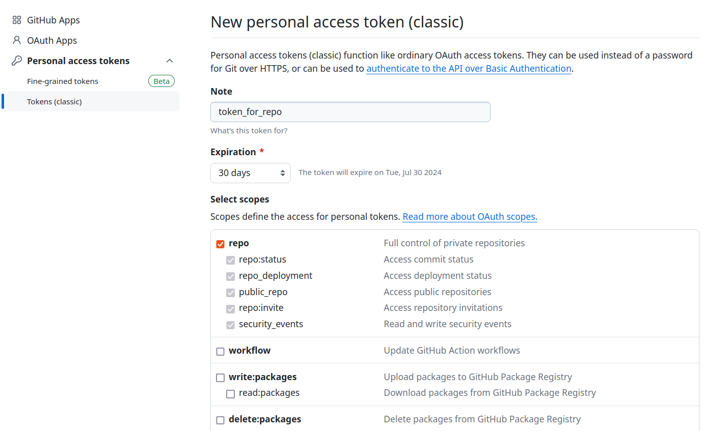

```{r setup, include=FALSE, purl=FALSE}
options(htmltools.dir.version = FALSE)
knitr::opts_chunk$set(comment = "##")
library(kableExtra)
```

# Outline

1. Introduction to Git

2. Introduction to GitHub

3. Basic Git Commands

4. Connect Git, GitHub, and Rstudio

<p><font size="4">* Acknowledgement: Parts of the slides are modified from the web-based resources "<a href="https://happygitwithr.com/">Happy Git and GitHub for the useR</a>" by Jennifer Bryan. </font></p>

---
class: inverse

# Part 1: Introduction to Git

---

# Why Do We Need Git?

When working a research project/paper solely or collaboratively with others, we may end up creating a folder with files as follows:
* draft1.docx
* Draft2.docx
* draft2_profcomments.docx
* draft_final.docx
* Simulation_v1.R
* Simulation_v2.R
* Simulation_v2_asdf.R
* Simulation_v3.R
* actualfinaldraft.tex
* actualfinaldraft.pdf
* paper_bib.bib
* Draft_comments.tex
* Draft_comments.pdf

$\hspace{5em} \vdots$

---

# Why Do We Need Git?

<p align="center">


- [Git](https://git-scm.com/) can help us keep track of changes and comments without creating multiple files.

---

# Why Do We Need Git?

- In short, [Git](https://git-scm.com/) is a **version control system**.

<p align="center">


--

  - It was created by Linus Torvalds in 2005 for the Linux kernel.

  - It was originally developed to help groups of developers work collaboratively on big software projects.

--

  - It manages the evolution of a set of files called a **repository** in a highly structured way.
  
  - The Git-based projects can be hosted on some online services such as [GitHub](https://github.com/), [GitLab](https://about.gitlab.com/), [Bitbucket](https://bitbucket.org/), etc.

--

- Online Git-based projects are similar to Google Drive or Dropbox but works better for projects with intensive coding and software developments.

---

# Some Benefits of Using Git

1. Keep old versions of our files indefinitely (tracking changes so that making any reversions is simple).

2. Work with multiple collaborators:

  - Keeps track of who changed what and when they changed it.
  
3. Changes are automatically integrated into the most recent version, and conflicts receive warnings.

<p align="center">


---
# Install Git - Mac/Linux

**Mac/Linux:** [Git](https://git-scm.com/) is probably pre-installed for these operating systems.

- Open the `Terminal` app and type `git --version` to confirm which version that has been installed and `which git` to find out where it is. 

<p align="center">


- If for some reason Git is not pre-installed, we can download it from [here](http://git-scm.com/downloads).

  * Ubuntu or Debian Linux: `sudo apt-get install git`

  * Fedora or RedHat Linux: `sudo yum install git`

- Other installation instructions can be found [here](https://happygitwithr.com/install-git).

---

# Install Git - Windows
  
**Windows:** Here is one option of the two listed [here](https://happygitwithr.com/install-git).

 * Install [Git for Windows](https://gitforwindows.org/) (also known as `msysgit` or "Git Bash") to get Git in addition to the Bash shell. 
 
 * **Important note:** When asked about "Adjusting your PATH environment", make sure to select "Git from the command line and also from 3rd-party software".
 
 * Note that RStudio for Windows prefers for Git to be installed below `C:/Program Files` and this appears to be the default. This implies, for example, that the Git executable on our Windows system is found at `C:/Program Files/Git/bin/git.exe`. Unless we have specific reasons to otherwise, follow this convention.

Hopefully, after following the instructions above, we have a Git Bash shell. To check this, open our shell and type `echo $SHELL`. We should see something like `usr/bin/bash`.

---
class: inverse

# Part 2: Introduction to GitHub

---

# Why GitHub?

[Git](https://git-scm.com/) is a software that can be used locally.

- We don't need to access to the Internet for proper version controls on our computer.

However, if we want to share our work or collaborate with others, we need to use some online repository services.

<p align="center">


-  We target [GitHub](https://github.com/) - not [GitLab](https://about.gitlab.com/) or [Bitbucket](https://bitbucket.org/) - for the sake of specificity and popularity. 

  - This [blog](https://radixweb.com/blog/github-vs-gitlab) discusses pros and cons of GitHub v.s. Gitlab.

---

# Benefits of Using GitHub

On the one hand, like RStudio with R, GitHub adds many user-friendly features to Git.

* Effective collaboration and code distribution.

* Allow others to comment on our code and suggest changes (pull requests/issues).

* Building our coding portfolio!

On the other hand, we can benefit from using R and Rstudio with GitHub.

- There is an active R package development community on GitHub.

- Rstudio has Git- and GitHub-related features.

---

# Special features of GitHub

In addition to a well-designed user interface, GitHub offers two especially important features:

- **Issues:** A list of bugs, feature requests, to-dos, etc.

  - Issues are tightly integrated with email and allow us to copy/embed important conversations in the associated repo.
  
  - Issues can be assigned to people (e.g., to-dos) and tagged ("bug" or "progress-report").
  
  - Issues are tightly integrated with commits and allow us to record the changes.

<p align="center">

</p>

<p align="center">
<font size="5"> The <a href="https://github.com/tidyverse/ggplot2/issues">Issues</a> page of ggplot2.</font>
</p>

---

# Special features of GitHub

In addition to a well-designed user interface, GitHub offers two especially important features:

- **Pull Requests:** A formal proposal for making changes on the main development branch.

  - Git allows a project to have multiple, independent branches of development, with the notion that some should eventually be merged back into the main development branch.
  
  - GitHub facilitates and preserves the discussion of the [pull requests](https://docs.github.com/en/pull-requests/collaborating-with-pull-requests/proposing-changes-to-your-work-with-pull-requests/about-pull-requests), holistically and line-by-line.

---
# Register A GitHub Account


Go to [https://github.com](https://github.com) and register a free account!

- GitHub can become a part of our professional portfolio, and it is likely that we plan to do any coding as part of our career. 

- So choose our username **carefully**! Some rules of thumb:

  * Incorporate our actual name to increase visibility and recognizability.

  * Reuse our username from other contexts, e.g., Twitter or Slack.

  * Shorter is better than longer.

  * Make it timeless (don't include the current affiliation, etc.)

  * All lowercase is recommended.

---
# Set Up Git (Optional)

Run the following in our shell/terminal (fill in your information):

```{bash, eval = FALSE}
git config --global user.name 'Firstname Lastname'
git config --global user.email 'email@website.com'
git config --global --list
```

**Note:** The email should be the one associated with our GitHub account!

We also suggest setting up our default editor. At some point when we have a merge conflict, Git will push us into an editor to resolve it. (For instance, we can use Sublime Text on a Mac).

Alternatively, we can set our Git username and email within R:

```{r eval=FALSE}
library(usethis)
use_git_config(user.name = "Firstname Lastname", user.email = "email@website.com")
```


Check out [Software Carpentry's guide](https://swcarpentry.github.io/git-novice/02-setup.html) for more examples of what line to run for different editor-operating system combinations.

---
# Install a Git Client (Optional)

Sometimes it could be useful to install a GUI for git. 

- For instance, [GitKraken](https://www.gitkraken.com/), which works on all common operating systems.

See [this webpage](https://happygitwithr.com/git-client.html) to see Jenny Bryan's notes for various git clients as well as why they are helpful.

We will discuss more about using Git with Rstudio later. Here is a [summary guideline](https://jennybc.github.io/2014-05-12-ubc/ubc-r/session03_git.html).

<p align="center">

</p>

---
# Create A New Repository on GitHub

1. Go to GitHub and click the green "New Repository" button. 

2. Repository name: `git_intro` or similar, following the [naming conventions](https://github.com/bcgov/BC-Policy-Framework-For-GitHub/blob/master/BC-Gov-Org-HowTo/Naming-Repos.md) here.

3. Description: Whatever you want, but fill in something.

4. Public or Private. 

  - GitHub offers free unlimited private repositories for all users.

  - These free private repositories support up to three external collaborators, making them a perfect place for our personal projects, for job applications, and for testing things out before making our project open source.

5. YES initialize the repository with a README.

6. Choose a license (optional).

---
# Add Collaborators to A GitHub Repo

We can always add collaborators to our GitHub repos through their usernames or emails.

<p align="center">

</p>

---
class: inverse

# Part 3: Basic Git Commands

---
# Commits, Diffs, and Tags

We now connect the fundamental concepts of Git to the data science workflow:

- **repository:** A repository or repo is just a directory of files that Git manages holistically. 

- **commit:** A commit functions like a snapshot of all the files in the repo, at a specific moment.

  - We must also write a short **commit message** every time we make a commit.
  
  - Every commit needs a nickname to identify it. Git automatically assigns each commit what is called a SHA (Simple Hashing Algorithm), a seemingly random string of 40 letters and numbers.
  
  - We can also designate certain snapshots as special with a **tag**, which is a name of our choosing.
  
---
# Commits, Diffs, and Tags

<p align="center">

</p>

- **diff:** The set of differences between Version A and B of a file is called a "_diff_" and Git users contemplate diffs a lot.

  - We can inspect the diffs between any two commits and keep track of the **history** of our project.

---
# Run the Git Commands With the Shell

The **shell** is a program on our computer that runs other programs. 
Sometimes, people use the terms `Terminal`, `Console`, `Command Line`, and `Shell` interchangeably.

We can also open a shell within RStudio:

* *Tools > Terminal > New Terminal* to launch a shell within RStudio. This will often be sufficient for our purposes.
  
* **Windows:** Here, we focus on the **Git Bash** shell, which should have come with our install of Git for Windows. 
  
  * Confirm that RStudio detected the presence of Git Bash. This should have happened automatically if we installed in the default location, but check by going to *Tools > Global Options > Terminal* and make sure we see `Git Bash` under "_New terminals open with:_".

---
# Basic Shell Commands

* `pwd` (**p**rint **w**orking **d**irectory). Shows the current working directory of our shell.

* `ls` (**l**ist **f**iles). Shows the files in the current working directory. Use `ls -a` to also list hidden files, such as .Rhistory and .git.

* `cd` (**c**hange **d**irectory). Allows us to navigate through our directories by changing the shell's working directory.

  * We can use relative paths such as `..` (parent directory) and `.` (current directory).
  * `~` is still your home directory.
  * We can drag and drop a file or folder into the shell window to paste the absolute path.
  * We can use `Tab` to autocomplete unambiguous directory and file names. 
  
* Navigate previous commands with _arrow-up_ and _arrow-down_.

* Search for previous commands with `ctrl + r`.

$\hspace{5em} \vdots$

---
# Basic Git Commands

These commands are used within the Shell/Terminal, and we will show how to run some of these commands in Rstudio as well.

* New local git repo from a repo on GitHub:

```{bash, eval = FALSE}
git clone https://github.com/zhangyk8/git_intro.git
```

* `git remote -v` lists all remotes and check that the remote was cloned successfully.

* `git remote add origin GITHUB_URL` adds the remote `GITHUB_URL` with nickname origin.

* `git add FILENAME` stages changes to the file. Will add the file to the tracked files if it isn't already. Use `git add .` to add all untracked files (but be careful with this!)

* `git commit -m "COMMIT MESSAGE"` commit all staged changes.

---
# Basic Git Commands

* `git status` informs us of our current branch, any changes or untracked files, and whether we are in sync with our remotes.

* `git log` shows the commit logs.

* `git diff` show changes between commits, commit and working tree, etc.

* `git pull` pulls commits from remote to local copy.

* `git push` pushes from local copy to remote.

* `git fetch` fetches commits.

* `git checkout` switch to a branch.

* `git init` creates an empty git repo within our current directory.

The detailed documentation can be found at [https://git-scm.com/docs](https://git-scm.com/docs).

---
# Clone Our Git Repo from GitHub

.middler-nocent[
1. Open a shell/Terminal window.

2. **Change our working directory to a new folder or desired folder.**

3. Clone the repo by entering (filling in the relevant info):
  ```{bash, eval = FALSE}
  git clone https://github.com/YOUR-USERNAME/YOUR-REPOSITORY.git
  ```
  **Notes:** we can get the direct link by navigating to our repo and clicking the green "<> Code" button and copying the text from the "HTTPS" option.
  
4. explore our repo by entering (filling in the relevant info):
```{bash, eval = FALSE}
cd YOUR-REPOSITORY
ls
head README.md
git remote show origin
git status
```
]

---
# Commit and Push A Local Change

1. Edit our README within shell by using the following line.
  ```{bash, eval = FALSE}
  echo "A line I wrote using the shell on my local computer" >> README.md
  ```

2. Check the status
  ```{bash, eval = FALSE}
  git status
  ```

3. Stage our commit and check the status
  ```{bash, eval = FALSE}
  git add .
  git status
  ```

4. Commit and push and check the status
  ```{bash, eval = FALSE}
  git commit -m "A commit from my local computer"
  git push
  git status
  ```
  
Now check the repository online at GitHub. What changed?

---
# Notes on GitHub Credentials

When we interact with GitHub, we have to include credentials in the request.

- Unfortunately, GitHub no longer accepts the password when we talk to GitHub as a Git server.

With HTTPS, we will use a **personal access token (PAT)**.

- Alternatively, we can also [set up keys for the SSH credential](https://happygitwithr.com/ssh-keys).

On [GitHub](https://github.com/), after signing in, we can manage our personal access tokens from [https://github.com/settings/tokens](https://github.com/settings/tokens).

- It is also reachable via "Settings > Developer settings > Personal access tokens".

We could click on "Generate new token" here, or call `usethis::create_github_token()` from R.

---
# Notes on GitHub Credentials

<p align="center">

</p>

Read more detailed instructions [here](https://docs.github.com/en/authentication/keeping-your-account-and-data-secure/managing-your-personal-access-tokens).

---
# Collaboration on Repo Through Branches

Branching allows one or many people to work in parallel without overwriting each other's work.

- Create a new branch:
```{bash, eval=FALSE}
git branch BRANCH-NAME
# Switch to the new branch
git checkout BRANCH-NAME
```

- Once we have done our work and committed it to the feature branch, you can switch back to `main` and merge the feature branch.
```{bash, eval=FALSE}
git checkout main
git merge BRANCH-NAME
```

---
# Dealing With Conflicts in Merging

Most of the time, the merge will go smoothly. However if both the branches we are merging changed the same part of the same file, we will get a merge conflict.
```{bash, eval=FALSE}
git merge BRANCH-NAME
# Auto-merging index.html
# CONFLICT (content): Merge conflict in index.html
# Automatic merge failed; fix conflicts and then commit the result.
```

- To solve a merge conflict, we should determine which files are in conflict, which we can do with `git status`:
```{bash, eval=FALSE}
git status
# On branch main
# You have unmerged paths.
#   (fix conflicts and run "git commit")
# 
# Unmerged paths:
#   (use "git add <file>..." to mark resolution)
# 
#     both modified:      index.html
# 
# no changes added to commit (use "git add" and/or "git commit -a")
```

---
# Dealing With Conflicts in Merging

- This shows only `index.html` is unmerged and needs to be resolved. We can open the file using any editor to see what lines are in conflict.
```{bash, eval=FALSE}
<<<<<<< HEAD:index.html
<div id="footer">contact : email.support@github.com</div>
=======
<div id="footer">
 please contact us at support@github.com
</div>
>>>>>>> issue-5:index.html
```

- In this conflict, the lines between `<<<<<< HEAD:index.html` and `======` are the content from the branch we are currently on. The lines between `=======` and `>>>>>>> issue-5:index.html` are from the feature branch we are merging.

---
# Dealing With Conflicts in Merging

- To resolve the conflict, edit this section until it reflects the state we want in the merged result. Pick one version or the other or create a hybrid. Also remove the conflict markers `<<<<<<`, `======`, and `>>>>>>`.
```{bash, eval=FALSE}
<div id="footer">
please contact us at email.support@github.com
</div>
```

- Now run `git add index.html` and `git commit` to finalize the merge. CONFLICTS RESOLVED.

**Notes:** If, during the merge, we get confused about the state of things or make a mistake, use `git merge --abort` to abort the merge and go back to the state prior to running `git merge`.

---
class: inverse

# Part 4: Connect Git, GitHub, and Rstudio

---

# Version Control of R Projects With Git

For new or existing projects, we recommend doing the followings:

- Dedicate a local directory or folder to it.

- Make it an Rstudio Project (Optional but recommended; obviously only applies to projects involving R and users of RStudio).

- Make it a Git repository.

We will discuss 

- how to create a new Rstudio project based on our existing GitHub repo;

- how to connect our existing project with a GitHub repo.

---
# Create Rstudio Project From GitHub Repo

We present two ways to do this:

**Option 1:** We can execute this command in any R session.

```{r, eval=FALSE}
usethis::create_from_github(
  "https://github.com/YOU/YOUR_REPO.git",
  destdir = "~/path/to/where/you/want/the/local/repo/"
)
```

**Option 2:** We can start a new Project in Rstudio:

1. *File > New Project > Version Control > Git*. In the "repository URL", paste the HTTPS URL for our GitHub repository.

2. Choose a desired directory and click "Open in new session".

**This is the recommended set up for all of our R projects!** 

That is, first create on GitHub, then clone through RStudio.

---
# Edit Our Repo Through RStudio

We should associate an R project with our GitHub repo.

  - If it is not already open, open that R project by double clicking on the project file.

**We should now see a `Git` pane within RStudio!**

1. Within the `Files` pane of RStudio, open `README.md`.

2. Add a new line of text "A commit from RStudio" to `README.md` and save.

3. Click `Diff` within the `Git` pane.

4. Click the box under `Staged` for the changed file (top left box).

5. Add a commit message within the box (top right).

6. Click `Commit` (top right).

7. Click `push` (top right). 

 - Confirm the local change propagated to the GitHub remote

---
# Connect Existing R Project to GitHub Repo

- Make or verify that our existing project is an RStudio Project.

- Make or verify a Git repo. If not, we have several options:

  - In the R Console, call `usethis::use_git()`.
    
  - In RStudio, go to "Tools > Project Options > Git/SVN". Under "Version control system", select "Git". Confirm New Git Repository? Yes!
  
  - In the shell, with working directory set to the project's directory, do `git init`.
  
---
# Connect Existing R Project to GitHub Repo
  
- Create and connect a GitHub repo. We have three options:

  1. In the R console, call `usethis::use_github()`.
  
  2. Via the RStudio IDE:
      - Create a GitHub repo on [GitHub](https://github.com/) as before. 
      - Click on the "two purple boxes and a white square" in the Git pane of Rstudio.
      - Click "Add remote". 
      - Paste the GitHub repo's URL here and pick a remote name, almost certainly origin. Now "Add".
  
  3. In a shell, do this after creating a GitHub repo, substituting your URL:

```{bash, eval=FALSE}
git remote add origin https://github.com/jennybc/myrepo.git
```
  
---
# Summary

- Git is a version control system that facilitates project managements and collaborations.

- GitHub is an online repository service for hosting Git projects.

- Git has its own commands and vocabulary.

  - We can work collaboratively through branching and resolve conflicts when merging a branch to the `main` branch.

- We can run Git commands and keep track of changes of our R projects through Rstudio.

Check out [Happy Git and GitHub for the useR](https://happygitwithr.com/) by Jenny Bryan for more details on much of what we went over.
